# Loki & Brain — Agentic Orchestration

This directory contains the **High-Level Orchestrators** for the Agentic Engineering Kit.

## Modes

### 1. 🧠 Brain Mode (`brain-mode.skill.md`)
> **The Strategist (System 2)**

- **Role**: Meta-Cognitive Orchestrator.
- **Function**: Plans, Routes, and Optimizes.
- **Logic**: Active Inference (Free Energy Principle).
- **Use Case**: Complex, ambiguous, or high-stakes projects.
- **Key Feature**: **Dynamic Cost Routing** (Local vs Remote).

**Trigger**: `brain activate`, `supermode`

---

### 2. ⚡ Loki Mode (`loki-mode.skill.md`)
> **The Executor (System 1)**

- **Role**: SDLC Orchestrator.
- **Function**: Executes the 10-Phase Engineering Lifecycle.
- **Logic**: Deterministic Workflow (S01 -> S10).
- **Use Case**: Building software with strict process requirements.
- **Key Feature**: **Human-in-the-Loop Gates**.

**Trigger**: `loki`, `orchestrate`

---

## How they work together

Brain Mode **wraps** Loki Mode.

1.  **Brain Mode** receives a request ("Build X").
2.  It analyzes complexity and budget.
3.  It spins up **Loki Mode** to handle the SDLC.
4.  It monitors Loki's progress, intervening if:
    - Costs spike.
    - Errors loop.
    - Requirements drift.

```mermaid
graph TD
    User -->|Request| Brain[🧠 Brain Mode]
    Brain -->|Route: Complex| Loki[⚡ Loki Exec Layer]
    Brain -->|Route: Simple| Local[💻 Local Script]
    Loki -->|Phase S01-S10| Artifacts[📂 Project Files]
    Brain -.->|Monitor| Loki
```

---

[© 2026 Andrei Nicolae Besleaga. This work is licensed CC BY-SA 4.0](https://creativecommons.org/licenses/by-sa/4.0/)
