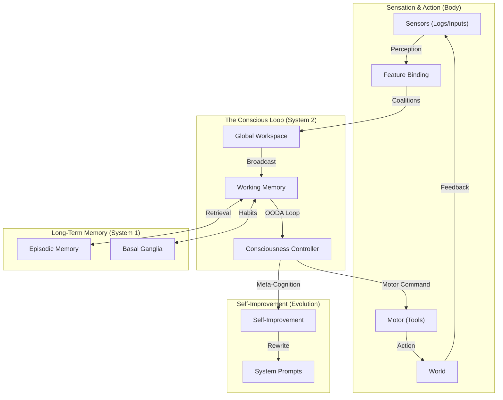

# Neuro-Cognitive Design Patterns

**Software Architecture modeled after the Human Brain.**

This directory contains **Skills** and **Architectures** derived from Neuroscience, Cognitive Psychology, and Epistemology. These patterns treat the Software System not as a machine, but as a **Cognitive Entity**.

---

## 🧠 The Complete Cognitive Architecture

We model the agent as a **Cognitive Turing Machine** with distinct functional areas:

### 1. The Body (Sensation & Action)
- **Sensory-Motor Skill** ([`sensory-motor.skill.md`](sensory-motor.skill.md)): Treats tools as "muscles" with proprioception (error feedback) and inputs as "senses" (multimodal binding).
- **Active Inference** ([`active-inference.skill.md`](active-inference.skill.md)): The low-level control loop that minimizes surprise between expectation and tool output.

### 2. The Mind (Consciousness & Control)
- **Consciousness Loop** ([`consciousness-loop.skill.md`](consciousness-loop.skill.md)): Implementation of the **OODA Loop** (Observe-Orient-Decide-Act) and Hofstadter's "Strange Loop" for self-reference.
- **Global Workspace** ([`global-workspace.skill.md`](global-workspace.skill.md)): The "Spotlight" where competing inputs form a unified context.

### 3. The Evolution (Learning)
- **Self-Improvement** ([`self-improvement.skill.md`](self-improvement.skill.md)): The ability to rewrite its own "DNA" (Prompts) based on failure analysis.
- **Learning & Adaptation** ([`learning-adaptation.skill.md`](learning-adaptation.skill.md)): "Neuroplasticity" mechanisms for strengthening successful paths.

---

## 📚 Skill Reference

| Function | Skill / Pattern | Description |
|---|---|---|
| **Coordination** | [`global-workspace.skill.md`](global-workspace.skill.md) | Central Blackboard for attention management. |
| **Control** | [`active-inference.skill.md`](active-inference.skill.md) | Predictive error minimization loop. |
| **Self-Ref** | [`consciousness-loop.skill.md`](consciousness-loop.skill.md) | Recursive OODA loop for "I" awareness. |
| **Body** | [`sensory-motor.skill.md`](sensory-motor.skill.md) | Embodied tool use and feedback control. |
| **Evolution** | [`self-improvement.skill.md`](self-improvement.skill.md) | Recursive self-editing of prompts. |
| **Memory** | [`working-memory.skill.md`](working-memory.skill.md) | Session state management. |
| **Storage** | [`episodic-consolidation.skill.md`](episodic-consolidation.skill.md) | Long-term vector storage. |
| **Routing** | [`cost-benefit-router.skill.md`](cost-benefit-router.skill.md) | Dynamic cost/privacy switching (Local vs Remote). |
| **Theory** | [`neuroscience-foundations.skill.md`](neuroscience-foundations.skill.md) | Cortico-Thalamic & Basal Ganglia theory. |
| **Theory** | [`cognitive-architectures.skill.md`](cognitive-architectures.skill.md) | Cognitive Turing Machine patterns. |
| **Theory** | [`epistemology-knowledge.skill.md`](epistemology-knowledge.skill.md) | Epistemological foundations for AI knowledge. |
| **Plasticity** | [`learning-adaptation.skill.md`](learning-adaptation.skill.md) | Neuroplasticity and path strengthening. |

---

[© 2026 Andrei Nicolae Besleaga. This work is licensed CC BY-SA 4.0](https://creativecommons.org/licenses/by-sa/4.0/)
