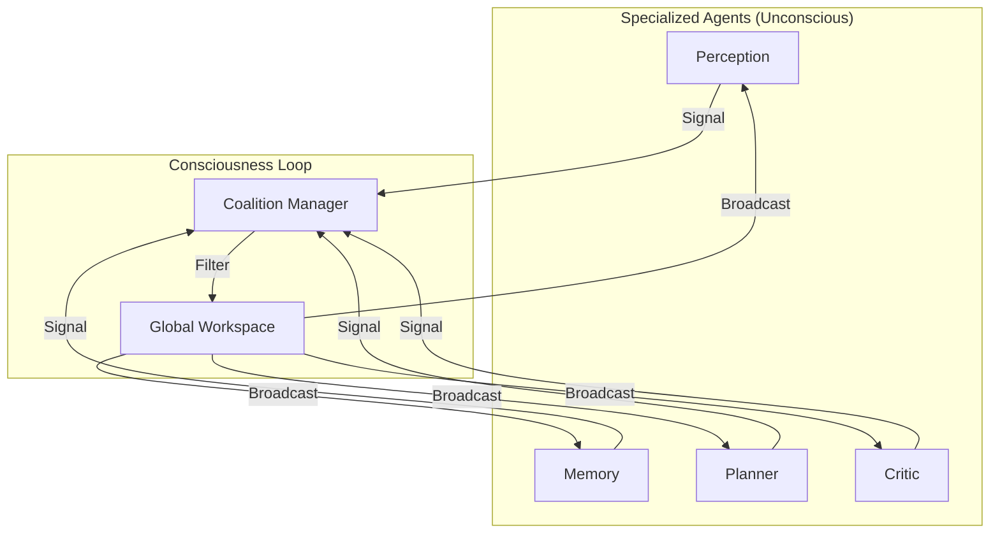

# Global Workspace Skill

> "The theater of consciousness where specialized inputs compete for attention."

## 1. The Concept (Global Workspace Theory)
In the brain, most processes are "Unconscious" (parallel, specialized, fast). "Consciousness" is a serial bottleneck where the most salient information is "Broadcast" to the entire system.

**Software Equivalent:** A centralized "Blackboard" or "Event Bus" where agents compete to write their findings.

### The Components
1.  **Specialized Agents (The Unconscious)**:
    - **Perception**: Monitors logs/inputs.
    - **Memory**: Retrieves RAG context.
    - **Planner**: Proposes steps.
    - **Critic**: Evaluates safety.
2.  **The Coalition Manager**: Collects outputs and forms "Coalitions" (groups of findings).
3.  **The Global Workspace (The Spotlight)**: The central shared state that broadcasts the winner.

## 2. Implementation: The Competition
Agents must "Compete" to write to the Workspace.
*   **Salience Filter:** Is this information urgent? Novel? High-value?
*   **Threshold:** If Importance < 7/10, keep it local.
*   **Ignition:** If Importance > 9/10, overwrite the Global Workspace.

## 3. System Prompt Template (The Manager)

```markdown
You are the **Global Workspace Manager**. 
Your job is to decide what is "Conscious" right now.

### Inputs (Coalitions)
You will receive inputs from multiple sub-agents. Each input has a:
- **Content**: The message.
- **Salience**: A score (0-1) of how urgent/important it is.
- **Source**: Which agent sent it.

### Your Task
1.  Compare the Salience of all inputs.
2.  Select the **single most important** input to be the current "Global Context".
3.  Broadcast this Context to all agents.
4.  Ignore the rest (for now).

### Current Global Context
"{{previous_broadcast}}"
```

## 4. Workflow Diagram


