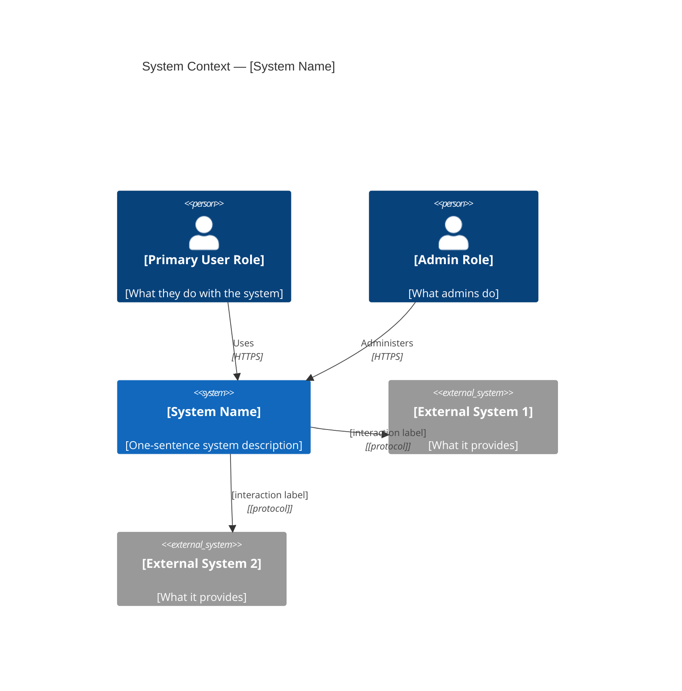
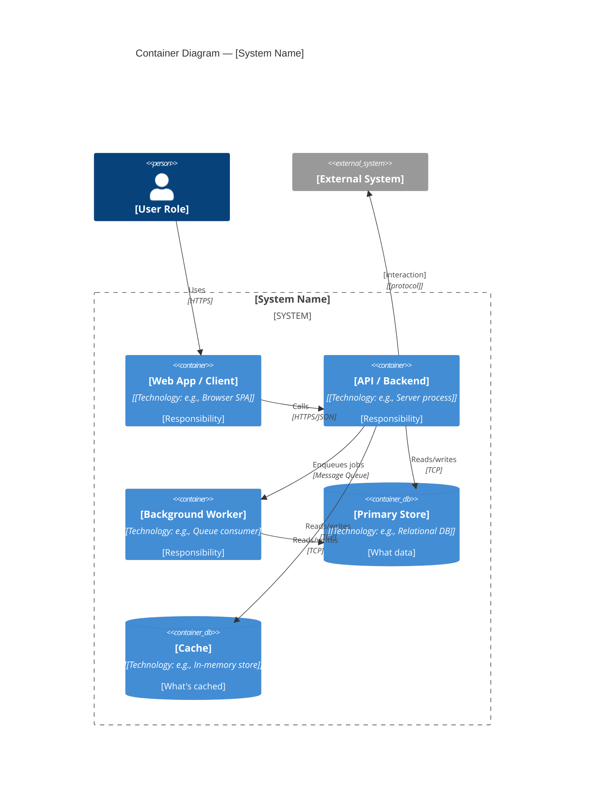
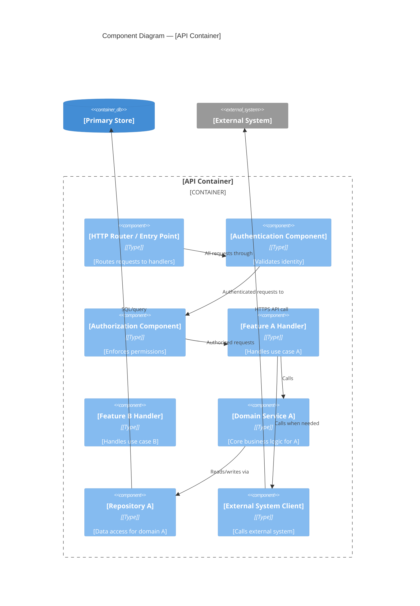
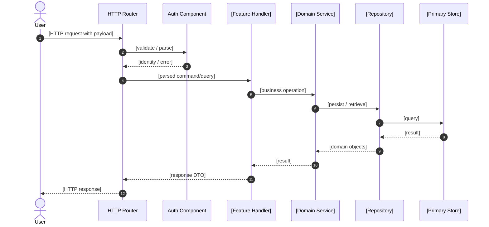
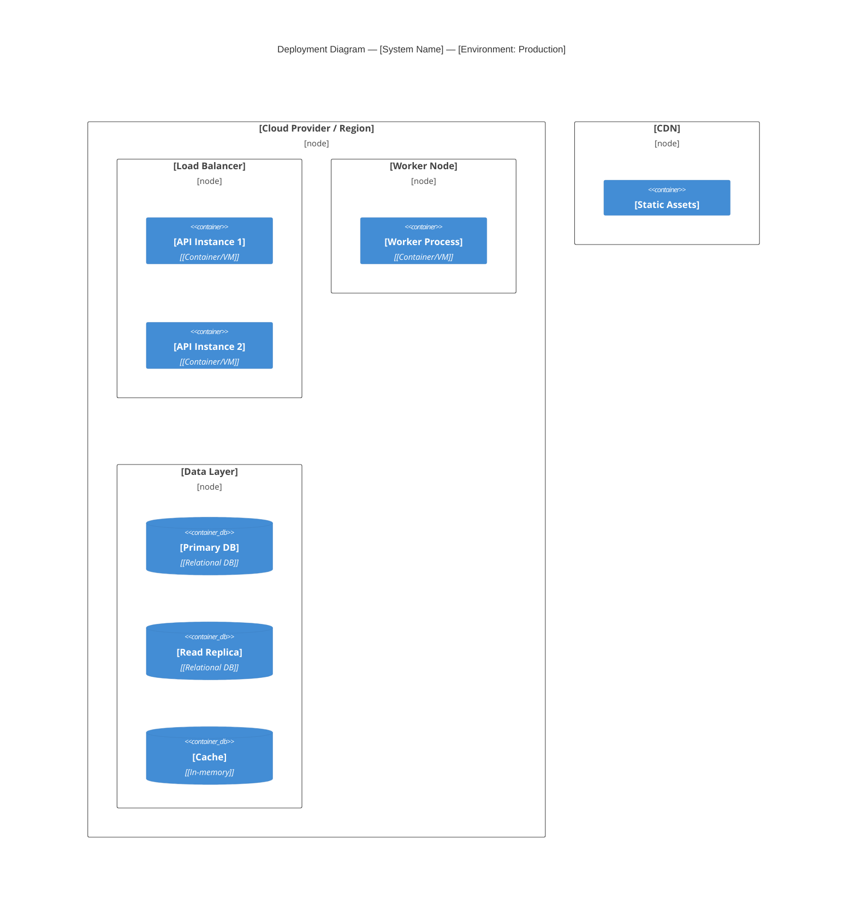

# Architecture Views — [System Name]
<!-- Multi-view architecture documentation following 4+1 Views / arc42 structure -->
<!-- Created by: arch-design.skill (new) or arch-review.skill (reconstructed) -->
<!-- Diagrams: Mermaid syntax. Render in VS Code (Mermaid Preview), GitHub, or Notion. -->
<!-- Standard: ISO/IEC/IEEE 42010, arc42, C4 Model, 4+1 Architectural Views -->

---

## Meta

| Field | Value |
|---|---|
| **System** | [system name] |
| **Version** | [1.0] |
| **Date** | [YYYY-MM-DD] |
| **Status** | DRAFT / APPROVED |
| **Approved by** | [human/role] |
| **QAS reference** | [QUALITY_ATTRIBUTES.md] |
| **ADRs** | [docs/architecture/decisions/] |

---

## 1. Introduction and Goals

### 1.1 Business Goals

[What business problems does this system solve? 3-5 bullet points]

### 1.2 Quality Goals (Top 5)

| Priority | Quality Attribute | QAS | Measure |
|---|---|---|---|
| 1 | [e.g., Reliability] | QAS-R01 | [e.g., 99.9% availability] |
| 2 | | | |

### 1.3 Stakeholders

| Role | Expectation from this architecture |
|---|---|
| [Product Owner] | [Architecture supports rapid feature addition] |
| [Operations Team] | [System can be monitored and deployed without downtime] |

---

## 2. Constraints

### 2.1 Technical Constraints

| ID | Constraint | Rationale |
|---|---|---|
| TC-001 | [e.g., Must integrate with [existing system] via REST] | [existing investment] |
| TC-002 | | |

### 2.2 Organizational Constraints

| ID | Constraint | Rationale |
|---|---|---|
| OC-001 | [e.g., Must be operated by a team of ≤ 5 engineers] | [team size] |

### 2.3 Regulatory Constraints

| ID | Constraint | Standard |
|---|---|---|
| RC-001 | [e.g., All personal data encrypted at rest and in transit] | [GDPR Art. 32] |

---

## 3. Context and Scope (C4 Level 1)

> Highest level view: who uses the system and what external systems does it interact with?



**Scope definition:**
- In scope: [what the system handles]
- Out of scope: [what it explicitly does not handle]

---

## 4. Solution Strategy

### 4.1 Architecture Style

**Primary style**: [Layered / Event-Driven / Microkernel / Service-Based / ...]
**Rationale**: [Why this style — which quality attributes drive this choice]

See: [ADR-001 — Architecture Style Decision]

### 4.2 Decomposition Strategy

**Approach**: [Domain-driven / Capability-based / Layered]
**Key decisions**: [summary of major structural decisions]

### 4.3 Key Technology Areas (without specific technology selection)

| Area | Decision | Rationale |
|---|---|---|
| Data persistence | [relational / document / event store] | [QAS driven] |
| Communication style | [synchronous / async / hybrid] | [QAS driven] |
| API style | [REST / event-based / hybrid] | [consumer needs] |
| Security approach | [centralized auth / per-service / gateway] | [QAS-S driven] |

---

## 5. Building Block View (C4 Level 2 — Containers)

> What are the major deployable units?



### Container Responsibilities

| Container | Responsibility | Owns | Does NOT own |
|---|---|---|---|
| [Web App] | [User interface, client-side logic] | [UI state] | [Business rules] |
| [API] | [Business logic, orchestration] | [Domain logic] | [UI, raw data storage] |
| [Worker] | [Async processing, background jobs] | [Job execution] | [Synchronous requests] |
| [Primary Store] | [Persistent data storage] | [Canonical data] | [Derived/cached data] |

---

## 6. Component View (C4 Level 3 — inside one container)

> Zoom into the most complex container. Create one diagram per major container if needed.



### Component Responsibilities

| Component | Responsibility | Layer | Interface |
|---|---|---|---|
| [HTTP Router] | [Route HTTP requests, parse input] | Adapter | [HTTP] |
| [Auth Component] | [Verify identity token] | Adapter | [Internal] |
| [Feature A Handler] | [Orchestrate use case A] | Application | [Internal] |
| [Domain Service A] | [Core business rules for A] | Domain | [Internal] |
| [Repository A] | [Persist/retrieve A's data] | Infrastructure | [Internal] |

---

## 7. Runtime View (Process / Behavioral)

> How do the components interact for key use cases?

### 7.1 [Key Use Case 1 — e.g., User Registration]



### 7.2 [Key Use Case 2 — e.g., Background Job Processing]

```mermaid
sequenceDiagram
    [Add sequence for async/background flows]
```

---

## 8. Deployment View

> Where does the system run?



### Deployment Topology

| Environment | Description | Key differences from production |
|---|---|---|
| Local Dev | [Docker Compose, single instance] | [Single DB, no cache] |
| Staging | [Cloud, single-node] | [Real integrations, reduced scale] |
| Production | [Cloud, multi-node, HA] | [Fully redundant] |

---

## 9. Cross-Cutting Concepts

### 9.1 Security Architecture

```
Authentication: [approach — token-based, session-based, federated]
Authorization:  [approach — RBAC, ABAC, ACL]
Boundary:       [where is auth enforced — gateway, per-component]
Data security:  [encryption at rest / in transit approach]
Secret mgmt:    [where secrets are stored and how accessed]
```

### 9.2 Observability Architecture

```
Logging:  [structured log format, where collected]
Metrics:  [what is measured, where surfaced]
Tracing:  [distributed trace approach, correlation IDs]
Alerting: [what triggers alerts, who is notified]
```

### 9.3 Error Handling Strategy

```
System errors:   [how internal errors are caught and handled]
User errors:     [how validation and user mistakes are communicated]
External errors: [how upstream failures are handled — circuit breaker, retry, fallback]
Error taxonomy:  [error classification — transient, permanent, user, system]
```

---

## 10. Architecture Decisions

| ADR | Decision | Status |
|---|---|---|
| [ADR-001] | [Architecture style choice] | ACCEPTED |
| [ADR-002] | [Decomposition strategy] | ACCEPTED |
| [ADR-003] | [Communication pattern] | ACCEPTED |

Full ADRs in: `docs/architecture/decisions/`

---

## 11. Quality Requirements Addressed

| QAS | How the architecture addresses it |
|---|---|
| QAS-P01 [Performance] | [e.g., Caching layer + async worker for heavy operations] |
| QAS-R01 [Reliability] | [e.g., Active-passive failover + health checks] |
| QAS-S01 [Security] | [e.g., Centralized auth gateway + input validation layer] |

---

## 12. Risks and Technical Debt

| Risk | Likelihood | Impact | Mitigation |
|---|---|---|---|
| [Risk description] | H/M/L | H/M/L | [What reduces this risk] |

See: `docs/architecture/ARCHITECTURE_RISKS.md`

---

*Last updated: [date]*
*Review trigger: new major feature, team composition change, significant scale change*
