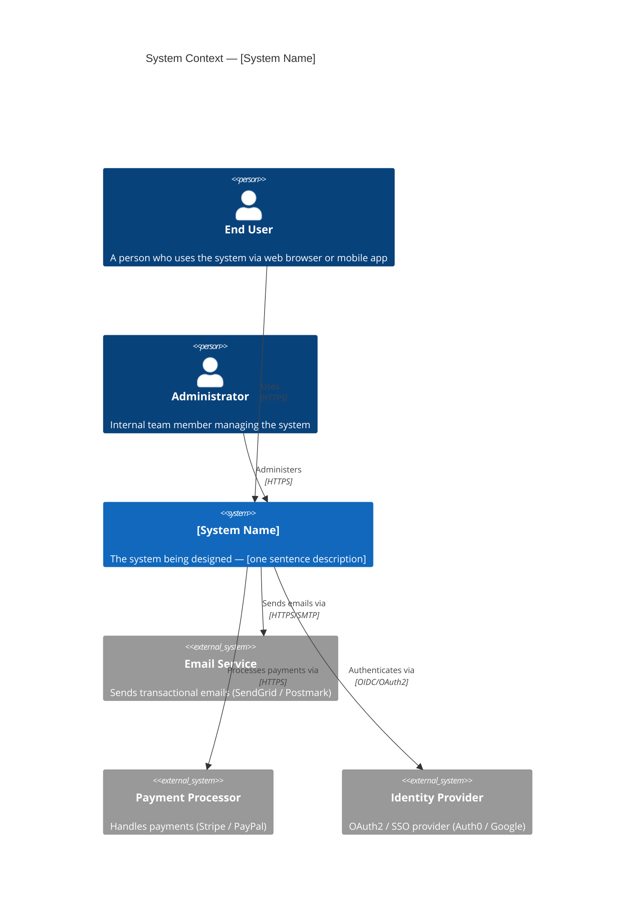
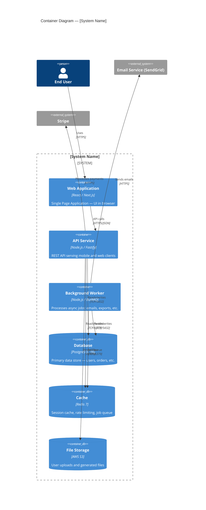
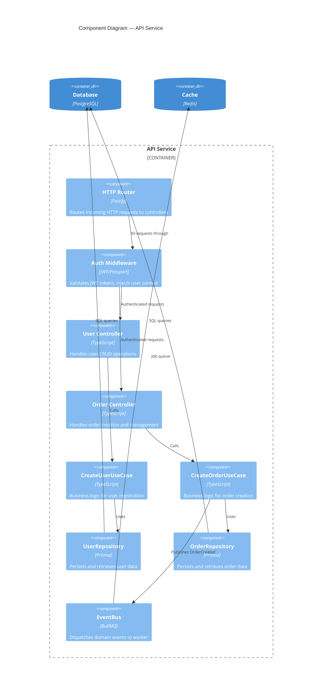

# C4 Architecture — [System Name]
<!-- C4 Model: 4 levels of abstraction for software architecture -->
<!-- Created by: prod-architect | Date: [date] | Store in: docs/architecture/ -->
<!-- Reference: https://c4model.com -->

---

## Level 1 — System Context Diagram

> Highest level view: who uses the system and what external systems does it interact with?



---

## Level 2 — Container Diagram

> Zoom into the system: what are the deployable units (applications, databases, services)?



---

## Level 3 — Component Diagram

> Zoom into one container: what are the major components inside the API service?



---

## Level 4 — Code/Class Diagram

> Zoom into a component: class structure and relationships (add as needed for complex components)

```
[Add Level 4 diagrams for complex domain areas as needed]

Example: User aggregate
  User (aggregate root)
    - Email (value object)
    - UserId (value object)
    - UserRole (enum)
    + create(email, name): Result<User>
    + updateEmail(email): Result<void>
    - validate(): void
```

---

## Architecture Decisions

See ADRs in `docs/architecture/decisions/` for rationale behind technology choices:

| ADR | Decision | Status |
|---|---|---|
| ADR-001 | [Technology choice] | [Accepted/Proposed] |
| ADR-002 | [Architecture pattern] | [Accepted/Proposed] |

---

## Layer Import Rules

```
Domain layer:       No imports from application, adapters, or infrastructure
Application layer:  Imports domain only (interfaces, entities, value objects)
Adapters layer:     Imports domain + application (through interfaces)
Infrastructure:     Imports domain interfaces (implements them)
Main/Bootstrap:     Imports all layers (composition root only)
```

Enforced by: `agentic-linter.skill` using `dependency-cruiser` or `deptrac`

---

## Data Flow Diagrams

### User Registration Flow
```
Browser → POST /api/v1/users
  → AuthMiddleware (skip — public endpoint)
  → UserController.create()
    → Zod validation (422 if invalid)
    → CreateUserUseCase.execute()
      → Email value object (domain validation)
      → UserRepository.findByEmail() → 409 if exists
      → User.create() (domain entity)
      → UserRepository.save()
      → EventBus.publish(UserRegisteredEvent)
      → Return UserDto
  → 201 Created { id, email, name, createdAt }
```

---

*Last updated: [date]*
*Review when: new services added, major refactoring, technology changes*
