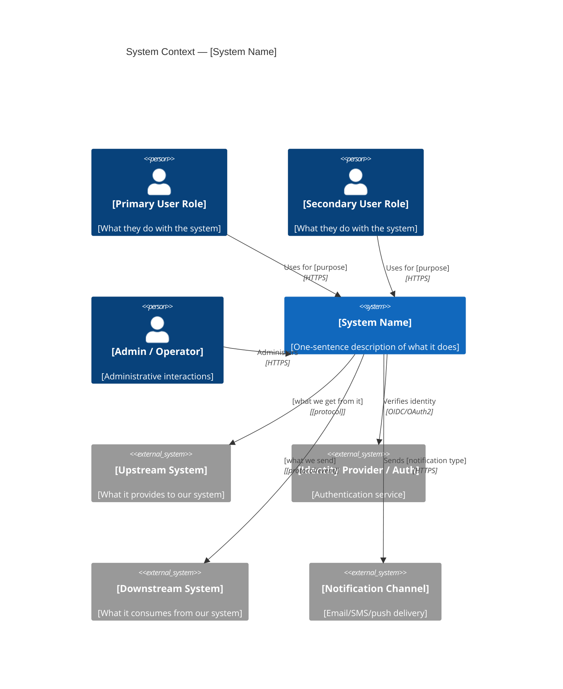

# System Context — [System Name]
<!-- Technology-agnostic system context description -->
<!-- Use BEFORE architecture design to establish scope and boundaries -->
<!-- Created by: req-elicitation.skill or arch-design.skill -->
<!-- Complements C4 Level 1 diagram with narrative and scope decisions -->

---

## Meta

| Field | Value |
|---|---|
| **System** | [system name] |
| **Version** | [1.0] |
| **Date** | [YYYY-MM-DD] |
| **Status** | DRAFT / APPROVED |

---

## System Purpose

**One-sentence description**: [The [system name] enables [actors] to [achieve goal] by [key capability].]

**Business problem solved**: [What was the problem before this system existed? What did people do manually or what was broken?]

**Success definition**: [How do we know if this system achieves its purpose? Measurable outcomes.]

---

## System Context Diagram



---

## Actors and External Systems

### Human Actors

| Actor | Description | Primary Goals | Frequency of Use |
|---|---|---|---|
| [Primary User] | [Who they are] | [What they want to accomplish] | [daily / weekly / occasional] |
| [Admin] | [Who they are] | [What they manage] | [daily / weekly] |

### External Systems

| System | Direction | Data/Service Exchanged | Integration Type | Owned by |
|---|---|---|---|---|
| [Identity Provider] | Upstream | [Authentication tokens, user identity] | [Synchronous API] | [External party / Internal team] |
| [Payment Gateway] | Upstream | [Payment processing] | [Synchronous API] | [Third party] |
| [Email Service] | Downstream | [Transactional email delivery] | [Asynchronous API] | [Third party] |
| [Analytics Platform] | Downstream | [User behavior events] | [Event stream] | [Internal] |

---

## System Boundary Decisions

### In Scope

The following capabilities are explicitly **within** this system's boundary:

```
- [Capability 1: e.g., User registration and authentication]
- [Capability 2: e.g., Order creation and management]
- [Capability 3: e.g., Inventory tracking]
- [Capability 4: e.g., Order status notifications to customers]
```

### Out of Scope (Explicitly Excluded)

The following are **not** this system's responsibility:

```
- [Out 1: e.g., Payment processing — delegated to [Payment Gateway]]
- [Out 2: e.g., Email delivery infrastructure — delegated to [Email Service]]
- [Out 3: e.g., Product catalog management — separate system]
- [Out 4: e.g., Mobile native apps — v1 is web only]
- [Out 5: e.g., Reporting and analytics — handled by data warehouse]
```

**Decision rationale**: [Why these boundaries were drawn here — organizational, technical, or strategic reasons]

---

## Data Flows (High Level)

### Primary Flows (happy path)

```
Flow 1: [Actor] → [System] → [External System]
  [Actor] initiates [action]
  [System] processes [what]
  [System] communicates [what] to [External System]
  [External System] responds with [what]
  [System] completes [action] for [Actor]

Flow 2: [External System] → [System] → [Actor]
  [External System] sends [event/data]
  [System] processes [what]
  [System] notifies [Actor] of [result]
```

### Exception Flows

```
Exception 1: [External System] unavailable
  [System] behavior when [upstream1] is unreachable:
    [e.g., Return cached data for read requests; queue write requests for retry]

Exception 2: [Actor] provides invalid input
  [System] behavior:
    [e.g., Reject request with descriptive error; do not partially process]
```

---

## Key Constraints on the System

| Constraint | Type | Description | Source |
|---|---|---|---|
| [Must work offline] | Technical | [Certain operations must function without external connectivity] | [Business requirement] |
| [GDPR compliance] | Regulatory | [All EU user data subject to GDPR data subject rights] | [Legal] |
| [99.9% availability] | Quality | [System must meet 99.9% monthly uptime] | [SLA] |
| [Response < 2s] | Quality | [All user-facing operations complete within 2 seconds] | [UX requirement] |

---

## External Integration Risk Assessment

| External System | Criticality | Failure Impact | Mitigation Strategy |
|---|---|---|---|
| [Identity Provider] | CRITICAL | [Users cannot authenticate] | [Fallback auth, session caching] |
| [Payment Gateway] | HIGH | [No new orders can be placed] | [Circuit breaker, queue for retry] |
| [Email Service] | MEDIUM | [Notifications delayed] | [Queue for retry; users not blocked] |

---

## Regulatory / Compliance Context

| Regulation / Standard | Applicability | Key Obligations |
|---|---|---|
| [GDPR] | [If EU users] | [Data subject rights, breach notification, DPA] |
| [PCI-DSS] | [If handling card data] | [No raw card data stored; SAQ scope] |
| [WCAG 2.2 AA] | [Public-facing UI] | [Accessibility for users with disabilities] |
| [SOC2 Type II] | [If SaaS for enterprise] | [Security, availability, confidentiality controls] |

---

## Open Questions and Assumptions

| # | Question / Assumption | Status | Owner |
|---|---|---|---|
| 1 | [Assumed: all users require authentication — no public/anonymous access] | ASSUMPTION — needs validation | [Human] |
| 2 | [Open: Should [Feature X] be part of this system or [Other System]?] | OPEN — requires decision | [Product Owner] |
| 3 | [Assumed: [External System] API is stable and versioned] | ASSUMPTION | [Engineering] |

---

*Context finalized when: all open questions resolved, stakeholders have reviewed and approved scope*
