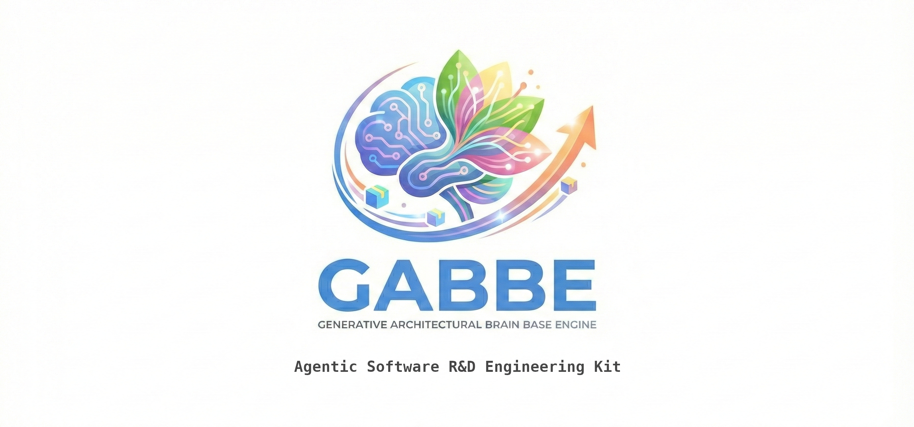
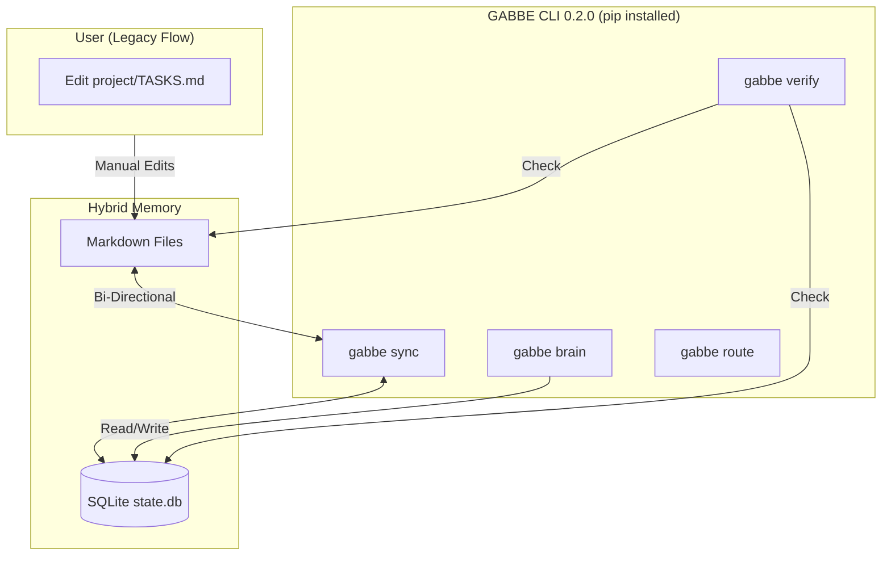
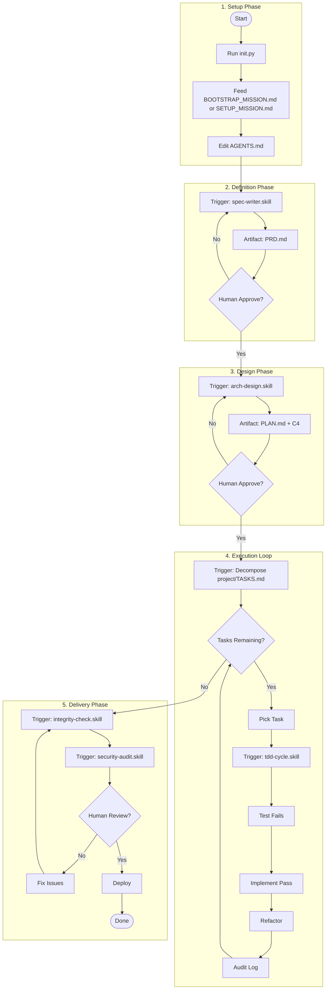
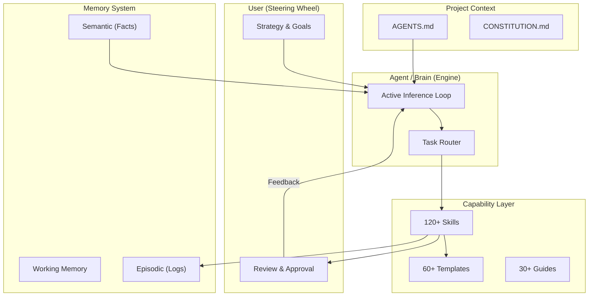
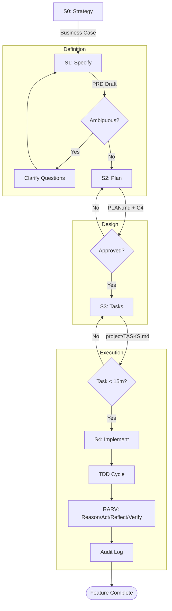

# GABBE (Generative Architectural Brain Base Engine)
## Agentic Software R&D Engineering Kit

## Quick Reference



## What is this?

- Universal kit for Software and AI coding agents: Claude Code, Cursor, GitHub Copilot, Antigravity/Gemini, Codex.
- Drop-in context kit that turns any AI coding agent into a governed engineering team for developing software.
- Based on Software Engineering & Architecture Practices and Procedures.
- Works for any project type, new or existing, any language, any team size.
- **Write Once, Run Everywhere**: SKILLS for Cursor (`.mdc`), VS Code (`folder/skill`), Claude (`.skill.md`), Gemini.
- The system features an experimental **Meta-Cognitive Orchestrator "Brain"** (Neurocognitive based architecture derived from Neuroscience, Cognitive Psychology, Epistemology, treating the Software System not as a machine, but as a **Cognitive Entity**), using Active Inference to plan, route, and optimize work.
- The system features a **Multi-Agent Swarm "Loki" Engineering Team** (30+ specialized agent roles for large projects), providing episodic and semantic memory, project history auditing and checkpoints.


It provides:
- **120+ Skills** (specialized capabilities)
- **60+ Templates** (standardized documents)
- **30+ Guides** (language & domain expertise)
- **30+ Personas** (specialized roles)
- **Brain Mode** (meta-cognitive orchestration)
- **Loki Mode** (multi-agent swarm engineering team for large projects)

> **120+ Skills · 60+ Templates · 30+ Guides · 30+ Personas · Loki / Brain Mode**

---

*Full documentation: [README_FULL.md](docs/README_FULL.md) · Full quick guide: [QUICK_GUIDE.md](docs/QUICK_GUIDE.md)*

---

### ⚡ Automated Setup (Recommended)
The `init.py` script is a **Universal Skill Compiler**. It generates the correct formats for your AI tools:
- **Cursor**: Generates `.cursor/rules/*.mdc` (Optimized with Globs)
- **VS Code / Copilot**: Generates `.github/skills/` with `config.json`
- **Claude Code**: Symlinks `.claude/skills` for instant updates
- **Gemini**: Wires up `.gemini/settings.json`

```bash
# 1. Run the Wizard
python3 scripts/init.py
```

2. **Feed the Mission**
   - The script generates `BOOTSTRAP_MISSION.md` (or `SETUP_MISSION.md` if dynamic setup is disabled) in your root.
   - **Copy its content** and paste it into your AI Agent's chat window.
   - This aligns the agent with your project context immediately.

3. **Verify Context**
   - Open `agents/AGENTS.md` and check the `Tech Stack` section.
   - Open `agents/CONSTITUTION.md` and review project laws.

4. **Git Tracking**
   - To keep the initial structure of `agents/memory/` and `project/` in your repository but prevent Git from tracking the continuous autonomous modifications your agents will make to them locally, run:
     ```bash
     git ls-files agents/memory/ project/ | xargs git update-index --skip-worktree
     ```

**Manual Setup:**
```bash
cp -r GABBE/agents .
chmod +x agents/setup-context.sh && agents/setup-context.sh
```

### 🌍 Cross-Platform Support
- **Linux / macOS / WSL:** Native support.
- **Windows (Native):**
  - Use `python scripts/init.py` (Symlinks automatically fallback to file copies if needed).
  - Use `agents/scripts/setup-context.ps1` instead of `.sh`.

---

## 🚀 Common Actions (Copy-Paste Prompts)

### Strategy & Ideation (Step 0)
```
"Use business-case/strategy skills to validate exactly why we are building [description] and who it is for."
```

### New Project from Scratch
```
"Read AGENTS.md. I want to build [description]. Start with spec-writer skill."
```
**Flow:** Strategy → Spec → Design → Tasks → TDD Implementation → Security → Deploy

### Resume Existing Project
```
"Read AGENTS.md and agents/memory/PROJECT_STATE.md. Resume the project."
```

### Fix a Bug
```
"Read AGENTS.md. Bug: [description]. Use debug skill with TDD."
```
**Flow:** Reproduce → Root Cause → Failing Test → Fix → Green → Regression Check

### Refactor / Pay Tech Debt
```
"Use tech-debt skill on [directory]. Then refactor the top-priority item."
```

### Security Audit
```
"Run security-audit skill on the entire codebase."
```

### Architecture Review
```
"Run arch-review skill. Check for SOLID violations and coupling."
```

### Software Engineering & System Architecture
```
"Act as a Principal Staff Engineer. Review the codebase in [directory] and generate a C4 system architecture diagram (Context and Container levels). Identify any bottlenecks and propose scaling strategies."
```
```
"Use the design-patterns and domain-model skills. We are building a [feature segment]. Propose the optimum architecture pattern (e.g. Event-driven, CQRS, Hexagonal) and define the core domain entities."
```

### Vibe-Coding (Creative Frontend)
```
"Use the vibe-coding skill. Build a [component/page] using [framework]. I want it to feel [aesthetic, e.g. glassmorphism, cyberpunk, sleek corporate]. Include micro-animations and smooth transitions. Prioritize visual WOW over generic utility."
```

### Activate Brain Mode (Complex Goals)
```
"Activate Brain Mode. Goal: [build X / migrate Y / solve Z]."
```
Uses Active Inference to plan, route between local/remote models, and learn from past outcomes.

### Activate Loki Mode (Large Projects)
```
"Activate Loki Mode. Goal: [build X / migrate Y / refactor Z]."
```
Multi-agent swarm with 30+ specialized personas for projects >5 features or >20 files.

---

## 🚀 GABBE CLI 0.2.0 (Stable)

GABBE has also an experimental helper, **Zero-Dependency CLI** (`gabbe`) which powers the "Hybrid Mode", to bridge the gap between Markdown files and a SQLite database.
It is a work-in-progress and you can do without it, only with the rest of the kit.

### Prerequisites
- Python 3.8+
- **LLM API Key**: For Brain/Route features, set `GABBE_API_KEY` (OpenAI-compatible).

**Environment Variables** (full reference in [CLI_REFERENCE.md](docs/CLI_REFERENCE.md#environment-variables)):

| Variable | Default | Description |
|---|---|---|
| `GABBE_API_URL` | `https://api.openai.com/v1/chat/completions` | OpenAI-compatible endpoint |
| `GABBE_API_KEY` | *(required for LLM features)* | Bearer token for the LLM API |
| `GABBE_API_MODEL` | `gpt-4o` | Model name sent in API requests |
| `GABBE_LLM_TEMPERATURE` | `0.7` | Sampling temperature (0.0–1.0) |
| `GABBE_LLM_TIMEOUT` | `30` | HTTP timeout in seconds |
| `GABBE_ROUTE_THRESHOLD` | `50` | Complexity score above which prompts route REMOTE |

### Installation
The CLI is a Python package.

```bash
# 1. Install locally (Recommended)
pip install -e .

# 2. Verify installation
gabbe --help
```

### Core Commands
| Command | Description |
|---|---|
| `gabbe init` | Initialize the SQLite Database (Run this after `python scripts/init.py`). |
| `gabbe sync` | **Hybrid Sync**: Bidirectional sync between `project/TASKS.md` and SQLite DB. |
| `gabbe verify`| **Enforcer**: programmable integrity check (files, tests, lint). |
| `gabbe status`| **Dashboard**: Visualizes project phase and task progress. |
| `gabbe brain` | **Meta-Cognition**: Activates Active Inference loop or Evolutionary Prompt Optimization (Requires API Key). |
| `gabbe route` | **Cost Router**: Arbitrates between Local and Remote LLMs based on task complexity (Requires API Key). |

### Architecture
GABBE uses a **Hybrid Architecture** where agents and humans interact via Markdown, but the system of record is SQLite.



### How to Use

#### Setup
```bash
# 1. Generate Context Configs
python3 scripts/init.py

# 2. Initialize Database
gabbe init
```

#### Daily Workflow
```bash
# Check status
gabbe status

# Sync tasks (manual edits)
gabbe sync

# Optimize a skill (Requires GABBE_API_KEY)
gabbe brain evolve --skill tdd-cycle
```

#### Verification
```bash
gabbe verify
```

---

## 4. End-to-End Workflow & Architecture

### Visual Overview (Mermaid)



### Text Overview (ASCII)

```text
[START]
   |
[INSTALL] python3 scripts/init.py -> Generates BOOTSTRAP_MISSION.md (or SETUP_MISSION.md)
   |
[SETUP]   Feed Mission to Agent -> Edit AGENTS.md (Stack/Rules)
   |
[DEFINE]  "Start new feature" -> spec-writer.skill -> PRD.md
   |      (Human Reviews & Approves PRD)
   v
[DESIGN]  Plan Architecture -> arch-design.skill -> PLAN.md + ADRs
   |      (Human Reviews & Approves Plan)
   v
[TASKS]   Decompose to project/TASKS.md (Atomic 15-min units)
   |
   +---> [IMPLEMENTATION LOOP] ----------------------------------+
   |     1. Pick Task from project/TASKS.md                               |
   |     2. Write Failing Test (Red)                              |
   |     3. Write Code to Pass (Green)                            |
   |     4. Refactor & Clean Up                                   |
   |     5. Verify (Tests + Lint) & Log to AUDIT_LOG.md           |
   |     (Repeat until project/TASKS.md is empty)                         |
   +-------------------------------------------------------------+
   |
[VERIFY]  integrity-check.skill -> security-audit.skill
   |      (Human Final Review)
   v
[DEPLOY]  Merge PR -> Staging -> Production -> [DONE]
```

---

---

## 5. System Architecture

How the pieces fit together to create a "Cognitive Entity".

### Visual Architecture (Mermaid)



### Text Architecture (ASCII)

```text
       [HUMAN USER]
            | (Goal/Feedback)
            v
    +-------------------+      +------------------+
    |   AGENT BRAIN     | <--- |  PROJECT CONTEXT |
    | (Active Inference)|      | (AGENTS/Rules)   |
    +--------+----------+      +------------------+
             |
             v
    [ROUTER & ORCHESTRATOR]
             |
    +--------+--------------------------+
    |                                   |
[SKILLS] (Function)               [MEMORY] (Context)
    |                                   |
    +-> [Coding]                  +-> [Episodic Logs]
    +-> [Architecture]            +-> [Semantic Facts]
    +-> [Security]                +-> [Continuity]
    +-> [Ops / SRE]                     |
            |                           |
            v                           v
    [TEMPLATES] (Structured Output) <---+
```

---

## 6. Spec-Driven SDLC Lifecycle

The "Golden Path" for every feature.

### Visual SDLC (Mermaid)



### Text SDLC (ASCII)

```text
0. STRATEGY
   -> Why are we building this? (Value/ROI)
   v
1. SPECIFY (S01)
   -> spec-writer.skill -> PRD.md (EARS Syntax)
   -> Human Review & Approval
   v
2. PLAN (S02)
   -> arch-design.skill -> PLAN.md + C4 Diagrams
   -> adr-writer.skill -> Architectural Decisions
   v
3. DECOMPOSE (S03/S04)
   -> project/TASKS.md -> Atomic steps (<15 mins each)
   v
4. IMPLEMENT (S05)
   -> One task at a time
   -> TDD Loop: Red -> Green -> Refactor
   -> RARV Loop: Reason -> Act -> Reflect -> Verify
   v
5. VERIFY & SHIP (S06-S10)
   -> Integrity Check -> Security Audit -> Deploy
```

---

## 7. Kit Structure Map

```
agents/
├── AGENTS.md                 # Universal config (edit per project)
├── CONSTITUTION.md           # Immutable project law
├── skills/                   # 120+ .skill.md files
│   ├── 00-index.md           # Full skills registry
│   ├── coding/               # tdd, review, debug, refactor, git...
│   ├── architecture/         # arch-design, patterns, api-design...
│   ├── security/             # audit, threat-model, privacy...
│   ├── ops/                  # sre, docker, k8s, deploy, cost...
│   ├── product/              # spec-writer, req-elicitation...
│   ├── core/                 # research, self-heal, lifecycle...
│   ├── data/                 # data-engineering, db-migration
│   ├── coordination/         # multi-agent-orch, agent-protocol
│   └── brain/                # active-inference, consciousness, memory...
├── templates/                # 60+ fill-in-the-blank documents
│   ├── 00-index.md           # Full templates registry
│   ├── coding/               # test plans, checklists, devcontainer
│   ├── architecture/         # ADR, C4, domain model, integration
│   ├── security/             # threat model, safety case, ethics
│   ├── ops/                  # incident, deploy, capacity, benchmark
│   ├── product/              # PRD, spec, user story, business case
│   ├── core/                 # plan, tasks, audit log, traceability
│   ├── coordination/         # agent profiles, swarm config
│   └── brain/                # inference loop, episodic memory, OODA
├── guides/                   # 30+ language & domain guides
├── personas/                 # 30+ specialized agent roles
├── memory/                   # Episodic + semantic + project state
└── docs/                     # Whitepapers & research
```

---

## 🧠 Brain Mode (Meta-Cognitive Layer)

Sits **above** Loki. Decides *how* to execute, not just *what* to execute.

| Feature | Description |
|---|---|
| **Active Inference** | Predict → Act → Observe → Compare → Adapt loop |
| **Cost Routing** | Simple tasks → local free models, complex → remote SOTA |
| **Episodic Memory** | Recalls past project outcomes to avoid repeated mistakes |
| **System 2 Thinking** | Strategic planning before execution |

---

## 🔧 Setup by Project Type

### JavaScript / TypeScript / Node.js
```
Guide: guides/js-ts-nodejs.md
Stack: Vitest, Zod, Prisma, Playwright, Hono
Config in AGENTS.md: test_cmd="npx vitest", lint_cmd="npx eslint ."
```

### Go (Golang)
```
Guide: guides/go-lang.md
Stack: Echo/Gin, Ent, Testify, Testcontainers
Config in AGENTS.md: test_cmd="go test ./...", lint_cmd="golangci-lint run"
```

### PHP / Laravel
```
Guide: guides/php-laravel.md
Stack: DDD, Actions, Pest PHP, PHPStan L9, Enlightn
Config in AGENTS.md: test_cmd="vendor/bin/pest", lint_cmd="vendor/bin/pint"
```

### Python / FastAPI
```
Guide: guides/python-fastapi-ai.md
Stack: Pydantic, Pytest, Ruff, FastAPI
Config in AGENTS.md: test_cmd="pytest", lint_cmd="ruff check ."
```

---

## 📋 SDLC Phases (10 Gates)

| Phase | Gate | Key Artifact |
|---|---|---|
| S01 | Requirements | `PRD_TEMPLATE.md` (EARS syntax) |
| S02 | Design | `ADR_TEMPLATE.md` + C4 diagrams |
| S03 | Specification | `SPEC_TEMPLATE.md` + API contracts |
| S04 | Tasks | `TASKS_TEMPLATE.md` (15-min rule) |
| S05 | Implementation | TDD Red→Green→Refactor + RARV |
| S06 | Testing | Unit >96% + integration + E2E |
| S07 | Security | `SECURITY_CHECKLIST.md` + audit |
| S08 | Review | Human code review |
| S09 | Staging | Smoke tests + benchmarks |
| S10 | Production | Rollback plan + monitoring |

---

## 🛠️ Skills Summary (by Category)

| Category | Count | Key Skills |
|---|---|---|
| **Coding** | 10+ | `tdd-cycle`, `debug`, `refactor`, `code-review`, `git-workflow` |
| **Architecture** | 5+ | `arch-design`, `arch-patterns`, `design-patterns`, `api-design` |
| **Operations** | 10+ | `reliability-sre`, `docker-dev`, `k8s-dev`, `cloud-deploy` |
| **Security** | 5+ | `security-audit`, `privacy-audit`, `compliance-review`, `ai-ethics` |
| **Product** | 5+ | `spec-writer`, `req-elicitation`, `accessibility`, `green-software` |
| **Core** | 10+ | `research`, `self-heal`, `knowledge-gap`, `meta-optimize` |
| **Data** | 2+ | `data-engineering`, `db-migration` |
| **Coordination** | 5+ | `multi-agent-orch`, `agent-protocol` |
| **Brain** | 10+ | `active-inference`, `consciousness-loop`, `cost-benefit-router` |
| **Loki Modes** | 2+ | `brain-mode`, `loki-mode` |

Full catalog: `skills/00-index.md` *(generated by `init.py`)*

---

## 📝 Templates Summary (by Category)

| Category | Count | Examples |
|---|---|---|
| **Coding** | 5+ | Clean Code Checklist, Test Plan, E2E Suite |
| **Architecture** | 10+ | ADR, C4, Domain Model, Quality Attributes |
| **Ops** | 5+ | Incident Postmortem, Deploy Config, Capacity Plan |
| **Security** | 5+ | Threat Model, Safety Case, Ethical Impact |
| **Product** | 5+ | PRD, Spec, User Story Map, Business Case |
| **Core** | 5+ | Plan, Tasks, Audit Log, Traceability Matrix |
| **Coordination** | 5+ | Agent Profile, Swarm Config, Handshake |
| **Brain** | 5+ | Active Inference Loop, Episodic Memory, OODA Trace |
| **Data** | 1+ | Data Pipeline |

Full catalog: `templates/00-index.md` *(generated by `init.py`)*

---

## 🔌 Essential MCP Servers

| Server | Purpose |
|---|---|
| **Context-7** | Up-to-date SDK docs (prevents hallucination) |
| **Sequential Thinking** | Chain-of-thought reasoning |
| **GitHub MCP** | PR review, code search |
| **PostgreSQL MCP** | Live schema introspection |
| **Playwright MCP** | Browser automation / visual TDD |
| **Brave Search** | Authoritative web research |

Config: `templates/core/MCP_CONFIG_TEMPLATE.json`

---

## 🔄 Self-Healing Loop

```
Task → Knowledge gap? → research.skill → Execute → Verify
                                          ↓ FAIL
                                   self-heal.skill (max 5×)
                                          ↓ STILL FAIL
                                   Human escalation report
```

---

## 📊 Memory Architecture

| Layer | Location | Purpose |
|---|---|---|
| **Project State** | `agents/memory/PROJECT_STATE.md` | Current SDLC phase |
| **Audit Log** | `agents/memory/AUDIT_LOG.md` | Append-only decision history |
| **Continuity** | `agents/memory/CONTINUITY.md` | Past failures (read every session) |
| **Episodic** | `agents/memory/episodic/` | Per-session decision logs |
| **Semantic** | `agents/memory/semantic/` | Crystallized project knowledge |

---

## 🚨 Troubleshooting

| Problem | Fix |
|---|---|
| Agent ignores AGENTS.md | Run `setup-context.sh` to create symlinks |
| Agent repeats mistakes | Check `CONTINUITY.md` — tell agent to read it |
| Tests pass immediately | False positive — test is broken, fix it first |
| Uses deprecated APIs | Activate Context-7 MCP |
| Session lost | `"Use session-resume skill to load all memory"` |
| Context too large | Use `context_cost: low` skills or activate Loki Mode |

---

## 📚 Guides by Stack

| Stack | Guide |
|---|---|
| JS/TS/Node.js | `guides/js-ts-nodejs.md` |
| Go | `guides/go-lang.md` |
| PHP/Laravel | `guides/php-laravel.md` |
| Python/FastAPI | `guides/python-fastapi-ai.md` |
| SQL/NoSQL | `guides/sql-nosql.md` |
| Microservices | `guides/microservices.md` |
| Architecture | `guides/systems-architecture.md` |
| Testing | `guides/testing-strategy.md` |
| Design Patterns | `guides/design-patterns.md` |
| Agentic AI | `guides/ai-agentic.md` |
| Multi-Agent Systems | `guides/multi-agent-systems.md` |
| Security/Compliance | `guides/compliance-audit.md` |
| DevOps/Environments | `guides/dev-environments.md` |
| Legacy/COBOL | `guides/legacy-tech.md` |
| Future Tech 2030 | `guides/future-tech.md` |
| C-Sharp / .NET | `guides/languages/c-sharp.md` |
| Self-Healing | `guides/ai/self-healing-summary.md` |
| Troubleshooting | `guides/ops/troubleshooting-guide.md` |
| Enterprise Migration | `guides/patterns/enterprise-migration-scenario.md` |


---

[© 2026 Andrei Nicolae Besleaga. This work is licensed CC BY-SA 4.0](https://creativecommons.org/licenses/by-sa/4.0/)
