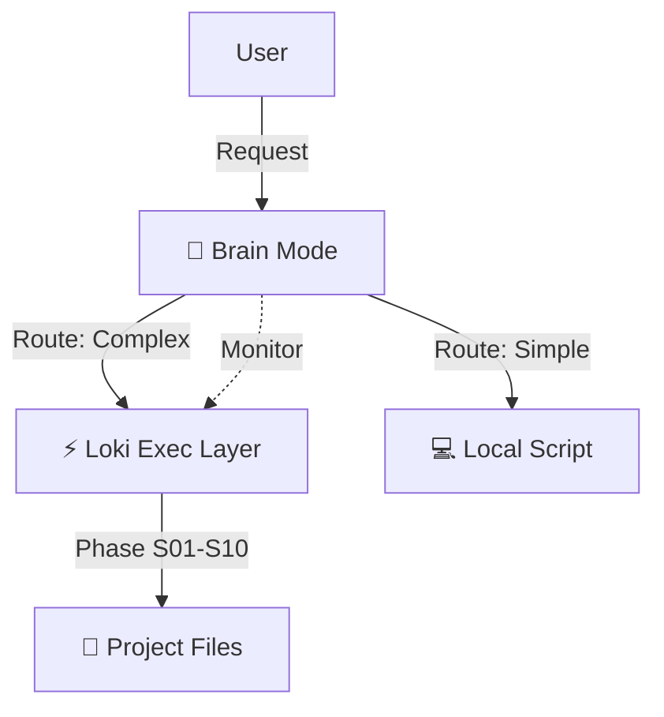

# AGENTS.md — Universal Agent Configuration Template

> This file is the single source of truth for all AI coding agents on this project.
> Fill in every [PLACEHOLDER] before starting. Agents read this file first.
> Symlinked to: .cursorrules | .claude/CLAUDE.md | .gemini/settings.json | .codex/AGENTS.md

---

## 1. Project Identity (REQUIRED VARIABLES)
> **ACTION REQUIRED**: Replace all `[PLACEHOLDER: ...]` values below with your specific stack.

```yaml
project_name: "[PLACEHOLDER: My Project]"
description: "[PLACEHOLDER: One sentence about what this project does]"
repo_url: "[PLACEHOLDER: https://github.com/org/repo]"

runtime: "[PLACEHOLDER: Node.js 22 | PHP 8.3 | Python 3.12 | Go 1.22]"
language: "[PLACEHOLDER: TypeScript 5.x | PHP | Python | Go]"
framework: "[PLACEHOLDER: Fastify | Laravel | FastAPI | Gin]"
package_manager: "[PLACEHOLDER: pnpm | npm | yarn | composer | pip | go mod]"

database: "[PLACEHOLDER: PostgreSQL 16 | MySQL 8 | MongoDB 7 | SQLite]"
orm: "[PLACEHOLDER: Prisma | Eloquent | SQLAlchemy | GORM]"
cache: "[PLACEHOLDER: Redis | Memcached | none]"

deployment_target: "[PLACEHOLDER: Docker/K8s | Vercel | AWS Lambda | VPS]"
ci_cd: "[PLACEHOLDER: GitHub Actions | GitLab CI | CircleCI]"
```

---

## 2. Operational Commands

> These are the EXACT commands agents must use. No approximations.
> Wrong: "run tests". Right: the exact command below.

```bash
# Install dependencies
install: "[PLACEHOLDER: pnpm install | composer install | pip install -r requirements.txt]"

# Start development server
dev: "[PLACEHOLDER: pnpm dev | php artisan serve | python -m uvicorn main:app --reload]"

# Run ALL tests (must pass before any PR)
test: "[PLACEHOLDER: pnpm test | php artisan test | pytest | go test ./...]"

# Run tests with coverage report
test_coverage: "[PLACEHOLDER: pnpm test --coverage | php artisan test --coverage | pytest --cov]"

# Run specific test file
test_single: "[PLACEHOLDER: pnpm vitest run src/path/to/file.test.ts]"

# Build for production
build: "[PLACEHOLDER: pnpm build | composer install --no-dev | go build ./...]"

# Type checking (must pass before any PR)
typecheck: "[PLACEHOLDER: pnpm tsc --noEmit | phpstan analyse --level=9 | mypy .]"

# Linting (must pass before any PR)
lint: "[PLACEHOLDER: pnpm eslint . | pint | ruff check .]"

# Formatting
format: "[PLACEHOLDER: pnpm prettier --write . | pint | ruff format .]"

# Security scan (dependency audit)
security_scan: "[PLACEHOLDER: pnpm audit | composer audit | pip-audit | snyk test]"

# Database migrations
migrate: "[PLACEHOLDER: pnpm prisma migrate dev | php artisan migrate | alembic upgrade head]"

# Generate API docs
docs: "[PLACEHOLDER: pnpm typedoc | php artisan scribe:generate]"
```

---

## 3. Architecture Rules

> These rules are enforced by the agentic-linter skill on every PR.
> Violations must be fixed before merging.

### Layer Definitions

```
[PLACEHOLDER — adapt to your architecture pattern]

<!-- OPTIONAL: Architecture Examples -> Document layer mappings (e.g., Domain -> Application -> Adapters -> Infrastructure) -->
```

### Forbidden Patterns

```
# NEVER do these:
- Direct database access from controllers (use use-cases / actions)
- Business logic in views or API response formatters
- Circular imports between any two modules
- Importing framework-specific code in domain layer
- Hardcoded configuration values (use env vars + config files)
- [PLACEHOLDER: add project-specific forbidden patterns]
```

### Directory Purpose Map

```
[PLACEHOLDER: Document what each top-level directory is for]

<!-- OPTIONAL: Directory Map Example -> e.g., src/ -> src code, tests/ -> test suites, docs/ -> Architectural info -->
```

---

## 4. Code Style & Patterns

<!-- OPTIONAL: Code Style Specifics -> Document naming conventions, OOP vs Functional, Error handling, State management, API response format, Import styles -->
---

## 5. Workflow for Agents — Review-Driven Development

Agents MUST follow this order. Skipping steps is forbidden.

Agents must always verify that agents/memory files are kept up-to-date at each task (episodic, metrics, semantic, AUDIT_LOG, CONTINUITY, PROJECT_STATE), according to this project structure and logic.

Agents must read agents/guides/ skills/ templates/ for any relevant information discovered during research and added by you or other agents, and use appropiate ones or knowledge in them, at each step and task of R&D, if needed.

**CRITICAL MANDATE: Optimal Skill, Guide & MCP Selection**
Agents must **always analyze the task/prompt and select (or ask the user to confirm/select) the best `guides` and `skills`** for the specific tasks, user queries, actions being performed, gate passing, or system workflows. Do not default to generic execution if a specialized skill or guide exists. If in doubt, present the best options to the user and ask for their selection.
Additionally, agents must explicitly evaluate whether any **MCP (Model Context Protocol) servers** (either universal or task-specific) would optimally assist the task. If essential or highly beneficial MCP servers are not currently enabled, agents *must recommend* the user to enable them before proceeding.

**CRITICAL MANDATE: Default Cost & Budget Optimization**
Agents must continuously design and execute solutions focusing on minimizing token load, context size, and api costs by default. Do not use complex swarms or expensive remote SOTA models for simple changes. If a task necessitates an expensive strategy, complex reasoning traces, or high-cost MCP tools, agents **must always ask the human user for explicit approval** before deploying that approach, providing a brief explanation for the cost-to-benefit ratio.

Apply the four cost levers (see `agents/guides/ops/cost-optimization.md` → *LLM & Agentic Cost Control*): (1) **prompt caching** — keep stable context first/byte-identical so the provider serves the cached prefix cheaply; (2) **context budgeting** — load the minimum skills/guides, prefer `context_cost: low` and only pull `high` when needed; (3) **model tiering** — route simple work to the cheapest reliable model (`gabbe route`), reserve SOTA for hard/critical tasks; (4) **batching** — run non-interactive bulk work via batch APIs (−50%). These optimizations must **never** weaken the quality gates, the 10-phase SDLC, or human-in-the-loop escalation.

**CRITICAL MANDATE: Spec-Driven Development (first-class)**
Work flows **spec → evals → test → code**, never code-first. Before implementing any non-trivial feature, ensure a spec exists: capture requirements in **EARS** syntax (`WHEN [event] THE SYSTEM SHALL [response]`), record them (`product/req-elicitation.skill`, `product/spec-writer.skill`, `templates/product/SPEC_TEMPLATE.md`, `guides/planning/product-requirements.md`), and maintain a **golden thread** of traceability: every requirement → a spec item → a test → code → an audit entry. No requirement without a test (Article I). If no spec exists for a task, write/clarify it first (`clarify.skill`) — ambiguity is resolved in the spec, not in the code.

**CRITICAL MANDATE: Human–Agent Collaboration (Manager, not Operator)**
The human (developer / engineer / architect) is a **manager, not an operator**: delegate the objective, observe progress, intervene on exceptions. Keep the human able to answer three questions at all times — **Purpose** ("what is this for?" — bound scope + non-goals via the spec), **Transparency** ("how is it working?" — legible reasoning/tools/cost via observability), **Control** ("how do I steer it?" — pause/correct/approve via HITL gates). Prefer an asynchronous, observable surface (memory + audit trace + the task/gate board) over pretending a long task is instant. A change is "done" only when all three hold (see `guides/principles/human-agent-collaboration.md`).

**CRITICAL MANDATE: Observability by Default (first-class)**
Every run, decision, model call, and tool call must be **observable** — never a black box. Emit a decision/span trace with token usage and **cost attribution** per step (`core/audit-trail.skill`, `core/agent-analytics.skill`; the optional `gabbe audit`/`runs` CLI). Tag model/tool spans with the **OpenTelemetry GenAI semantic conventions** (`gen_ai.usage.*`, model, operation) and a decision-span hierarchy (root → plan → discover → execute → retrieve). Redact prompt/response content by default (privacy — Article IV); record references, not secrets. Observability must hold even without the CLI: the Markdown memory (`AUDIT_LOG.md`, decision log) is the authoritative trace.

### Step 0 — Preflight & Clarify (before anything else)
```
Run preflight.skill as the FIRST action of every session and every major task:
  1. Auto-checks: integrity-check (fast) → confirm memory + working tree are coherent.
  2. Load index SUMMARIES (not bodies): agents/{skills,guides,templates,personas}/00-index.md
     → know what capabilities exist before choosing generically.
  3. Load memory headers with decay-aware priming (PROJECT_STATE, CONTINUITY, latest snapshot).
  4. Surface cost posture: GABBE_AUTONOMY (ask|auto|hybrid, default hybrid) + remaining budget.
  5. Recommend the OPTIMAL set for the task (skills/guides/persona/MCP), ranked by
     relevance × (1/context_cost); pick a reasoning pattern proportionate to task + budget.
  6. Flag new/changed capabilities since last preflight (defer adoption to update-scan.skill).
  7. End by invoking clarify.skill → ask the focused batch of clarifying questions
     (and "questions you should ask me") before proceeding.
Do not begin implementation until blocking questions are answered, unless the autonomy
posture is `auto` AND the task is cheap AND reversible.
```

### Step 1 — Load Context (every session start)
```
1. Read this AGENTS.md completely
2. Read CONSTITUTION.md if it exists
3. Read the relevant task from project/TASKS.md (if project/TASKS.md exists)
4. If agents/memory/PROJECT_STATE.md exists: read it (understand current SDLC phase)
5. If agents/memory/CONTINUITY.md exists: read it (understand past failures to avoid)
```

### Step 2 — Plan Before Coding
```
Before touching any file, write a brief implementation plan.

  - What files will you create or modify?
  - What is the expected behavior change?
  - What tests will you write?
  - Does this change affect any architecture boundaries?
  - Are there any knowledge gaps? (If yes -> invoke knowledge-gap.skill)
For complex tasks: write PLAN.md or use PLAN_TEMPLATE.md

```

### Step 3 — Test First (TDD Red Phase)
```
Write the failing test BEFORE writing implementation code.
<!-- OPTIONAL: Detailed TDD Red -> The test MUST fail (Red). Do not implement features not covered by a test -->
```

### Step 4 — Implement (TDD Green Phase)
```
Write the minimal code to make the failing test pass.
<!-- OPTIONAL: Detailed TDD Green -> Do not add features not covered by a failing test -->
```

### Step 5 — Verify (must all pass before marking done)
```
Run: [test command] -> must pass
Run: [typecheck command] -> must pass
Run: [lint command] -> must pass
<!-- OPTIONAL: Deep Verification -> E.g. Run agentic-linter to enforce boundaries -->
```

### Step 6 — Refactor
```
Improve code quality while keeping all tests green.
<!-- OPTIONAL: Refactoring Metrics -> E.g. Complexity < 10, no duplication > 3 -->
```

### Step 7 — Log & Complete
```
Write entry to agents/memory/AUDIT_LOG.md
Update task status in project/TASKS.md to DONE
Refresh agents/memory/RESUME_POINTER.md (state-preserve.skill) — keep the
  "next action" current so any future session resumes losslessly
<!-- OPTIONAL: High-Level Orchestration -> E.g. sdlc-checkpoint.skill -> mark phase done -->
```

> **State preservation is continuous, not just at Step 7.** Per `state-preserve.skill`
> and §13, save incrementally after every meaningful step and flush a full snapshot
> before budget/time runs out — assume a cutoff can happen at any moment.

---

## 6. Governance & Security

### 🛡️ Mandatory Security & Guardrails
Agents MUST adhere to the **Security & Guardrails** section appended to the bottom of whatever skill they are currently executing. Bypassing these skill-specific guardrails is strictly forbidden.

### Forbidden Actions (agents must never do these without explicit human approval)
```
- Commit .env files or any file containing secrets
- Push directly to main/master branch
- Change CI/CD pipeline configuration
- Modify CONSTITUTION.md
- Switch to a different library/framework than what's defined in Project Identity
- Make breaking API changes
- Add new environment variables without documenting them
- Disable or modify linting/testing rules
- Grant elevated permissions or bypass authentication
- [PLACEHOLDER: add project-specific forbidden actions]
```

### Secrets Policy
```
All secrets MUST be in environment variables.
Local dev: .env file (always in .gitignore)
CI/CD: GitHub Secrets / GitLab CI Variables / AWS Secrets Manager
Never hardcode API keys, passwords, tokens, or connection strings.
Use: [PLACEHOLDER: dotenv | .env.vault | AWS Secrets Manager | HashiCorp Vault]
```

### PR Format (Conventional Commits)
```
Format: <type>(<scope>): <subject>

Types: feat | fix | docs | style | refactor | test | chore | perf | sec | deps
Scope: module or layer name (optional)

<!-- OPTIONAL: Commit Examples -> e.g. feat(auth): add OAuth2 login -->

PR body must include:
  - What changed and why
  - Test coverage for the change
  - Breaking changes (if any)
  - Security implications (if any)
```

### Quality Gates (all must pass before PR merges)
```
<!-- OPTIONAL: Quality Gates Specifics -> Document testing, linting, code coverage >99%, CI integration gates -->
```

---

## 7. Research Policy

Agents must use authoritative sources. Never guess or hallucinate.

### Source Tiers (in order of trust)
```
<!-- OPTIONAL: Source Tiers -> Tier 1: Official docs/Specs. Tier 2: Academic. Tier 3: Verified blogs. Avoid: Reddit/SO. -->
```

### Research Gate -- mandatory before:
```
- Using any library not in existing package.json / composer.json
- Calling any API method not confirmed in official docs
- Implementing any security mechanism or cryptographic approach
- Interpreting any regulatory requirement (GDPR, OWASP, HIPAA)
```

### When to invoke research.skill
```
"I'm not sure about X" -> knowledge-gap.skill -> research.skill -> confirm before coding
If library version not found in official docs -> do NOT assume behavior -> report to human
Use Context-7 MCP for library docs (prevents hallucinated deprecated API usage)
```

---

## 8. Self-Healing Policy

Agents may autonomously fix failures up to 5 attempts.

### What agents may self-heal (no human approval needed):
```
- Type errors and lint errors
- Test assertion updates when spec changed
- Deprecated API calls (found via Context-7 MCP)
- Dependency version bumps (patch/minor versions only)
- Import path corrections
- Formatting and code style issues
```

### What requires human decision:
```
- Architecture or library changes
- Breaking API changes (any consumer affected)
- Security-affecting changes (auth, permissions, encryption)
- Major version dependency bumps
- Any modification to CONSTITUTION.md
- Any change to CI/CD pipelines
- Any change that removes or weakens a security control
```

### Self-Heal Escalation Protocol
After 5 failed attempts, agent MUST:
```

1. STOP all autonomous action
2. Create structured escalation report:
   - Error description
   - All 5 attempts made and their outcomes
   - Research findings
   - Recommended human decision
3. Write to AUDIT_LOG.md
4. Wait for human response before continuing

```

### Self-Evolving Policy (within cost + permission bounds)
The system may keep itself current and improve over time — discovering new/better
skills, tools, MCP servers, and models and adopting the best per scenario — but
only inside hard bounds. Use `update-scan.skill` for the discovery loop.

```
ALLOWED (gated by GABBE_AUTONOMY + budget):
  - Adopt a cheaper/better model or tool for a task when reversible and validated
  - Import a vetted external skill (validate_skills + slug/egress scan first)
  - Refine a prompt/persona from SUCCESSFUL trajectories only (A2-style)

ALWAYS REQUIRES HUMAN APPROVAL (even under GABBE_AUTONOMY=auto):
  - Anything expensive, SOTA-model, or irreversible
  - Pulling in externally-sourced code that runs (supply-chain surface)
  - Any change to protected files (see below)

GUARDRAILS:
  - Misaligned-replay guard: NEVER feed failed/known-bad trajectories into the
    evolution pool — the system must not amplify its own mistakes.
  - Protected files: never edit build/IaC/CI/dependency manifests
    (package.json, pyproject.toml, lockfiles, Dockerfiles, workflow YAML)
    unless the failure is specifically dependency/build-related and within the
    self-heal allowlist above. Otherwise escalate.
  - Policy-as-code self-enforcement: when no external compliance proxy is
    present, the agent self-enforces these rules and logs every adoption,
    recommendation, and rejection to AUDIT_LOG.md (auditable + reversible).
  - Prefer canary/shadow adoption with easy rollback; version evolved components.
```

---

## 9. Human-in-the-Loop Triggers

The agent MUST stop and ask the human when encountering:

```
ALWAYS pause and ask:
  - Any breaking change to a public API
  - Ambiguous requirements (multiple valid interpretations)
  - Security trade-offs (convenience vs security)
  - Budget or scope changes
  - Regulatory requirement interpretation (GDPR, HIPAA, etc.)
  - Architectural change (new service, new database, library switch)
  - Any discovered vulnerability that requires feature disablement
  - "I've tried 5 times and cannot fix this" (see Self-Healing Policy)
  - Any expensive / SOTA-model / irreversible action — even under GABBE_AUTONOMY=auto
  - Adopting a new tool, model, or externally-sourced skill (see update-scan / skills-registry)
  - [PLACEHOLDER: add project-specific escalation triggers]

<!-- OPTIONAL: Escalation Format -> Detail issue, options considered, and recommendation -->
```

**Clarify at every major step (not just at session start).** Per `clarify.skill`, the agent
estimates its own uncertainty before each major step and asks a focused batch of clarifying
questions (≈3–6, highest-impact first) whenever interpretation is ambiguous, a decision input is
missing, retrieval/verification failed, or the action is expensive/irreversible. The amount of
questioning scales with the `GABBE_AUTONOMY` posture (ask → clarify freely; hybrid → clarify on
real ambiguity; auto → silent for cheap/reversible work but always pause for the cases above).
Record assumed defaults in `agents/memory/AUDIT_LOG.md` so silence is informed, not a guess.

---

## 10. Tool-Specific Overrides

### Claude Code (claude.ai/code, Claude Code CLI)
```
- Skills: Use slash commands matching skill names (e.g., /tdd-cycle, /code-review)
- Memory: Use TodoWrite tool for task tracking
- Hooks: Check .claude/settings.json for hook configuration
- Context: This AGENTS.md is symlinked to .claude/CLAUDE.md
```

### Cursor
```
- Context: This AGENTS.md is symlinked to .cursorrules
- Skills: Reference skill files directly in conversation
- Agent mode: @workspace for codebase-wide context
```

### GitHub Copilot
```
- Context: Instructions from .github/copilot-instructions.md (symlinked)
- Skills: Reference skills/ directory files in comments or conversation
```

### Gemini CLI
```
- Context: This AGENTS.md is symlinked to .gemini/settings.json (instructions field) + GEMINI.md
- Skills: Symlinked to .agent/skills/ -- invoke by trigger keywords
- MCP: Configure .gemini/mcp_config.json using templates/MCP_CONFIG_TEMPLATE.json
```

### Google Antigravity
```
- Context: Reads the root AGENTS.md (priority AGENTS.md → GEMINI.md → defaults, v1.20.3+)
- Skills: Emitted to .agents/skills/<slug>/SKILL.md (agentskills.io standard)
- Models: Picks up CLAUDE.md when running a Claude model — same project context
```

### OpenCode (local-first)
```
- Context: Reads the root AGENTS.md + an opencode.json `instructions` array
- Skills: Emitted to .agents/skills/<slug>/SKILL.md (agentskills.io standard)
```

### Zed / Continue / Roo Code / Kilo Code
```
- Context: Read the root AGENTS.md (agents.md standard); Zed also via .rules,
  Continue via .continue/rules/, Roo via .roo/rules/, Kilo via .kilocode/rules/
- Skills: Reference agents/skills/ directly, or the universal .agents/skills/ tree
```

---

## 11. Monorepo Support

For monorepos, this root AGENTS.md applies globally.
Package-level AGENTS.md files override root for that package's scope.

```
<!-- OPTIONAL: Monorepo Setup Example -> Add AGENTS.md per package to override root settings -->
```

Agent context priority: Package AGENTS.md > Root AGENTS.md

---

## 12. References

### Skill Access
- **Search First**: Before coding, search for relevant skills:
    - **Cursor**: Check `.cursor/rules/` for `.mdc` files.
    - **VS Code / Copilot**: Check `.github/skills/` or invoke via slash command.
    - **Claude Code**: Use `/skill-name` or check `.claude/skills/`.
    - **Gemini**: Skills are auto-loaded from `agents/skills`.
- **Read Instructions**: Read the full content of the skill file (e.g., `tdd-cycle.skill.md` or `tdd-cycle.mdc`) before use.

```
Project law:          agents/CONSTITUTION.md
Skills registry:      agents/skills/00-index.md
Language guides:      agents/guides/00-index.md
Templates:            agents/templates/00-index.md
Personas agents:      agents/personas/00-index.md
Brain Patterns:       agents/skills/brain/README.md
Quick reference:      QUICK_GUIDE.md
Project memory:       agents/memory/PROJECT_STATE.md
Past failures:        agents/memory/CONTINUITY.md
Decision log:         agents/memory/AUDIT_LOG.md
```
- **Skills**: `agents/skills/` (Master) → `.cursor/rules/` (*.mdc) | `.github/skills/` | `.claude/skills/`
- **Personas**: `agents/personas/` (30+ specialized agent roles for Loki Mode)
- **Memory**: `agents/memory/`

---

## 13. Session & Continuity

Every session, agents MUST:

```
START of session:
  1. Read this AGENTS.md
  2. Read agents/memory/PROJECT_STATE.md (if exists) -> understand current state
  3. Read agents/memory/CONTINUITY.md (if exists) -> understand past failures
  4. Load latest agents/memory/episodic/SESSION_SNAPSHOT/ (if exists)
  5. If resuming: use session-resume.skill for full recovery
  6. Run integrity-check.skill before starting new work on existing code

CONTINUOUSLY (never lose progress — assume you may be cut off at any moment):
  Use state-preserve.skill. An agent can be stopped without warning — tokens
  exhausted, turn/time limit reached, network drop, crash — usually with NO
  chance for a graceful shutdown. So state must be saved INCREMENTALLY, not
  only at session end:
  1. After each meaningful step: refresh agents/memory/RESUME_POINTER.md
     (current task, last completed step, the precise NEXT ACTION, open
     questions) and append the outcome to agents/memory/AUDIT_LOG.md.
  2. Pre-exhaustion flush: when budget/tokens are low or wall-time/turns near
     the cap — or before any long/irreversible action — write a FULL snapshot
     FIRST (RESUME_POINTER first, then snapshot/PROJECT_STATE/CONTINUITY).
     Never spend your last tokens on work whose result you cannot persist.
  3. At all times the on-disk Markdown memory must be enough for a fresh agent
     to resume losslessly via session-resume.skill. The optional gabbe CLI
     (runs/replay/resume) augments this but the Markdown files are authoritative.

PORTABLE (switch coding agent or LLM anytime — state-portability.skill):
  State is agent-agnostic. To move work to a different agent/LLM and continue
  as before, DEHYDRATE (export STATE_HANDOFF.md + a lossless bundle of
  agents/memory + project/TASKS.md + gabbe.config.json + instructions) and
  HYDRATE it in the destination agent, then run session-resume + preflight.
  Memory + instructions + state are a fully compatible export/import; the
  single STATE_HANDOFF.md is enough even for a filesystem-less LLM chat.
  Helpers: agents/scripts/state_export.sh and state_import.sh. Never export
  secrets; merge on import (never clobber newer local state without asking).

END of session:
  1. Update project/TASKS.md with current status of all in-progress tasks
  2. Write session summary to agents/memory/episodic/ (DECISION_LOG_TEMPLATE.md)
  3. Update agents/memory/PROJECT_STATE.md with current SDLC phase
  4. Write all decisions/outcomes to agents/memory/AUDIT_LOG.md
  5. Update agents/memory/CONTINUITY.md with lessons learned
  6. Create SDLC checkpoint if a phase was completed
  7. If stopping mid-task: note exactly where you stopped and why (RESUME_POINTER)
```

---

## 14. Project-Specific Rules

```
[PLACEHOLDER: Add any additional project-specific rules, constraints, or context here.]

<!-- OPTIONAL: Examples -> e.g. "API consumed by mobile, 30-day deprecation", "no hardcoded i18n strings" -->
```

### Per-project policy: `project/gabbe.config.json` (optional)
A runtime-agnostic policy file the agent reads to tune itself to this project —
autonomy posture, budgets, model tiers, enabled MCPs, skill registries, and
protected files. Copy `docs/gabbe.config.example.json` to
`project/gabbe.config.json` and edit. The agent
applies it via `coordination/self-optimize.skill`; the optional `gabbe` CLI
surfaces it via `gabbe/config.py` (`GABBE_AUTONOMY`, `GABBE_PROJECT_CONFIG`).
Precedence for autonomy: env `GABBE_AUTONOMY` > config `autonomy` > `hybrid`.
See `docs/SCHEMA.md` → *Project policy config*.

---

# GABBE CLI Workflows (Optional)

> **Complete reference**: See `agents/guides/ops/gabbe-cli-workflows.md` for full details.
>
> **This section is optional.** The GABBE CLI provides platform controls (budget, audit, replay, escalation) but is NOT required. Agents can fully operate via markdown inference without it.

### Core CLI Integration
See `agents/guides/ops/gabbe-cli-workflows.md` for standard CLI workflows: Init, Sync, Verify, Status, Route, Forecast, and Brain execution controls. (Note: The GABBE CLI is an optional experimental tool; agents can fully rely on markdown inference execution otherwise).

---

# Loki & Brain — Agentic Orchestration

## Modes

### 1. 🧠 Brain Mode (`brain-mode.skill.md`)
> **The Strategist (System 2)**

- **Role**: Meta-Cognitive Orchestrator.
- **Function**: Plans, Routes, and Optimizes.
- **Logic**: Active Inference (Free Energy Principle) & Experimental CLI Platform Controls (`gabbe/brain.py`).
- **Use Case**: Complex, ambiguous, or high-stakes projects.
- **Key Feature**: **Dynamic Cost Routing** (Local vs Remote).
- **Standalone Mode**: Can fully run purely via LLM markdown inference without the `gabbe` CLI.

**Trigger**: `gabbe brain activate`, `supermode`

---

### 2. ⚡ Loki Mode (`loki-mode.skill.md`)
> **The Executor (System 1)**

- **Role**: SDLC Orchestrator.
- **Function**: Executes the 10-Phase Engineering Lifecycle.
- **Logic**: Deterministic Workflow (S01 -> S10).
- **Use Case**: Building software with strict process requirements.
- **Key Feature**: **Human-in-the-Loop Gates** and strictly bounds execution within `gabbe` CLI limits.
- **Standalone Mode**: Can fully run purely via LLM markdown inference without the `gabbe` CLI.

**Trigger**: `loki`, `orchestrate`

---

## How they work together

Brain Mode **wraps** Loki Mode.

1.  **Brain Mode** receives a request ("Build X").
2.  It analyzes complexity and budget.
3.  It spins up **Loki Mode** to handle the SDLC.
4.  It monitors Loki's progress, intervening if:
    - Costs spike.
    - Errors loop.
    - Requirements drift.

### Active Orchestration Diagram



Text Overview (ASCII):
```text
[User] --(Request)--> [Brain Mode 🧠]
                        |
                        +--(Route: Complex)--> [Loki Exec Layer ⚡] --(Phase S01-S10)--> [Project Files 📂]
                        |                           ^
                        |                           | (Monitor)
                        |                           |
                        +--(Route: Simple)---- [Local Script 💻]
```


---

*Last updated: [DATE]*
*GABBE Kit version: 0.9.6*
*This file is maintained by the team and updated when project conventions change.*

---
