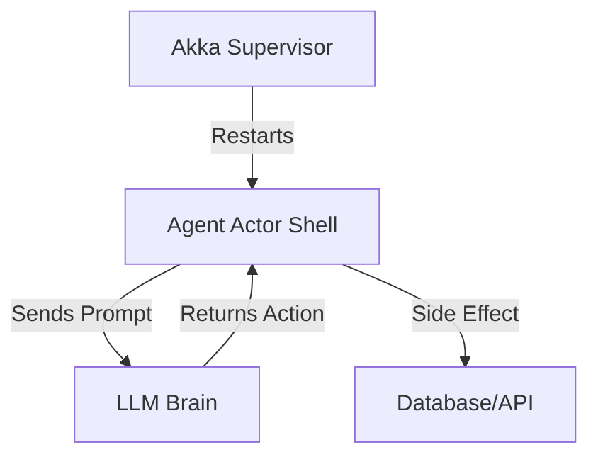

# Actor Models & Agent Frameworks

**Bridging Classic Distributed Systems with Modern AI Agents.**

This guide explains the theoretical and practical convergence of the **Actor Model** (1973) and **Agentic AI** (2026).

---

## 1. The Convergence

| Concept | Classic Actor (Akka/Erlang) | Modern AI Agent (LangGraph/Loki) |
|---|---|---|
| **Unit of Comp** | Actor (Process) | Agent (Loki Persona) |
| **Communication** | Async Messages (Mailbox) | Prompts / Structured JSON |
| **State** | Private, Mutable (in RAM) | Context Window / Vector DB |
| **Failure** | "Let it Crash" (Supervisors) | Self-Correction / Retries |
| **Topology** | Mesh / Tree | Graph / Swarm |

**Key Insight:** AI Agents *are* Actors, but with a probabilistic brain instead of a deterministic script.

---

## 2. Framework Comparison

### Classic (Infrastructure Layer)
*   **Erlang/Elixir (OTP):** The gold standard for "99.9999999% uptime". Perfect for the *control plane* of a swarm.
*   **Akka (Scala/Java):** JVM-based actor system. Good for high-throughput data processing.
*   **Proto.actor (Go/C#):** Lightweight, cross-platform actors.

### Modern (Cognitive Layer)
*   **LangGraph:** Adds "State Machines" and "Cyclic Graphs" to Agents. Best for reasoning loops.
*   **Microsoft AutoGen:** Explicitly uses "Conversational Agents" which act like Actors sending text messages.
*   **Loki (This Kit):** Uses a **Swarm Topology** where the "Orchestrator" is the Supervisor Actor.

---

## 3. Implementing the Hybrid Architecture

The strongest systems in 2026 use **Actors for Plumbing** and **Agents for Reasoning**.

### Pattern: The "Shell & Brain"
*   **The Shell (Go/Elixir Actor):** Handles networking, mailbox, retries, and determining "Is the agent alive?".
*   **The Brain (Python/LLM Agent):** The internal logic function called by the Shell when a message arrives.

---

## 4. Best Practices

1.  **Mailboxes:** Agents are slow. Your Actor system must have *large* mailboxes or backpressure to handle the speed mismatch (ms vs sec).
2.  **Supervision Strategies:**
    *   *Hallucination Exception:* -> **Restart** (Clear context, try again).
    *   *Tool Error:* -> **Resume** (Keep context, try different tool).
3.  **Addressability:** Give every Agent a stable URL or PID (e.g., `actor://swarm/eng-backend/ipv4`).

---

## 5. References
*   [The Actor Model (Hewitt, 1973)]
*   [Erlang OT Design Principles]
*   [LangGraph Documentation]
