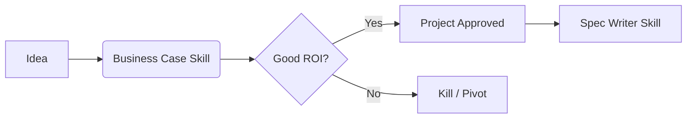

# Strategic Analysis Guide
<!-- Connects Business Value, User Needs, and System Architecture -->

---

## Overview

Strategic Analysis is the **"Phase 0"** of the Agentic SDLC. Before writing requirements (Spec-Driven Development), we must answer three fundamental questions:

1.  **Business:** Is this worth investigating? (Business Case)
2.  **User:** Who is this for and what do they need? (Design Thinking)
3.  **System:** How does this impact the whole? (Systems Thinking)

These workflows produce the *raw material* meant to be consumed by the `spec-writer.skill`.

---

## 1. Business Link (ROI)

**Tool:** `business-case.skill`
**Output:** `product/BUSINESS_CASE_TEMPLATE.md`

Use this when you have a feature idea but aren't sure if it pays off.

### Key Questions
- What is the cost of doing nothing?
- What is the Payback Period?

---

## 2. Design Thinking (User Empathy)

**Tool:** `design-thinking.skill`
**Output:** `product/EMPATHY_MAP_TEMPLATE.md`, `docs/strategic/USER_JOURNEY.md`

Use this when requirements are vague or you don't fully understand the user's pain.

### Workflow
1.  **Empathize:** "Create an Empathy Map for [Persona]."
2.  **Define:** "Draft a Problem Statement based on the map."
3.  **Ideate:** "Brainstorm solutions for [Problem]."
4.  **Prototype:** "Describe a text-based wireframe for the solution."

The **Prototype** text becomes the primary input for the PRD.

---

## 3. Systems Thinking (Holistic View)

**Tool:** `systems-thinking.skill`
**Output:** `docs/strategic/SYSTEM_ANALYSIS.md`

Use this for complex bugs, re-architecture, or recurring incidents.

### The Iceberg Model
Instead of just fixing the **Event** (the bug), we dig deeper:
-   **Event:** The server crashed.
-   **Pattern:** It crashes every Friday at 4 PM.
-   **Structure:** Batch jobs run then, and we have no rate limiting.
-   **Mental Model:** "Internal jobs don't need limits."

### Causal Loop Diagrams
We map variables to find **Leverage Points**.
-   *Example:* "Adding more developers (A) increases communication overhead (B), which slows down velocity (C), which leads to pressure to add more developers (A)." -> **Reinforcing Loop (Vicious)**.

---

## Integration with SDD

These outputs are not shelf-ware. They are **context inputs**:

> "Agent, read `product/BUSINESS_CASE_TEMPLATE.md` and `product/EMPATHY_MAP_TEMPLATE.md`. Now, use the **spec-writer skill** to draft a PRD for the solution defined in the Business Case."

This ensures your Spec/PRD is:
1.  Financially viable.
2.  User-centric.
3.  Systemically sound.
