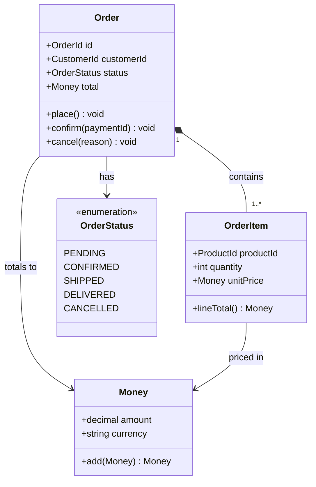
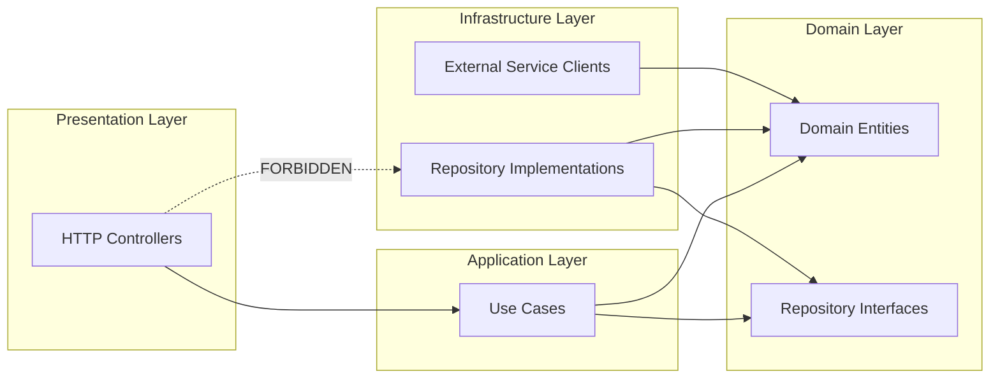
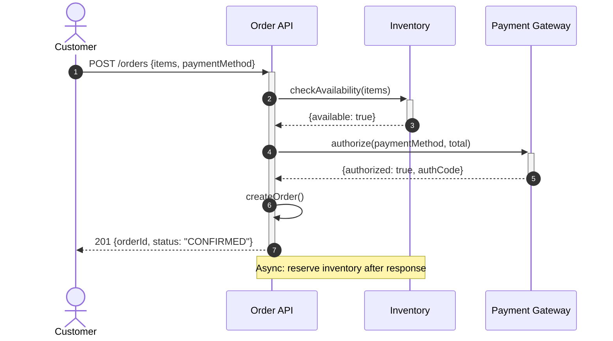
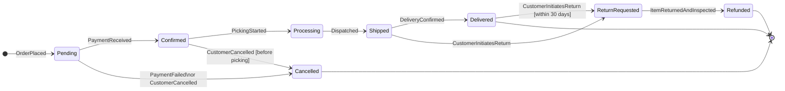
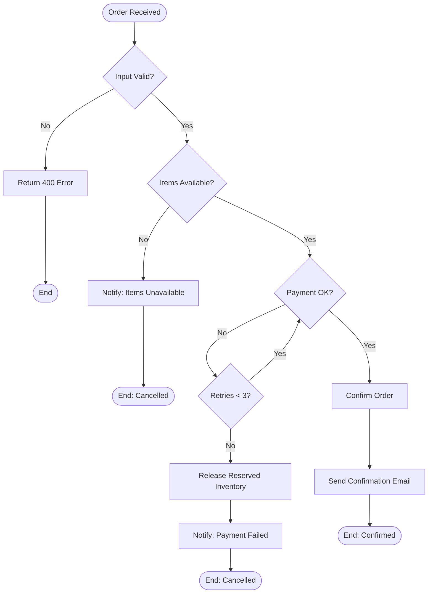
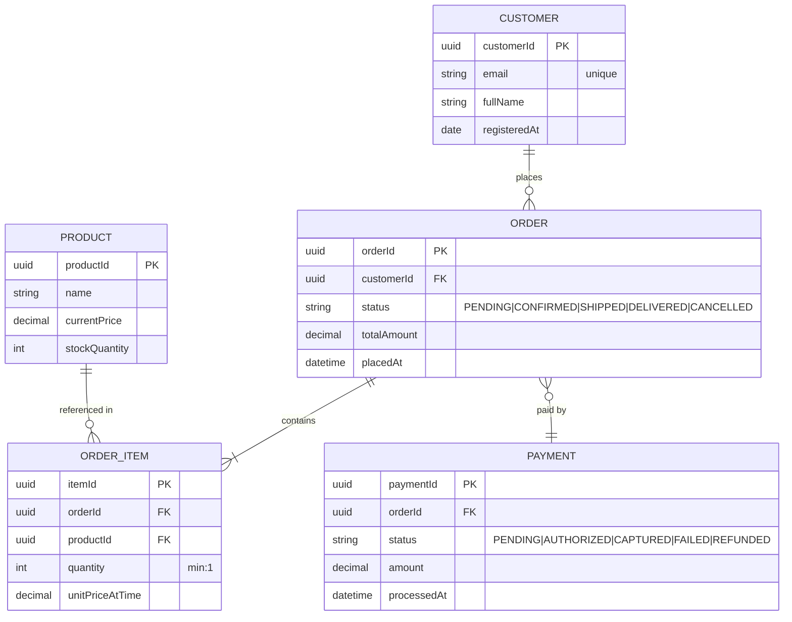
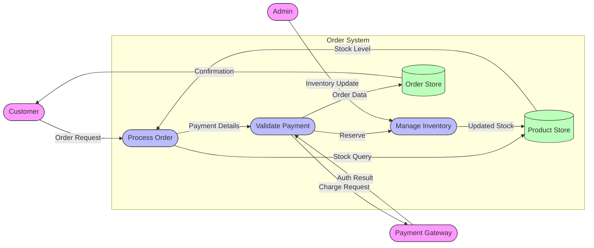
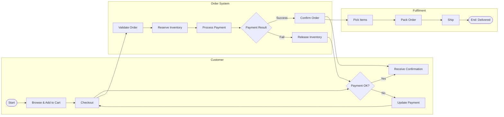

# Guide: Diagramming Standards
<!-- When to use which diagram type, notation standards, Mermaid syntax reference -->
<!-- Diagram families: UML, C4, ER, BPMN, DFD, Domain, Infrastructure -->
<!-- Technology-agnostic. All diagrams expressed in Mermaid where possible. -->

---

## The Golden Rule of Diagrams

**One diagram answers ONE question for ONE audience.**

```
Before drawing: ask "What question does this diagram answer?"
If no clear answer → don't draw it.
If the answer requires 2+ questions → split into 2 diagrams.

Good question: "What external actors interact with our system?" → System Context
Bad question:  "Everything about our system" → No single diagram type
```

---

## Diagram Selection Decision Tree

```
Q: What are you trying to show?

├── System structure / architecture
│   ├── Who uses it and what external systems interact?
│   │   → System Context Diagram (C4 Level 1)
│   ├── What are the major deployable units?
│   │   → Container Diagram (C4 Level 2)
│   ├── What components are inside one container?
│   │   → Component Diagram (C4 Level 3)
│   ├── How are classes/entities related in code?
│   │   → Class Diagram (UML)
│   └── How do packages/modules depend on each other?
│       → Package Diagram (UML) / Module Dependency Map
│
├── Runtime behavior / interactions
│   ├── How do components/actors interact over time for one scenario?
│   │   → Sequence Diagram (UML)
│   ├── What decision logic or process flow?
│   │   → Activity Diagram (UML) / Flowchart
│   ├── What states can an object be in?
│   │   → State Machine Diagram (UML)
│   └── How does a business process work end-to-end?
│       → BPMN Process Diagram / Swimlane
│
├── Data
│   ├── How are data entities related? (schema-level)
│   │   → Entity-Relationship Diagram (ER)
│   └── How does data flow through the system? (process-level)
│       → Data Flow Diagram (DFD)
│
├── Deployment / infrastructure
│   └── Where does the system run?
│       → Deployment Diagram (C4 Deployment or UML)
│
└── Domain / business
    ├── How do bounded contexts relate?
    │   → Context Map
    ├── What business capabilities exist?
    │   → Capability Map
    ├── What happened in what order?
    │   → Event Storming / Timeline
    └── Who does what, who makes decisions?
        → Use Case Diagram (UML) or RACI Matrix
```

---

## C4 Architecture Diagrams

The C4 model provides 4 levels of abstraction for software architecture.
Each level answers a different question for a different audience.

```
Level 1 — System Context:
  Question:  Who uses the system? What external systems interact?
  Audience:  Everyone — business, technical, non-technical
  Scope:     The entire system as one box

Level 2 — Container:
  Question:  What are the major deployable units?
  Audience:  Technical (developers, architects, DevOps)
  Scope:     Inside the system boundary — one step of zoom

Level 3 — Component:
  Question:  What are the major components inside ONE container?
  Audience:  Technical (developers, architects)
  Scope:     Inside one container

Level 4 — Code:
  Question:  How is one component implemented internally?
  Audience:  Developers (code author's immediate team)
  Scope:     Classes, interfaces, functions
  Note:      Use sparingly — code changes too fast to maintain L4 diagrams
```

### C4 Mermaid Syntax

```mermaid
%% Level 1 — System Context
C4Context
    title System Context — [Name]
    Person(id, "Label", "Description")
    Person_Ext(id, "Label", "Description")        %% external person
    System(id, "Label", "Description")
    System_Ext(id, "Label", "Description")        %% external system
    SystemDb(id, "Label", "Description")          %% database system
    Rel(from, to, "Label", "Protocol")
    Rel_Back(from, to, "Label")                   %% reverse arrow
    UpdateLayoutConfig($c4ShapeInRow="3")
```

```mermaid
%% Level 2 — Containers
C4Container
    title Container Diagram — [Name]
    Person(user, "User")
    System_Boundary(sys, "System Name") {
        Container(id, "Label", "Technology", "Description")
        ContainerDb(id, "Label", "Technology", "Description")
        ContainerQueue(id, "Label", "Technology", "Description")
    }
    System_Ext(ext, "External System")
    Rel(from, to, "Label", "Protocol")
```

---

## UML Structural Diagrams

### Class / Domain Diagram

```
Use when: showing the structure of domain objects, their attributes, and relationships.
In architecture context: use for domain model documentation (not database schema).

Relationship notation:
  Association:    A → B         (A uses B)
  Dependency:     A --> B       (A depends on B, weaker)
  Aggregation:    A <>-- B      (B is part of A, but exists independently)
  Composition:    A *-- B       (B is owned by A, destroyed with A)
  Inheritance:    A <|-- B      (B extends A)
  Realization:    A <|.. B      (B implements A's interface)

Multiplicity:
  1        exactly one
  0..1     zero or one
  *        zero or many
  1..*     one or many
  N..M     between N and M
```



### Package / Module Diagram

```
Use when: showing how code is organized into modules and their dependencies.
Rules:
  - Arrows show dependency direction (A → B means A imports/uses B)
  - Cyclic dependencies (A → B → A) are architectural violations
  - Group related packages into namespace boundaries
```



---

## UML Behavioral Diagrams

### Sequence Diagram

```
Use when: showing how actors/components interact for ONE specific scenario.
Best for: API flows, use case implementation, integration sequences.

Rules:
  - One scenario per diagram (not all scenarios combined)
  - Show actors (people) as stick figures; components as boxes
  - Solid arrow: synchronous call (caller waits)
  - Dashed arrow: return message
  - Open arrowhead: async message (caller doesn't wait)
  - Activation bars: show when an object is active
  - Use alt/opt/loop for conditional branches (keep simple — split if complex)
```



### State Machine Diagram

```
Use when: showing all valid states an entity can be in and how it transitions.
Best for: order lifecycle, user account states, subscription states.

Rules:
  - [*]: initial state (filled circle) and final state (circle with ring)
  - Transitions labeled with: event [guard] / action
  - Every state must be reachable from the initial state
  - No impossible transitions — every exit must have a guard if conditional
  - Keep to ≤ 10 states per diagram; split complex lifecycles into sub-states
```



### Activity Diagram / Flowchart

```
Use when: showing decision logic, process flow, algorithmic steps, or workflow.
Best for: business process documentation, algorithm description.

Rules:
  - Start and end nodes clearly shown
  - Decision diamonds: binary outcomes labeled on both exits
  - Parallel flows: fork/join bars for concurrent activities
  - Keep to one level — use sub-diagrams for complex sub-processes
  - Action verb phrases for activity labels
```



---

## Entity-Relationship Diagrams (ER / Data Model)

```
Use when: documenting the data model — entities, attributes, and relationships.
Note: Use for logical/conceptual model, not physical DB schema.
      Physical schema is implementation — ER is business model.

Cardinality (crow's foot notation):
  ||--||  : exactly one to exactly one
  ||--o{  : exactly one to zero-or-many
  ||--|{  : exactly one to one-or-many
  }o--o{  : zero-or-many to zero-or-many
  }|--|{  : one-or-many to one-or-many
```



---

## Data Flow Diagrams (DFD)

```
Use when: showing how data moves through a system — processes, stores, flows.
Best for: understanding data processing, compliance documentation.

DFD notation:
  External Entity: rectangle (source or sink of data, outside system)
  Process:         rounded rectangle or circle (transforms data)
  Data Store:      parallel lines (persistent storage)
  Data Flow:       labeled arrow (data in motion)

Levels:
  Level 0 (Context DFD): whole system as one process with all external entities
  Level 1: Explode main process into sub-processes with their flows
  Level 2+: Drill into sub-processes (use sparingly — only complex areas)

Mermaid approximation (no native DFD, use flowchart with shapes):
```



---

## BPMN / Swimlane Diagrams

```
Use when: showing who does what in a business process — multiple actors.
Best for: business process modeling, regulatory documentation.

Swimlane rules:
  - One lane per actor/role
  - Activities (tasks): in the lane of who performs them
  - Decision gates (diamonds): in the lane of who decides
  - Sequence flows: connect activities across lanes with arrows
  - Events (circles): start/end markers per lane
  - External systems: typically represented as separate pools/lanes
```



---

## Diagram Review Checklist

Before finalizing any diagram:

```
Content:
  □ Title: clear, descriptive, present tense ("Order Placement Flow")
  □ Scope: what's IN the diagram is clear (system boundary, time boundary)
  □ Audience: the diagram is pitched at the right level for its reader
  □ Accuracy: reflects the ACTUAL system, not the aspirational system
  □ Completeness: all significant elements included (not an exhaustive catalog)

Clarity:
  □ All elements labeled (no unlabeled arrows or boxes)
  □ Legend included if custom notation used
  □ Consistent level of abstraction throughout (no mixing levels)
  □ Key message visible at first glance (not buried in detail)
  □ Clutter: anything that can be removed without loss? Remove it.

Maintenance:
  □ Date/version noted on the diagram or in filename
  □ Owner identified (who is responsible for keeping this current?)
  □ Review trigger: "Update when [X] changes"
  □ Source file (Mermaid code) stored with the diagram, not just the image
```

---

## Tool Recommendations

```
Mermaid:          Text-based, renders in GitHub/GitLab/Notion/VS Code
                  Best for: C4, Sequence, State, ER, Flowchart, Class
                  Source: mermaid.js.org

PlantUML:         Text-based, broader UML support, requires Java
                  Best for: complex UML, timing diagrams
                  Source: plantuml.com

draw.io (diagrams.net): GUI, XML-based, stores as XML in repo
                  Best for: freeform diagrams, whiteboards, mixed notation
                  Source: diagrams.net

Structurizr:      Purpose-built C4 model tool
                  Best for: large system C4 diagrams with many views
                  Source: structurizr.com

Excalidraw:       Collaborative whiteboard, hand-drawn style
                  Best for: early-stage exploration, event storming
                  Source: excalidraw.com

Lucidchart/Miro:  Collaborative GUI tools
                  Best for: team workshops, stakeholder presentations
```

---

## Diagram Naming Conventions

```
File naming:
  [system]-[view-type]-[context].md or .mermaid

Examples:
  orderservice-sequence-place-order.md
  platform-container-diagram.md
  domain-context-map.md
  customer-lifecycle-state-machine.md
  data-model-order-management.md

Version in filename only if multiple significant versions need to coexist:
  architecture-container-v2.md (v2 = major redesign)
```
