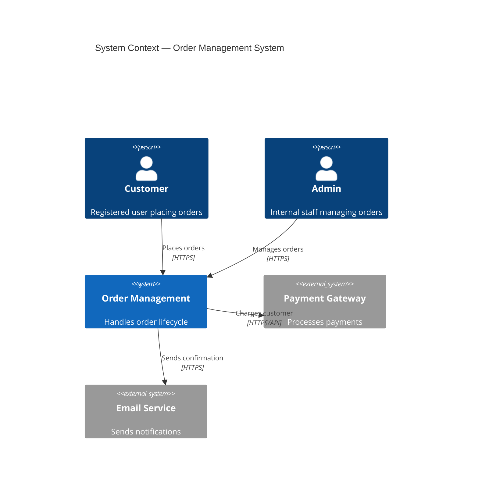
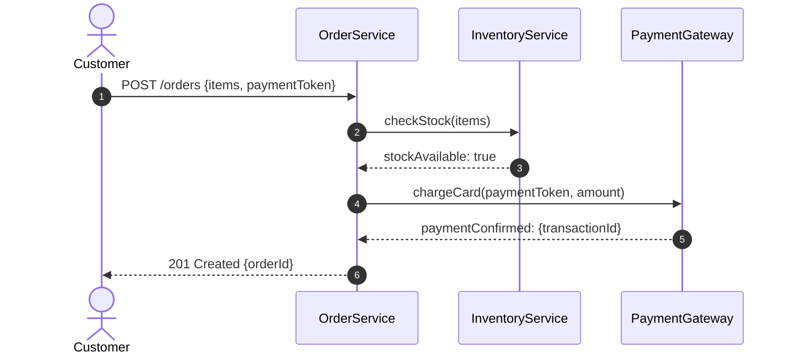
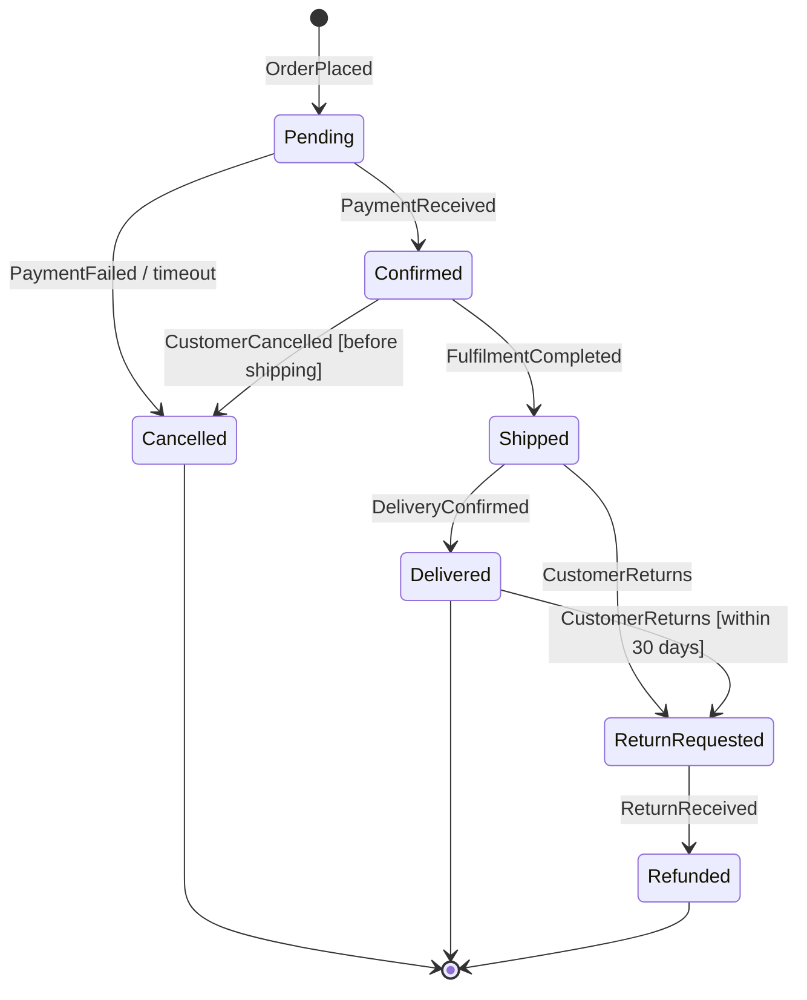
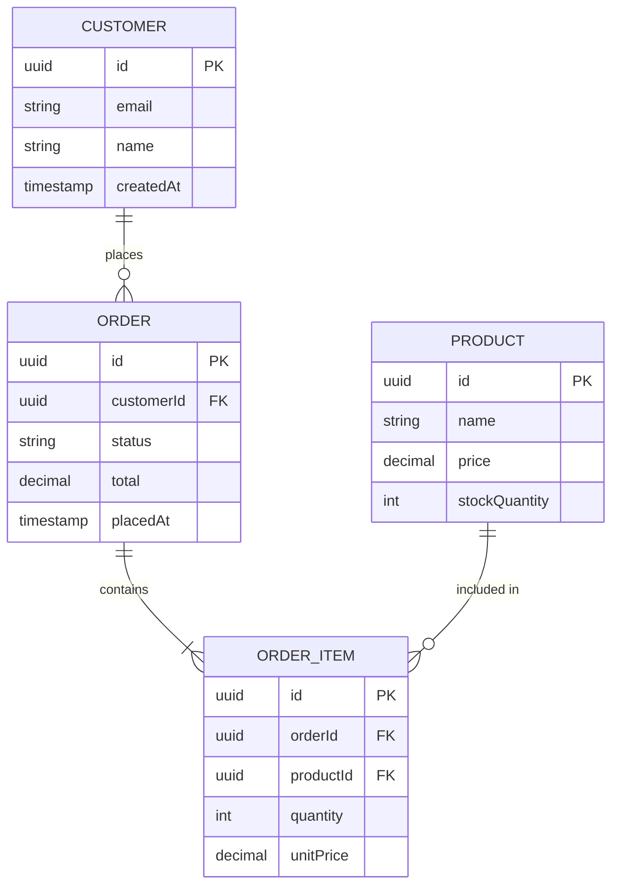
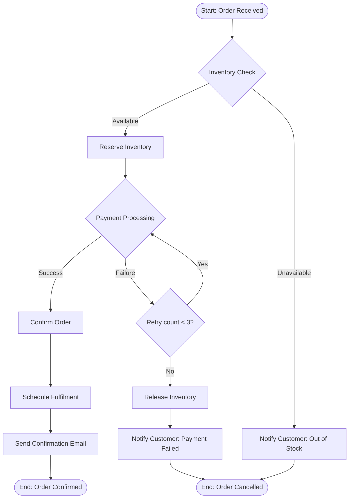
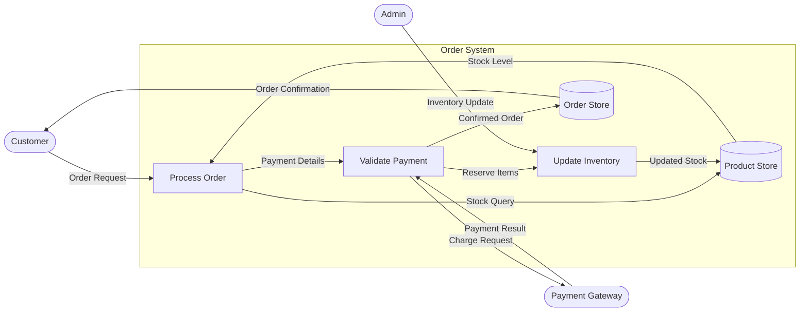
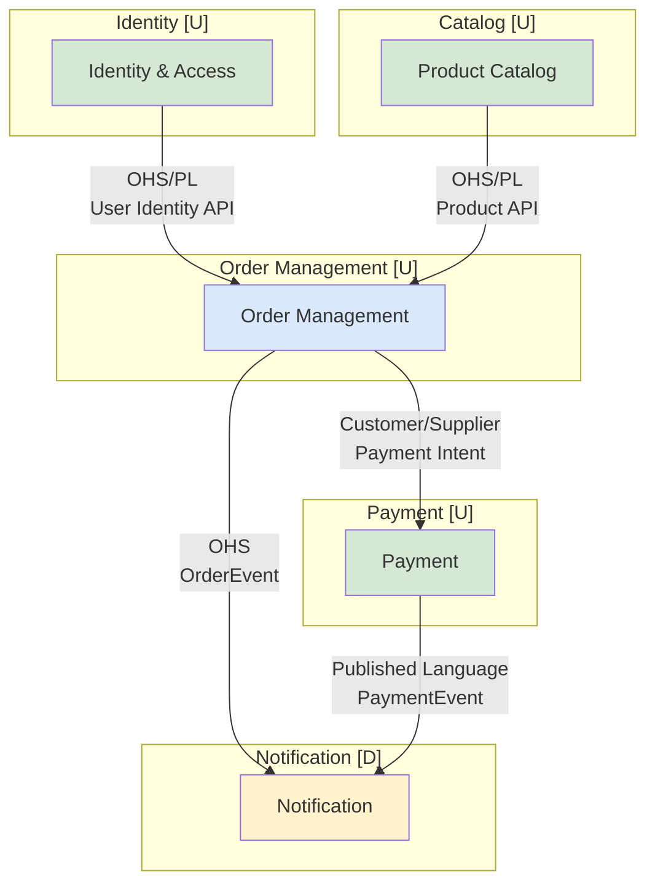

# Diagramming Skill

## Goal

Select the appropriate diagram type for the communication need, create it using correct
notation and standards, and produce output in Mermaid syntax (or PlantUML as fallback).
Diagrams are communication tools — choose based on what question the reader needs answered.

---

## Diagram Selection Guide

```
Question being answered → Diagram type

"What IS the system and who uses it?"           → System Context (C4 Level 1)
"What are the major deployable parts?"           → Container Diagram (C4 Level 2)
"What are the components inside a container?"    → Component Diagram (C4 Level 3)
"How are business objects structured?"           → Domain Class Diagram
"How are data tables related?"                   → Entity-Relationship Diagram
"What packages/modules exist?"                   → Package Diagram
"How does process X flow step by step?"          → Sequence Diagram
"What are all the paths through a use case?"     → Activity Diagram
"What states can object X be in?"                → State Machine Diagram
"Who does what in a process?"                    → Swimlane Diagram (BPMN or Activity)
"How does the business process work end-to-end?" → BPMN Process Diagram
"What are all the use cases for an actor?"       → Use Case Diagram
"Where is the system deployed physically?"       → Deployment Diagram (C4 or UML)
"How does data flow through the system?"         → Data Flow Diagram (DFD)
"What are the business capabilities?"            → Capability Map
"How do domains relate to each other?"           → Context Map
"What happened in what order (events)?"          → Event Storming / Timeline
```

---

## Diagram Standards by Type

### C4 Architecture Diagrams (Mermaid C4)

```
Level of abstraction:
  Level 1 — System Context: whole system as one box + external actors
  Level 2 — Container:      major deployable units (apps, databases, services)
  Level 3 — Component:      major components inside ONE container
  Level 4 — Code:           class/entity level (use sparingly)

Rules:
  - Each diagram has ONE level of zoom
  - Include title, description for each element
  - Show communication protocol on relationship arrows
  - External systems in grey/different color
  - Boundary boxes for systems

Mermaid C4 syntax:
  C4Context, C4Container, C4Component, C4Deployment
  Person(), System(), System_Ext(), Container(), ContainerDb()
  Rel(from, to, "label", "protocol")
```

**Mermaid C4 Context Example:**


---

### Sequence Diagram (interaction over time)

```
Use when: showing how components/actors interact in a specific scenario.
Strengths: clear temporal ordering, shows synchronous vs async, highlights round-trips.

Rules:
  - Show ONE use case scenario per diagram (not all scenarios in one)
  - Label all arrows with the operation/message name
  - Use activation bars for synchronous calls
  - Show return messages explicitly (dashed arrows)
  - Use alt/opt/loop for conditional flows

Anti-patterns:
  - Too many actors (> 6) — split into smaller diagrams
  - Showing all edge cases in one diagram — use separate diagrams
  - Missing return arrows — always show response
```

**Mermaid Sequence Example:**


---

### State Machine Diagram (object lifecycle)

```
Use when: showing all valid states an entity can be in and transitions between them.
Strengths: captures business rules about what transitions are allowed.

Rules:
  - Start state: filled circle (●)
  - End state: filled circle with ring (⊙)
  - Transitions labeled with: trigger [guard condition] / action
  - Every state should be reachable from start
  - Every non-terminal state should have at least one exit

Anti-patterns:
  - Missing guard conditions (ambiguous transitions)
  - No final state (infinite loop entity)
```

**Mermaid State Example:**


---

### Entity-Relationship Diagram (data model)

```
Use when: showing data model — tables, entities, and relationships.
Strengths: precise notation for cardinality, clear data ownership.

Cardinality notation (Chen / crow's foot):
  ||--|| : exactly one to exactly one
  ||--o{ : exactly one to zero-or-more
  }o--o{ : zero-or-more to zero-or-more
  ||--|{ : exactly one to one-or-more

Rules:
  - Every entity has a primary key attribute
  - Relationship lines include cardinality
  - Attribute names use domain language (not column names)
  - Foreign key relationships shown as lines, not as duplicate attributes
```

**Mermaid ER Example:**


---

### Activity / Flowchart (process flow)

```
Use when: showing decision logic, algorithmic flow, or business process steps.
Strengths: clear decision branches, parallelism notation.

Rules:
  - Start and end nodes clearly marked
  - Decision nodes (diamond) have labeled branches for each outcome
  - Parallel flows shown with fork/join bars
  - Use swimlanes to show who does what
```

**Mermaid Flowchart Example:**


---

### Data Flow Diagram (DFD)

```
Use when: showing how data moves through a system across processes and stores.
DFD uses a specific notation:
  External Entity: rectangle (data source/sink outside system)
  Process:         rounded rectangle or circle (transforms data)
  Data Store:      open-ended rectangle (persistent storage)
  Data Flow:       labeled arrow (data moving)

Levels:
  Level 0 (Context DFD): System as one process, all external entities, all data flows
  Level 1 (System DFD):  Explode main process into sub-processes
  Level 2:               Explode one sub-process further (only if needed)

Rules:
  - Data stores: data at rest (not processes)
  - Processes: always transform input to output (labeled as verb phrases)
  - All flows must be labeled with what data flows
  - External entities: actors or systems outside system boundary
```

**DFD in Mermaid (approximation using flowchart):**


---

### Context Map Diagram (domain relationships)

```
Use when: showing how bounded contexts relate to each other.
See domain-model.skill.md for context map patterns.
```

**Mermaid Context Map Example:**


---

## Diagram Review Checklist

```
Before finalizing any diagram:
  □ Title: is there a clear, descriptive title?
  □ Scope: is it clear what's IN and what's OUTSIDE the diagram?
  □ Labels: are all elements and arrows labeled clearly?
  □ Legend: does the diagram need a legend for custom notation?
  □ Level: is this diagram one consistent level of abstraction?
  □ Audience: would the target reader understand it without explanation?
  □ Accuracy: does this match the actual system (not wishful thinking)?
  □ Completeness: are all significant elements shown?
  □ Clutter: is there anything that can be removed to improve clarity?
```

---

## Constraints

- One diagram = one question answered. Do not mix levels of abstraction.
- Diagrams must match reality — no aspirational architecture in current-state diagrams
- Prefer Mermaid for text-based portability (renders in GitHub, VS Code, Notion)
- If Mermaid can't represent the diagram type, describe in structured text with explicit notation
- Include diagram title and date — diagrams without metadata become unreliable
- Simple is better — if a diagram needs extensive explanation, simplify the diagram
