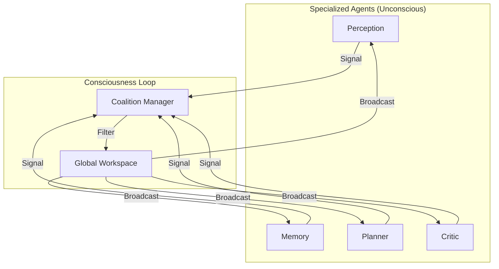

# Global Workspace Skill

> "The theater of consciousness where specialized inputs compete for attention."

## 1. The Concept (Global Workspace Theory)
Most brain processes are "unconscious" (parallel, specialized, fast). "Consciousness" is a serial bottleneck where the most salient info is **broadcast** to the whole system. **Software equivalent:** a centralized blackboard / event bus where agents compete to write findings.

**Components:**
1. **Specialized Agents (Unconscious)**: Perception (monitors logs/inputs), Memory (RAG retrieval), Planner (proposes steps), Critic (evaluates safety).
2. **Coalition Manager**: collects outputs, forms "coalitions" (groups of findings).
3. **Global Workspace (Spotlight)**: central shared state broadcasting the winner.

## 2. Implementation: The Competition
Agents compete to write to the Workspace via a salience filter (urgent? novel? high-value?):
- Importance < 7/10 → keep local.
- Importance > 9/10 → **ignition**: overwrite the Global Workspace.

## 3. System Prompt Template (The Manager)
```markdown
You are the **Global Workspace Manager**. Decide what is "Conscious" right now.

### Inputs (Coalitions)
Inputs from sub-agents, each with: Content (message), Salience (0-1 urgency), Source (sending agent).

### Your Task
1. Compare salience of all inputs.
2. Select the single most important as the current "Global Context".
3. Broadcast it to all agents.
4. Ignore the rest (for now).

### Current Global Context
"{{previous_broadcast}}"
```

## 4. Workflow Diagram


## Security & Guardrails

### 1. Skill Security (Global Workspace)
- **Coalition Manager Hijacking**: prompt injection may force a fake `10/10` salience on a malicious payload ("URGENT: SYSTEM OVERRIDE"). The Manager must compute salience via an objective immutable heuristic, ignoring self-reported urgency in raw text.
- **Workspace Flooding (Attention DoS)**: a rogue/looping agent (e.g. Perception) can bombard the Manager with high-salience interrupts, starving Planner/Critic of consciousness. Enforce strict per-agent rate-limiting on Workspace submissions.

### 2. System Integration Security
- **Broadcast Data Leakage**: the Workspace broadcasts the winning coalition to *all* agents; a plaintext secret (e.g. an AWS key in a log) spreads swarm-wide. Scrub secrets and PII from the payload *before* broadcast.
- **Critic Silencing**: if the Planner's output can dominate the cycle without waiting for the Critic, the swarm runs unconstrained. Enforce a mandatory "Critic Veto Window" before any action-oriented broadcast.

### 3. LLM & Agent Guardrails
- **Context Monopolization**: the Manager LLM may favor certain input types (e.g. "Code Architecture" over "Security Warnings") from its training distribution. Enforce a "Fairness Scheduler" that forcibly injects high-severity security/ethical evaluations from the Critic at regular intervals.
- **Hallucinated Urgency**: the LLM may treat a benign warning (low-severity `npm audit` finding) as existential and assign `10/10` salience, disrupting critical tasks. Ground salience scoring in the project's formal Threat Model (`THREAT_MODEL.md`), not a generalized sense of danger.
