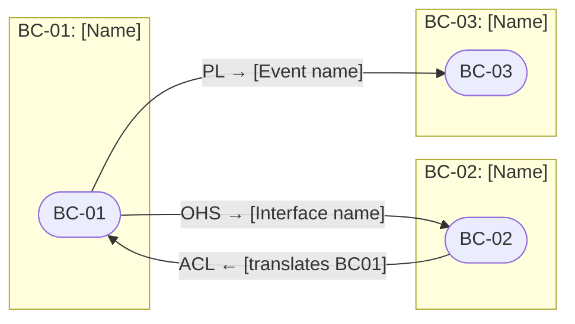
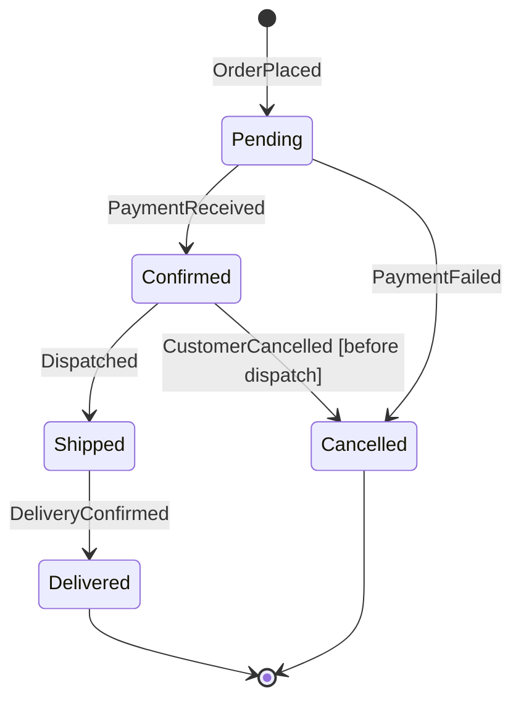
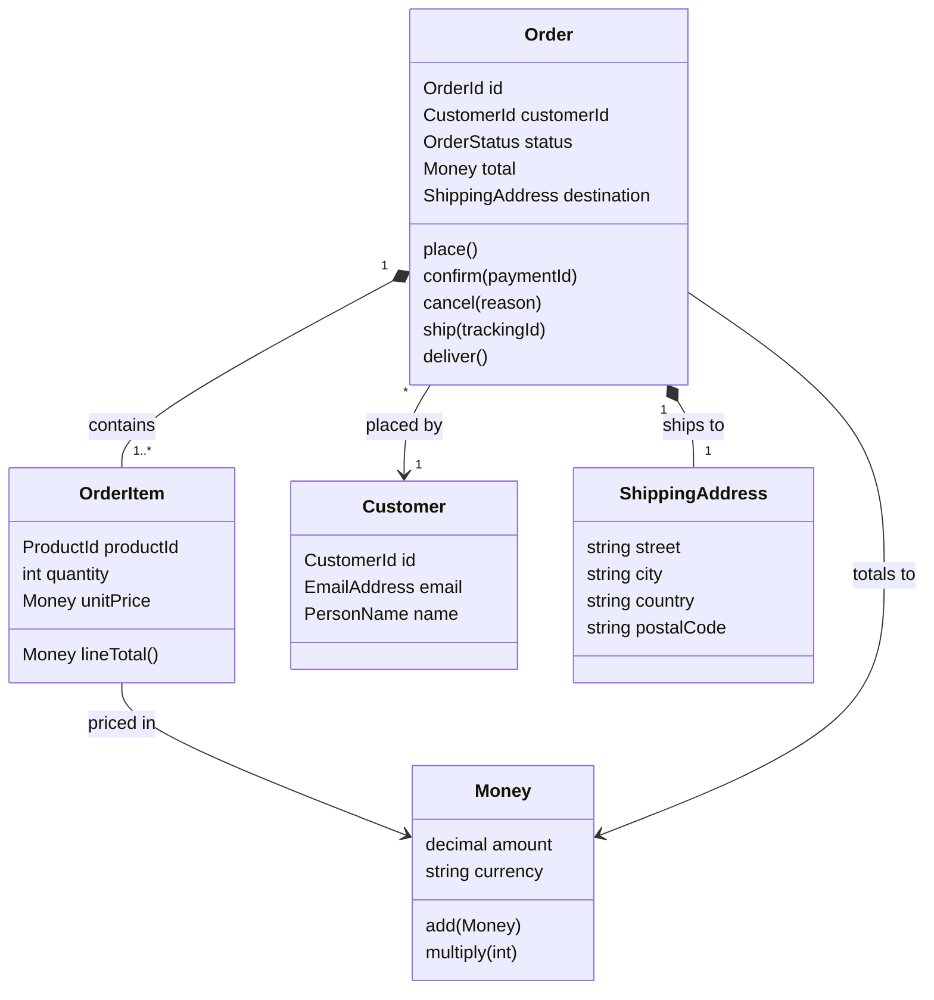

# Domain Model — [System Name]
<!-- Technology-agnostic domain model using DDD concepts -->
<!-- Created by: domain-model.skill -->
<!-- No technology terms. No database column names. No framework artifacts. -->

---

## Meta

| Field | Value |
|---|---|
| **System** | [system name] |
| **Version** | [1.0] |
| **Date** | [YYYY-MM-DD] |
| **Status** | DRAFT / APPROVED |

---

## Ubiquitous Language Glossary

> The authoritative vocabulary for this system. All team members and all code use these exact terms.

| Term | Definition | Context (if context-specific) | Related Terms |
|---|---|---|---|
| [Order] | [A confirmed request to purchase one or more products, with associated payment and delivery information] | [Order Management] | [OrderItem, Customer] |
| [Customer] | [A registered individual who has placed at least one order] | [All contexts] | [Account, User] |
| [Cart] | [A temporary collection of products a visitor intends to purchase, before order placement] | [Catalog/Cart] | [CartItem, Order] |

**Terms deliberately NOT used** (and why):

| Avoided term | Use instead | Reason |
|---|---|---|
| "User" | "Customer" or "Operator" or "Visitor" | Too generic — ambiguous across contexts |
| "Record" | "Order", "Invoice", etc. | Not domain language — implementation term |

---

## Bounded Contexts

### BC-01: [Context Name]

**Responsibility**: [One sentence — what business capability this owns]

**Core domain?**: [YES — competitive advantage / NO — supporting/generic]

**Ubiquitous language** (terms unique to this context):
- [Term]: [definition within this context]
- [Term]: [definition within this context]

**Team/Owner**: [team or role responsible]

---

### BC-02: [Context Name]

**Responsibility**:
**Core domain?**:
**Ubiquitous language**:
**Team/Owner**:

---

## Context Map



See `CONTEXT_MAP_TEMPLATE.md` for full context map with relationship explanations.

---

## Aggregate Definitions

### Aggregate: [Name]

| Field | Value |
|---|---|
| **Aggregate Root** | [Entity name that is the access point] |
| **Bounded Context** | [BC-NNN] |
| **Business purpose** | [what business operation this aggregate supports] |

**Members:**
| Name | Type | Role |
|---|---|---|
| [OrderId] | Value Object | Identity of the aggregate root |
| [Order] | Entity (Root) | Guards invariants, owns members |
| [OrderItem] | Entity | Line item within the order |
| [ShippingAddress] | Value Object | Delivery destination |
| [Money] | Value Object | Total amount and currency |

**Invariants** (business rules that are ALWAYS true):
```
1. An Order must have at least one OrderItem.
2. Order total must equal the sum of (OrderItem.quantity × OrderItem.unitPrice).
3. An Order in [Delivered] state cannot transition to [Cancelled].
4. OrderItem quantity must be ≥ 1.
```

**Lifecycle (State Machine):**


**Domain Events emitted:**
| Event | When emitted | Payload |
|---|---|---|
| OrderPlaced | When order is first created | {orderId, customerId, items, total} |
| OrderConfirmed | When payment is received | {orderId, paymentId} |
| OrderCancelled | When cancellation is processed | {orderId, reason} |
| OrderShipped | When fulfilment dispatches | {orderId, trackingId, estimatedDelivery} |
| OrderDelivered | When delivery confirmed | {orderId, deliveredAt} |

---

### Aggregate: [Another Aggregate Name]

| Field | Value |
|---|---|
| **Aggregate Root** | |
| **Bounded Context** | |
| **Business purpose** | |

**Members:**
**Invariants:**
**Lifecycle:**
**Domain Events:**

---

## Value Objects

| Value Object | Attributes | Validation Rules | Immutable? |
|---|---|---|---|
| [Money] | amount (decimal), currency (ISO 4217) | amount ≥ 0; currency must be valid ISO code | YES |
| [EmailAddress] | value (string) | Must match RFC 5322 format; case-insensitive | YES |
| [PhoneNumber] | countryCode, number | Must be E.164 format | YES |
| [DateRange] | startDate, endDate | startDate must be ≤ endDate | YES |

---

## Domain Services

Domain services contain business logic that doesn't naturally fit within one aggregate:

| Domain Service | Responsibility | Input | Output |
|---|---|---|---|
| [PricingCalculator] | Calculate final price including discounts, taxes | {items, customerId, promoCode} | {subtotal, discounts, tax, total} |
| [InventoryChecker] | Verify sufficient stock across multiple products | {items[]} | {available: boolean, shortfall[]} |

---

## Domain Events Catalog

| Event | Context | Emitter | Consumers | Payload |
|---|---|---|---|---|
| [OrderPlaced] | Order Mgmt | Order aggregate | Inventory, Notification, Analytics | {orderId, customerId, items, total, placedAt} |
| [PaymentFailed] | Payment | Payment aggregate | Order Mgmt, Notification | {paymentId, orderId, reason, failedAt} |
| [InventoryDepleted] | Inventory | Inventory aggregate | Catalog, Purchasing | {productId, depletedAt} |

---

## Domain Model Diagram



---

## Known Domain Complexities

Document areas of the domain that are inherently complex or contentious:

| Area | Complexity | Notes |
|---|---|---|
| [Pricing] | HIGH | [Multiple discount types can apply; tax varies by jurisdiction; currency conversion needed] |
| [Inventory] | MEDIUM | [Reservations vs actual deductions; multi-warehouse scenarios] |
| [Order state transitions] | MEDIUM | [Partial cancellation rules; return vs refund distinction] |

---

*Domain model reviewed with: [list domain experts consulted]*
*Next review: [when major business rule changes, or every 6 months]*
