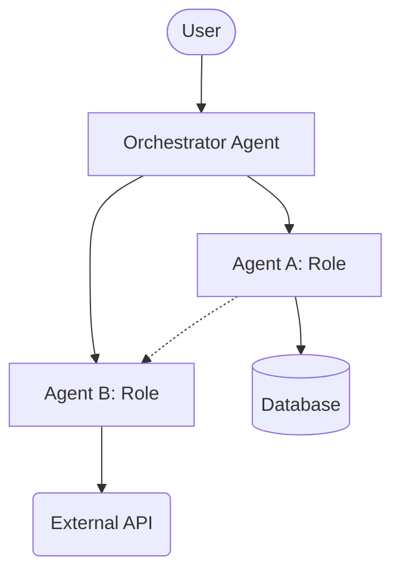

# Swarm Architecture: [Swarm Name]

## 1. Overview
- **Objective**: [What problem is this swarm solving?]
- **Architecture Pattern**: [e.g., Orchestrator-Worker, Hierarchical, Mesh, Sequential]
- **Key Agents**: [List of agents involved]

## 2. Topology Diagram

## 3. Data Flow & State
- **Shared State**: [How do agents share context? e.g., Shared Memory, Redis, Database]
- **Message Passing**: [Protocol used? e.g., JSON-RPC, REST, Queue]
- **Context Management**: [Strategy for managing context window limits]

## 4. Roles & Responsibilities
| Agent | Responsibilities | Inputs | Outputs |
|---|---|---|---|
| Orchestrator | Task delegation, final synthesis | User prompt | Final answer |
| Agent A | [Responsibility] | [Input] | [Output] |
| Agent B | [Responsibility] | [Input] | [Output] |

## 5. Error Handling & Recovery
- **Failure Mode 1**: [What if Agent A fails?] -> [Recovery Strategy]
- **Timeout Policy**: [What if an agent takes too long?]
- **Escalation**: [When to call for human help?]

## 6. Security & Permissions
- **Authentication**: [How do agents authenticate?]
- **Authorization**: [What are the boundaries of operation?]
