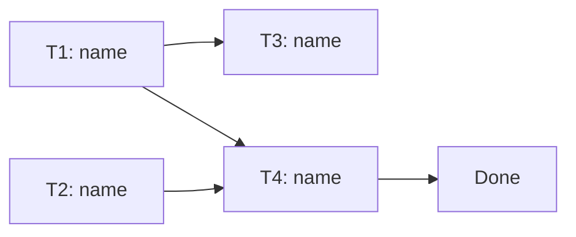

# Dependency & Parallelism Worksheet: [Project / Milestone Name]

**Date:** [YYYY-MM-DD]
**Author:** [name]
**Status:** Draft | Reviewed

<!-- Goal: find what can run in parallel, what's on the critical path, and where
     resources collide. This drives scheduling and staffing decisions. -->

---

## 1. Task Dependency Table

| Task | Depends on | Blocks | Can parallelize with | Resource conflicts |
|---|---|---|---|---|
| [T1: name] | [—] | [T3, T4] | [T2] | [None] |
| [T2: name] | [—] | [T4] | [T1] | [Shares DB migration window with T5] |
| [T3: name] | [T1] | [ ] | [ ] | [ ] |
| [T4: name] | [T1, T2] | [ ] | [ ] | [ ] |

---

## 2. Critical Path

<!-- The longest chain of dependent tasks. Its length is the floor on project
     duration — shortening anything OFF this path does not help. -->

**Path:** [T1 → T4 → ... → done]
**Estimated length:** [sum of durations along the path]
**Slack elsewhere:** [Tasks with float and how much, e.g. "T2 has 2d slack."]
**Biggest risk on the path:** [Which task, and why.]

---

## 3. Dependency DAG

<!-- Replace with a real graph. Mermaid or plain arrows both fine. -->



Plain-text fallback:
```
T1 ─┬─> T3
    └─> T4 ──> DONE
T2 ─────> T4
```

---

## 4. Parallelization Plan

| Wave | Tasks runnable together | Owner(s) | Gate to next wave |
|---|---|---|---|
| 1 | [T1, T2] | [ ] | [Both complete] |
| 2 | [T3, T4] | [ ] | [ ] |

**Resource bottlenecks:** [Shared people, environments, or services that cap actual parallelism below the theoretical max.]
