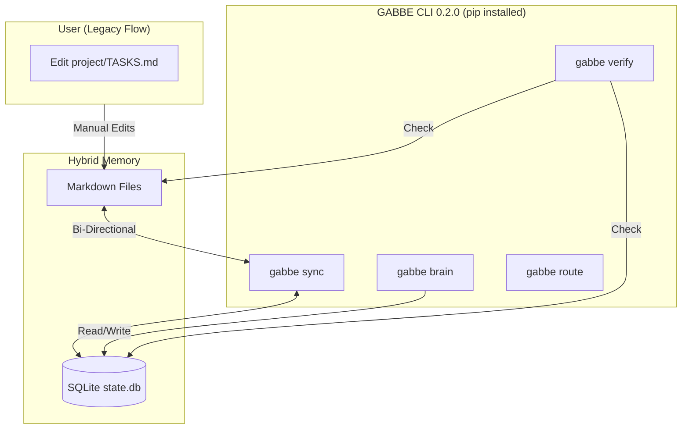

# GABBE (Generative Architectural Brain Base Engine) - Agentic Software R&D Engineering Kit

## QUICK_GUIDE.md — Everything You Need in One Place

> Complete reference sheet for the Agentic Engineering Kit.
> Bookmark this. Read it before your first session.

---

## Why This Kit Exists — The Lethal Trifecta

AI coding agents suffer from three compounding problems:

1. **Velocity mismatch** — Agents generate code 10-100x faster than humans can review. Without guardrails, they skip critical steps (spec approval, security review, test coverage) and the human only discovers problems after the damage is done.

2. **Non-determinism** — Same prompt, different output every time. Without structured context (AGENTS.md, CONSTITUTION.md, skill constraints), agents make inconsistent architectural decisions across sessions.

3. **Cost asymmetry ("context rot")** — Wrong decisions compound. A missed security check at S01 (Requirements) costs 100x more to fix at S08 (Review). Architectural debt chosen in hour 1 creates exponential rework.

**This kit solves all three** through:
- Explicit context (AGENTS.md — single source of truth for every agent)
- Deterministic workflows (SDD Lifecycle, TDD Cycle, RARV Loop)
- Enforced checkpoints (10-Gate Quality System, human-in-the-loop triggers)
- Persistent memory (SESSION_SNAPSHOT, CONTINUITY.md, AUDIT_LOG.md)

**ROI:** Repositories using this approach could see reduction in agent runtime and in token usage through explicit context, cached decisions, and SDLC memory.

---

## 5-Minute Setup Checklist

```bash
# 1. Download & Run the Installer
curl -sL https://raw.githubusercontent.com/andreibesleaga/GABBE/main/init.py | python3 -

# OR if you have the repo cloned:
python3 GABBE/scripts/init.py

# 2. Select Install Location
#    - Local (Recommended): Installs to agents/ in your project
#    - Global: Installs to ~/agents/ for all projects

# 3. Follow the Interactive Wizard
#    - It configures your Stack, Project Type, and Compliance needs
#    - It generates platform-specific skills:
#      - .cursor/rules/*.mdc (Cursor)
#      - .github/skills/ (VS Code / Copilot)
#      - .claude/skills/ (Claude Code)
#      - .gemini/settings.json (Gemini)

```
## 4. Initialize Your Agent with the Mission
    - The script generates `BOOTSTRAP_MISSION.md` (or `SETUP_MISSION.md` if dynamic setup is disabled) in your root.
    - Open the generated file: `BOOTSTRAP_MISSION.md` or `SETUP_MISSION.md`
    - Copy the entire content.
    - Paste it into your AI Agent's chat window (first message).
    - This aligns the agent with your project context immediately.

## 5. Refine Context (The "Human-in-the-Loop" Step)
    - Open `agents/AGENTS.md`: Check `Tech Stack` section.
    - Verify `test_cmd` and `lint_cmd` match your project.
    - Open `agents/CONSTITUTION.md`: Review project laws.
    - Adjust Article I (Directives) if needed.

---

## 🚀 GABBE CLI 0.2.0 (Stable)

The core of GABBE 2.0 is the **Zero-Dependency CLI** (`gabbe`) which powers the "Hybrid Mode". It bridges the gap between flexible Markdown files and a robust SQLite database.
It's an experimental work-in-progress and you can do without the whole package only with the rest of the kit.

### Prerequisites
- Python 3.8+
- **LLM API Key**: For Brain/Route features, set `GABBE_API_KEY` (OpenAI-compatible).

**Environment Variables** (full reference in [CLI-REFERENCE.md](CLI-REFERENCE.md#environment-variables)):

| Variable | Default | Description |
|---|---|---|
| `GABBE_API_URL` | `https://api.openai.com/v1/chat/completions` | OpenAI-compatible endpoint |
| `GABBE_API_KEY` | *(required for LLM features)* | Bearer token for the LLM API |
| `GABBE_API_MODEL` | `gpt-4o` | Model name sent in API requests |
| `GABBE_LLM_TEMPERATURE` | `0.7` | Sampling temperature (0.0–1.0) |
| `GABBE_LLM_TIMEOUT` | `30` | HTTP timeout in seconds |
| `GABBE_ROUTE_THRESHOLD` | `50` | Complexity score above which prompts route REMOTE |

### Installation
The CLI is a Python package.

```bash
# 1. Install locally (Recommended)
pip install -e .

# 2. Verify installation
gabbe --help
```

### Core Commands
| Command | Description |
|---|---|
| `gabbe init` | Initialize the SQLite Database (Run this after `python scripts/init.py`). |
| `gabbe sync` | **Hybrid Sync**: Bidirectional sync between `project/TASKS.md` and SQLite DB. |
| `gabbe verify`| **Enforcer**: programmable integrity check (files, tests, lint). |
| `gabbe status`| **Dashboard**: Visualizes project phase and task progress. |
| `gabbe brain` | **Meta-Cognition**: Activates Active Inference loop or Evolutionary Prompt Optimization (Requires API Key). |
| `gabbe route` | **Cost Router**: Arbitrates between Local and Remote LLMs based on task complexity (Requires API Key). |

### Architecture
GABBE 2.0 uses a **Hybrid Architecture** where agents and humans interact via Markdown, but the system of record is SQLite.



### How to Use

#### Setup
```bash
# 1. Generate Context Configs
python3 scripts/init.py

# 2. Initialize Database
gabbe init
```

#### Daily Workflow
```bash
# Check status
gabbe status

# Sync tasks (manual edits)
gabbe sync

# Optimize a skill (Requires GABBE_API_KEY)
gabbe brain evolve --skill tdd-cycle
```

#### Verification
```bash
gabbe verify
```

## 🚀 Common Actions (Copy-Paste Prompts)

### New Project from Scratch
```
"Read AGENTS.md. I want to build [description]. Start with spec-writer skill."
```
**Flow:** Spec → Design → Tasks → TDD Implementation → Security → Deploy

### Resume Existing Project
```
"Read AGENTS.md and agents/memory/PROJECT_STATE.md. Resume the project."
```

### Fix a Bug
```
"Read AGENTS.md. Bug: [description]. Use debug skill with TDD."
```
**Flow:** Reproduce → Root Cause → Failing Test → Fix → Green → Regression Check

### Refactor / Pay Tech Debt
```
"Use tech-debt skill on [directory]. Then refactor the top-priority item."
```

### Security Audit
```
"Run security-audit skill on the entire codebase."
```

### Architecture Review
```
"Run arch-review skill. Check for SOLID violations and coupling."
```

### Software Engineering & System Architecture
```
"Act as a Principal Staff Engineer. Review the codebase in [directory] and generate a C4 system architecture diagram (Context and Container levels). Identify any bottlenecks and propose scaling strategies."
```
```
"Use the design-patterns and domain-model skills. We are building a [feature segment]. Propose the optimum architecture pattern (e.g. Event-driven, CQRS, Hexagonal) and define the core domain entities."
```

### Vibe-Coding (Creative Frontend)
```
"Use the vibe-coding skill. Build a [component/page] using [framework]. I want it to feel [aesthetic, e.g. glassmorphism, cyberpunk, sleek corporate]. Include micro-animations and smooth transitions. Prioritize visual WOW over generic utility."
```

### Activate Brain Mode (Complex Goals)
```
"Activate Brain Mode. Goal: [build X / migrate Y / solve Z]."
```
Uses Active Inference to plan, route between local/remote models, and learn from past outcomes.

### Activate Loki Mode (Large Projects)
```
"Activate Loki Mode. Goal: [build X / migrate Y / refactor Z]."
```
Multi-agent swarm with 30+ specialized personas for projects >5 features or >20 files.

---

## Kit Structure Overview

```
GABBE/
  scripts/init.py      <- Installer Wizard (Run this first)
  README_FULL.md       <- Complete step-by-step guide
  QUICK_GUIDE.md       <- This file
  agents/             <- The actual kit payload
      AGENTS.md        <- Universal config template
      CONSTITUTION.md  <- Immutable project law
      setup-context.sh <- Internal wiring script (wrapped by scripts/init.py)
      skills/          <- 120+ agent capability packages (💯)
          core/        <- (tdd, refactor, debug, git...)
          security/    <- (audit, threat-model...)
          arch/        <- (design, review, patterns...)
      templates/       <- 60+ fill-in-the-blank documents
      guides/          <- 30+ language-specific guides
      loki/
      docs/
```

---

## 🏗️ How to Use Kit Resources

### 1. Guides (`agents/guides/*.md`)
- **What:** Textbooks for the Agent.
- **Who:** The AGENT reads them.
- **When:** At the start of a session or when learning a new stack.
- **How:** "Read `guides/js-ts-nodejs.md` to understand our stack standards."

### 2. Templates (`agents/templates/**/*.md`)
- **What:** Forms to be filled out.
- **Who:** The AGENT fills them out; the HUMAN reviews them.
- **When:** At specific SDLC gates (e.g., S01 = PRD, S02 = ADR).
- **How:**
    1.  **Agent Instantiation:** "Create a PRD for [feature] using `templates/product/PRD_TEMPLATE.md`."
    2.  **Manual Instantiation:** You copy the file to `docs/PRD.md` and fill it out yourself. (Rare, but allowed).

### 3. Scripts (`agents/setup-context.sh`, `scripts/init.py`)
- **What:** Automation tools.
- **Who:** The HUMAN runs them.
- **When:** Once at project start (scripts/init.py) or if symlinks break (setup-context.sh).
- **How:** Run from terminal: `python3 scripts/init.py`.

### 4. Skills (`agents/skills/**/*.skill.md`)
- **What:** Procedure manuals ("Standard Operating Procedures").
- **Who:** The AGENT follows them step-by-step.
- **When:** Triggered by specific keywords (e.g., "Review this PR" -> code-review.skill).
- **How:** You say the trigger word, the Agent loads the skill and follows the checklist.

---

## 🤝 Roles & Responsibilities: Who Does What?

| Task | Human (You) | Agent (The Machine) |
|---|---|---|
| **Strategy** | **Decides "What to build"** and "Why". | Suggests options, researches feasibility. |
| **Setup** | Runs `scripts/init.py`, feeds `BOOTSTRAP_MISSION.md` or `SETUP_MISSION.md`. | Reads mission, analyzes stack, updates `AGENTS.md`. |
| **Config** | Edits `AGENTS.md` (Stack, Commands) & `CONSTITUTION.md`. | **Read-Only**. Can propose changes, cannot edit laws. |
| **Spec** | Reviews and **Approves** `PRD.md`. | **Writes** `PRD.md` using `spec-writer.skill`. |
| **Arch** | Reviews and **Approves** `PLAN.md`. | **Designs** `PLAN.md` using `arch-design.skill`. |
| **Tasks** | Reviews and **Approves** `project/TASKS.md`. | **Decomposes** work into 15m tasks. |
| **Code** | **Reviews PRs**, handles sensitive API keys. | **Writes Code**, Tests, Lints, Commits. |
| **Fixes** | Provides new context/logs if stuck. | **Self-Heals** (loops 5x), researches, fixes. |

**The Golden Rule:** The Agent is the *Engine*; You are the *Steering Wheel*. You define the destination (Spec) and check the map (Review), but the Agent drives the car (Coding).


---

## Skill Scopes — Global vs Workspace

Skills can be installed at two scopes:

| Scope | Location | Visible to |
|---|---|---|
| **Global** | `~/.claude/skills/` or `~/.agent/skills/` | All projects on this machine |
| **Workspace** | `.claude/skills/` or `.agent/skills/` in project root | This project only |

**Universal Skill Compiler** (what scripts/init.py does):

The script detects your selected agents and generates the correct format for each:

| Platform | Format | Location |
|---|---|---|
| **Cursor** | `.mdc` rules | `.cursor/rules/*.mdc` |
| **VS Code / Copilot** | Folders + Config | `.github/skills/<slug>/` |
| **Claude Code** | Symlink | `.claude/skills` → `agents/skills` |
| **Gemini / Antigravity** | Settings | `.gemini/settings.json` points to `agents/skills` |

This means you write a skill once in `agents/skills/` and it runs everywhere.

---

## How to Invoke Skills

Skills are invoked by mentioning trigger keywords in conversation.

```
# By Slash Command (VS Code / GitHub Copilot):
/code-review            -> triggers code-review.skill
/tdd-cycle              -> triggers tdd-cycle.skill

# By Trigger Keyword (Claude / Cursor / Gemini):
"Review this PR for security issues"          -> triggers code-review.skill
"Use TDD to implement the login endpoint"     -> triggers tdd-cycle.skill
"I'm not sure how to use this library"        -> triggers knowledge-gap.skill

# By Explicit Name:
"Use the spec-writer skill for this feature"
"Run the security-audit skill on this codebase"
```


All 120+ skills are listed in `skills/00-index.md`.

---

## SDD Lifecycle (Spec-Driven Development)

The mandatory artifact chain for all new features:

```
0. STRATEGY   (business-case / design-thinking / systems-thinking)
              -> Validates the "Why" and "Who" before the "What"
              -> Creates BUSINESS_CASE.md or EMPATHY_MAP.md
              -> Feeds directly into the Specification phase

1. SPECIFY    (/speckit.specify or spec-writer.skill)
              -> Creates PRD.md with EARS requirements
              -> Invokes ambiguity layer: agent asks clarifying questions
              -> Human reviews and approves

2. CLARIFY    (Ambiguity Layer — built into spec-writer.skill)
              -> Agent identifies ambiguous requirements
              -> Asks structured clarifying questions
              -> No assumption is made without explicit answer

3. PLAN       (adr-writer.skill + prod-architect persona)
              -> Creates PLAN.md: implementation phases, files, dependencies
              -> Creates C4 architecture diagram
              -> Creates ADRs for significant decisions
              -> Runs threat-model.skill for security features

4. DECOMPOSE  (prod-tech-lead persona + 15-Minute Rule)
              -> Creates project/TASKS.md from PLAN.md
              -> Every task: achievable in ~15 minutes, atomic, testable
              -> Tasks have: acceptance criteria, dependency order, status

5. IMPLEMENT  (Engineering swarm / single agent, with RARV cycle)
              -> TDD: test first, implement, verify, refactor
              -> RARV: Reason -> Act -> Reflect -> Verify
              -> Self-heal on failure (max 5 attempts)
              -> Audit log entry for each completed task
```

**The 15-Minute Rule:** If a task takes > 15 minutes, it's too large. Decompose further.

**Artifact chain integrity:** spec-analyze.skill checks that spec.md ↔ plan.md ↔ project/tasks.md are aligned. Run it whenever artifacts change.

---

## TDD Workflows

### Unit TDD Cycle (tdd-cycle.skill)

```
Red   -> Write failing test. Run it. Confirm it FAILS.
          If it passes immediately: the test is broken. Fix the test.
Green -> Write minimal code to pass the test. Run it. Confirm it PASSES.
          Do not add any code not needed by the test.
Refactor -> Improve code quality. Run tests. Confirm still GREEN.
            Check: complexity < 10, no duplication, no dead code.
```

### Browser-Based Visual TDD (browser-tdd.skill)

For frontend UI components where "works" means "looks and behaves correctly":

```
1. Write Playwright test: check DOM structure, computed CSS, scroll behavior, viewport position
2. Confirm Red: npx playwright test -> MUST FAIL initially
3. Implement CSS/component change
4. Confirm Green: npx playwright test -> screenshots, CSS values, DOM assertions pass
5. If fail: analyze root cause (overflow:hidden parent? z-index stacking? viewport breakpoint?)
6. Refactor for readability while keeping test Green

Example Playwright assertions:
  - page.locator('nav').evaluate(el => el.getBoundingClientRect().top) === 0 (sticky)
  - page.locator('.card').getByRole('button').toBeVisible() (accessibility)
  - page.screenshot({ fullPage: true }) (visual regression baseline)
```

---

## Architecture-Driven Development (ADD)

Enforcing layer boundaries with agentic tools:

### Define Rules in AGENTS.md (Section 3)
```yaml
# Example for Clean Architecture:
layers:
  domain:      "src/domain/**"     # No imports from outer layers
  application: "src/application/**" # May import domain only
  adapters:    "src/adapters/**"   # May import domain + application
  infra:       "src/infrastructure/**" # May import all inner layers
```

### Enforce with agentic-linter.skill
```bash
# On every PR, agent runs:
npx dependency-cruiser --config .dependency-cruiser.cjs src
# OR for PHP:
vendor/bin/deptrac analyse

# If violations found: agent proposes Dependency Inversion refactor
# Never just reports — always provides a concrete fix proposal
```

### ADR for Significant Decisions
```
When to create an ADR (Architecture Decision Record):
  - Adopting a new library or framework
  - Choosing between multiple valid architectural approaches
  - Any decision that would be hard to reverse
  - Any decision affecting security or data handling

How: "Use adr-writer skill to document the decision to [X] instead of [Y]"
```

---

## Memory Architecture — Preventing Amnesia

Long sessions and team projects lose context. The 4-layer memory system solves this:

| Layer | Location | Contains | Lifetime |
|---|---|---|---|
| **Working** | Context window | Current task, recent code | Session |
| **Episodic** | `agents/memory/episodic/` | Past decisions, failed experiments per session | Project |
| **Semantic** | `agents/memory/semantic/` | Crystallized facts (auth quirks, schema conventions) | Project |
| **Procedural** | `skills/*.skill.md` | Immutable how-to guides per task type | Global |

### Key Memory Files


| File | Purpose |
|---|---|
| `agents/memory/PROJECT_STATE.md` | Current SDLC phase, last checkpoint, blockers |
| `agents/memory/CONTINUITY.md` | **Read every session** — past failures to avoid |
| `agents/memory/AUDIT_LOG.md` | Append-only log of all decisions and outcomes |
| `agents/memory/episodic/SESSION_SNAPSHOT/` | Per-milestone state snapshots |
| `agents/memory/semantic/PROJECT_KNOWLEDGE_TEMPLATE.md` | Crystallized project facts |

### CONTINUITY.md — The Most Important File
This file prevents agents from repeating failed approaches:
```markdown
### 2024-03-15 — Bull queue memory leak with Redis cluster
Context: Tried to use Bull for job processing
Approach: Standard Bull config with Redis cluster mode
Why it failed: Bull doesn't support Redis cluster without bull-cluster package
Resolution: Switched to BullMQ which has native cluster support
Tags: [library-conflict, redis, job-queue]
```

---

## Golden Rules of Agentic Engineering

### Rule 1 — Atomicity
> Tasks must be achievable in ~15 minutes. Decompose relentlessly.

```
BAD:  "Implement user authentication"  (days of work)
GOOD: "Create User entity with email/password fields in src/domain/user.ts"  (15 min)
      "Add UserRepository interface in src/domain/ports/user-repository.ts"  (15 min)
      "Implement PrismaUserRepository in src/infrastructure/prisma-user-repo.ts"  (15 min)
```

### Rule 2 — Explicit Context
> If it's not in AGENTS.md, it doesn't exist. Common sense is a myth in AI.

```
BAD:  Expecting agents to "know" that you use pnpm, not npm
GOOD: Specifying in AGENTS.md: install: "pnpm install"

BAD:  Expecting agents to "know" your architecture layers
GOOD: Defining layers explicitly in AGENTS.md Section 3
```

### Rule 3 — Verification
> Trust but verify. TDD or Browser loops always. Output is a draft until it passes a test.

```
No feature is "done" until:
  - Unit test passes (Red -> Green verified)
  - All existing tests still pass (no regressions)
  - Lint and typecheck pass
  - Security scan clean (for security-relevant changes)
```

### Rule 4 — Artifacts as Control Interface
> spec.md/project/tasks.md are the control interface, not byproducts. Manage artifacts; code follows.

```
Wrong mental model: "Write code, then document it"
Right mental model:  "Write spec.md -> human approves -> write project/tasks.md -> code emerges from tasks"

The PRD.md is the truth. The spec.md is the truth. The project/tasks.md is the control panel.
Code is just the output of working through project/tasks.md correctly.
```

---

## 4-Phase Team Adoption Roadmap

### Phase 1 — Standardization (Week 1-2)
```
Goal: Every repo has an AGENTS.md and CONSTITUTION.md
Actions:
  - Run `scripts/init.py` to create tool-specific symlinks (commands, architecture rules, forbidden actions)
  - Draft CONSTITUTION.md (at minimum Articles I-VII)
  - Measure: all agents read AGENTS.md before coding
```

### Phase 2 — Capability (Week 3-4)
```
Goal: Install and customize skill packs
Actions:
  - Install skills/ directory for each repo
  - Customize code-review.skill with project-specific rules
  - Customize git-workflow.skill with your PR template
  - Train team on skill invocation patterns
  - Measure: PR review time, bug escape rate
```

### Phase 3 — Adoption (Month 2)
```
Goal: Mandate SDD for all new features
Rule: No code without an approved PRD.md
Actions:
  - Make spec-writer.skill the entry point for all feature requests
  - Enforce 7-gate quality system in CI/CD
  - Track and repay tech debt with tech-debt.skill
  - Measure: specification-to-code ratio, coverage, architectural violations
```

### Phase 4 — Orchestration (Month 3+)
```
Goal: Loki Mode for background autonomous tasks
Actions:
  - Identify large projects suitable for Loki Mode
  - Set up agents/memory/ for long-running projects
  - Deploy Loki swarm for a pilot project (new feature or migration)
  - Measure: agent-hours per feature, human intervention rate
```

---

## MCP Servers — Key Ones to Install

| Server | Install | Why |
|---|---|---|
| **Context-7** | `npx @context7/mcp-server` | Up-to-date SDK docs (prevents API hallucination) |
| **Sequential Thinking** | `npx @modelcontextprotocol/server-sequential-thinking` | Chain-of-thought before acting |
| **GitHub MCP** | `npx @modelcontextprotocol/server-github` | PR review, issues, code search |
| **PostgreSQL MCP** | `npx @modelcontextprotocol/server-postgres` | Live schema introspection |
| **Semgrep MCP** | `pip install semgrep-mcp` | In-agent SAST security scanning |
| **Brave Search MCP** | `npx @modelcontextprotocol/server-brave-search` | Authoritative web research |
| **Playwright MCP** | `npx @playwright/mcp` | Browser automation for visual TDD |
| **Sentry MCP** | `npx @sentry/mcp` | Error tracking and bug context |
| **Qdrant MCP** | `docker run qdrant/qdrant` + MCP server | Long-term semantic memory |

See `templates/core/MCP_CONFIG_TEMPLATE.json` for the full catalog with security configuration.

---

## Research Policy — Authoritative Sources Only

Agents must use authoritative sources. Non-authoritative answers are hallucinations.

| Tier | Sources | When to use |
|---|---|---|
| **Tier 1** | Official docs (MDN, nodejs.org, laravel.com), RFCs (RFC.editor.org), Security (OWASP, NIST) | Always prefer |
| **Tier 2** | arXiv, IEEE, ACM, official GitHub repos, release notes | For academic/technical questions |
| **Tier 3** | AWS docs, GCP docs, Azure docs, Anthropic docs | For cloud/vendor specifics |
| **NOT acceptable** | Blog posts, Medium, Reddit, StackOverflow opinions | Never cite as authoritative |

**Research Gate** — mandatory before:
- Using a new library (not in package.json/composer.json)
- Implementing security mechanisms or cryptography
- Interpreting regulatory requirements (GDPR, HIPAA, PCI-DSS)

**Context-7 MCP** is the fastest path to authoritative library docs. Use it first.

---

## Self-Healing & Human-in-the-Loop

### Self-Healing Loop (max 5 attempts)
```
Task assigned
  -> Detect knowledge gap? -> knowledge-gap.skill -> research.skill
  -> Execute task
  -> Verification FAILS?
     -> self-heal.skill: diagnose -> research -> fix -> verify
     -> Attempt 1, 2, 3, 4, 5...
     -> After 5 attempts: ESCALATE (stop, report, wait for human)
  -> Verification PASSES -> audit-trail.skill -> Done
```

### Human-in-the-Loop — When to Pause and Ask
```
ALWAYS pause and ask the human:
  - Breaking API change
  - Ambiguous requirements (multiple valid interpretations)
  - Security trade-off (convenience vs protection)
  - Architecture change (new service, library switch)
  - Scope/budget change
  - After 5 failed self-heal attempts
  - Regulatory interpretation (GDPR article, OWASP rule)
```

### What Agents Handle Autonomously
```
No human needed for:
  - Type errors and lint fixes
  - Test assertion updates (when spec changed)
  - Deprecated API updates (via Context-7 MCP verification)
  - Patch/minor version dependency bumps
  - Code style and formatting
  - Documentation updates
```

---

## Tool Reference by Stack


| Category | JS/TS/Node.js | PHP/Laravel | Python/FastAPI/AI | Go (Golang) |
|---|---|---|---|---|
| **Package Manager** | pnpm (preferred) | Composer | `uv` (preferred), Poetry | `go mod` |
| **Type Checking** | `tsc --noEmit` | PHPStan L9 | `mypy --strict`, Pyright | `go build` |
| **Linting** | ESLint | Pint, PHP-CS | `ruff` (preferred) | `golangci-lint` |
| **Unit Testing** | Vitest | Pest, PHPUnit | `pytest` | `Testify` / `testing` |
| **Integration** | Testcontainers | RefreshDB | `testcontainers-python` | `Testcontainers` |
| **E2E / Browser** | Playwright | Dusk | `playwright-python` | `Testcontainers` |
| **ORM** | Prisma | Eloquent | SQLAlchemy, SQLModel | `Ent` / `GORM` |
| **Validation** | Zod | Spatie Data | Pydantic v2 | `go-playground/validator` |
| **Arch Lint** | `dep-cruiser` | `deptrac` | `import-linter` | `arch-go` |
| **SAST** | Semgrep | Enlightn | Bandit, Semgrep | `govulncheck` |
| **Secrets** | gitleaks | gitleaks | gitleaks | `gitleaks` |
| **Tech Debt** | SonarQube | PHPMD | `radon`, `xenon` | `golangci-lint` |
| **Coverage** | v8 / Istanbul | PCOV | `pytest-cov` | `go test -cover` |

## Skill Reference

### Core & Development
| Skill | Triggers |
|---|---|
| `code-review`, `tdd-cycle`, `browser-tdd`, `refactor`, `debug`, `api-design`, `db-migration` | review, test, visual, refactor, bug, API, migration |
| `git-workflow`, `documentation`, `spec-writer`, `spec-analyze`, `adr-writer`, `secure-coding` | commit, docs, spec, analyze spec, ADR, secure |
| `agentic-linter`, `clean-coder`, `mobile-dev`, `visual-design`, `vibe-coding`, `ci-autofix` | boundary, clean, mobile, design, vibe, fix |

### Architecture & Design
| Skill | Triggers |
|---|---|
| `arch-design`, `arch-review`, `arch-patterns`, `design-patterns` | design arch, audit arch, architecture, pattern |
| `diagramming`, `domain-model`, `adaptive-architecture`, `compatibility-design` | diagram, domain, local-first, compatibility |
| `architecture-governance`, `error-handling-strategy`, `event-governance` | archunit, error handling, schema registry |

### Security, Compliance & Quality
| Skill | Triggers |
|---|---|
| `security-audit`, `threat-model`, `privacy-audit`, `compliance-review`, `legal-review` | security, threat, privacy, SOC2, legal |
| `access-control`, `data-governance`, `backup-recovery`, `queue-management` | rbac, lineage, backup, dlq |
| `reliability-sre`, `performance`, `performance-audit`, `incident-response`, `system-benchmark`, `cost-optimization` | SRE, perf, profile, incident, load, cost |
| `accessibility`, `tech-debt`, `arch-debt`, `hazard-analysis`, `production-health`, `dependency-security` | a11y, debt, skew, fmea, tmr, deps |

### Strategy & Agentic
| Skill | Triggers |
|---|---|
| `business-case`, `design-thinking`, `systems-thinking`, `research` | ROI, empathy, loops, research |
| `req-elicitation`, `req-review` | gather reqs, audit specs |
| `agentic-patterns`, `multi-agent-orch`, `agent-protocol`, `agent-interop`, `swarm-consensus` | agentic, swarm, protocol, connect, vote |
| `knowledge-gap`, `self-heal`, `session-resume`, `sdlc-checkpoint`, `knowledge-connect` | unsure, fix, resume, checkpoint, RAG |
| `integrity-check`, `audit-trail`, `system-lifecycle`, `episodic-consolidation` | verify, log, trace, consolidation |
| `emerging-tech`, `legacy-modernization` | future, legacy |

## Templates Reference

| Category | Templates |
|---|---|
| **Core** | `AGENTS`, `MCP_CONFIG`, `DEVCONTAINER`, `DEV_SPACE`, `PLAN`, `TASKS`, `AUDIT_LOG`, `SDLC_TRACKER`, `SESSION_SNAPSHOT`, `SWARM_CONFIG`, `AGENT_HANDSHAKE`, `SYSTEM_ANALYSIS` |
| **Arch** | `ADR`, `ARCH_DECISION_FRAMEWORK`, `ARCHITECTURE_DECISION_MATRIX`, `ARCHITECTURE_REVIEW`, `ARCHITECTURE_VIEWS`, `C4_ARCHITECTURE`, `CONTEXT_MAP`, `DOMAIN_MODEL`, `SYSTEM_CONTEXT`, `SWARM_ARCHITECTURE`, `DESIGN_PATTERN_USAGE`, `CAPABILITY_MAP`, `LEGACY_AUDIT` |
| **Reqs** | `PRD`, `SPEC`, `BUSINESS_CASE`, `CAPABILITY_MAP`, `EMPATHY_MAP`, `NFR`, `QUALITY_ATTRIBUTES`, `REQUIREMENTS_REVIEW`, `STAKEHOLDER_REGISTER`, `TRACEABILITY_MATRIX`, `ETHICAL_IMPACT_ASSESSMENT` |
| **Eng** | `CLEAN_CODE_CHECKLIST`, `SECURITY_CHECKLIST`, `THREAT_MODEL`, `TECH_DEBT`, `TEST_PLAN`, `TEST_CASE`, `INTEGRATION_SPEC`, `DATA_PIPELINE`, `DESIGN_TOKENS`, `E2E_TEST_SUITE`, `SAFETY_POLICY` |
| **Ops** | `DEPLOY_CONFIG`, `INFRA_PLAN`, `BUG_REPORT`, `INCIDENT_POSTMORTEM`, `LEGACY_AUDIT`, `ADAPTIVE_SYSTEM`, `AGENT_PROFILE`, `COST_OPTIMIZATION_REPORT`, `CAPACITY_PLAN`, `RELEASE_READINESS_REPORT`, `BENCHMARK_REPORT` |
| **Product** | `USER_STORY_MAP`, `KNOWLEDGE_MAP` |
 
 ## Guides Reference
 
 | Category | Guides |
 |---|---|
 | **Stack** | `js-ts-nodejs`, `go-lang`, `php-laravel`, `python-fastapi-ai`, `sql-nosql`, `c-sharp` |
 | **Arch** | `systems-architecture`, `critical-systems-arch`, `event-driven-architecture`, `monolith`, `microservices` |
 | **Agentic** | `agentic-patterns`, `multi-agent-systems`, `autonomous-swarm-patterns`, `agent-communication` |
 | **Lifecycle** | `full-system-lifecycle`, `testing-strategy`, `production-health`, `compliance-audit`, `strategic-analysis`, `troubleshooting-guide`, `self-healing-summary` |
 | **Integration** | `enterprise-patterns`, `knowledge-integration`, `no-code-integration`, `api-standards`, `enterprise-migration-scenario` |
 | **UI/UX** | `visual-design-system`, `a2ui-protocols`, `agent-ui` |

---

## Quick Command Reference

```bash
# Initialize kit for a new project
# Initialize kit for a new project
python3 GABBE/scripts/init.py

# Check project health (run anytime)
# Tell agent: "Run integrity-check skill"

# Start a new feature
# Tell agent: "Use spec-writer skill for [feature name]"

# Fix a bug (TDD approach)
# Fill: templates/core/BUG_REPORT_TEMPLATE.md
# Tell agent: "Use debug skill. Bug is described in BUG_REPORT_TEMPLATE.md"

# Resume interrupted project
# Tell agent: "Use session-resume skill to load all project memory"

# Security audit before release
# Tell agent: "Run security-audit skill on this codebase"

# Check tech debt
# Tell agent: "Run tech-debt skill on src/ directory"

# Prepare for production deploy
# Tell agent: "Run integrity-check skill, then safety-scan skill, then deployment skill"

# Make it look good (Vibe Coding)
# Tell agent: "Use vibe-coding skill. Make the landing page feel 'Cyberpunk 2077' but clean."
```

---

*See README.md for quick reference.*
*See README_FULL.md for full workflow guides with Mermaid diagrams.*
*See skills/00-index.md for complete skills registry with installation instructions.*
*See agents/skills/brain/README_ORCHESTRATORS.md for Loki Mode multi-agent orchestration.*
*See agents/skills/brain/README.md for complete brain documentation.*


---

[© 2026 Andrei Nicolae Besleaga. This work is licensed CC BY-SA 4.0](https://creativecommons.org/licenses/by-sa/4.0/)
