# GABBE (Generative Architectural Brain Base Engine) - Agentic Software R&D Engineering Kit

## Complete Guide

## What is this?

- Universal kit for Software and AI coding agents: Claude Code, Cursor, GitHub Copilot, Antigravity/Gemini, Codex.
- Drop-in context kit that turns any AI coding agent into a governed engineering team for developing software.
- Based on Software Engineering & Architecture Practices and Procedures.
- Works for any project type, new or existing, any language, any team size.
- **Write Once, Run Everywhere**: Skills work on Cursor (`.mdc`), VS Code (`folder/skill`), Claude (`.skill.md`), Gemini.
- The system features an experimental **Meta-Cognitive Orchestrator "Brain"** (Neurocognitive based architecture derived from Neuroscience, Cognitive Psychology, Epistemology, treating the Software System not as a machine, but as a **Cognitive Entity**), using Active Inference to plan, route, and optimize work.
- The system features a **Multi-Agent Swarm "Loki" Engineering Team** (30+ specialized agent roles for large projects), providing episodic and semantic memory, project history auditing and checkpoints.

It provides:
- **120+ Skills** (specialized capabilities)
- **60+ Templates** (standardized documents)
- **30+ Guides** (language & domain expertise)
- **30+ Personas** (specialized roles)
- **Brain Mode** (meta-cognitive orchestration)
- **Loki Mode** (multi-agent swarm engineering team for large projects)

> **120+ Skills · 60+ Templates · 30+ Guides · 30+ Personas · Loki / Brain Mode**

---

## Table of Contents

1. [What Is This Kit?](#1-what-is-this-kit)
2. [Brain Mode](#2-brain-mode)
3. [Quick Start (5 min)](#3-quick-start-5-min)
4. [Kit Structure Map](#4-kit-structure-map)
5. [Workflow 1: New Project from Scratch](#5-workflow-1-new-project-from-scratch)
6. [Workflow 2: Refactoring & Bugfixing Existing Project](#6-workflow-2-refactoring-bugfixing-existing-project)
7. [Self-Healing + Research Loop](#7-self-healing-research-loop)
8. [Multi-Agent Systems (MAS)](#8-multi-agent-systems-mas)
9. [Architecture & Design Patterns](#9-architecture-design-patterns)
10. [Agentic Patterns (Advanced AI)](#10-agentic-patterns-advanced-ai)
11. [Testing Strategy](#11-testing-strategy)
12. [Enterprise Domains (Infra, Data, Integration)](#12-enterprise-domains-infra-data-integration)
13. [Environment & Deployment (Local/Remote/Cloud)](#13-environment-deployment-localremotecloud)
14. [Legacy Systems (COBOL, Mainframe)](#14-legacy-systems-cobol-mainframe)
15. [Future Tech & Adaptive Skills (2026-2030)](#15-future-tech-adaptive-skills-2026-2030)
16. [System Quality & Evolution (SRE, Performance)](#16-system-quality-evolution-sre-performance)
17. [System Lifecycle & Traceability](#17-system-lifecycle-traceability)
18. [Skills Reference](#18-skills-reference)
19. [Templates Reference](#19-templates-reference)
20. [MCP Configuration](#20-mcp-configuration)
21. [Extending the Kit](#21-extending-the-kit)
22. [Loki Mode (Large Projects)](#22-loki-mode-large-projects)
23. [Guides by Technology Stack](#23-guides-by-technology-stack)
24. [Troubleshooting](#24-troubleshooting)

---

## 1. What Is This Kit?

This kit gives AI coding agents the **context, skills, memory, and workflows** to act as a reliable software engineering team. It solves the **Lethal Trifecta** of agentic AI:

- **Velocity mismatch** — agents code faster than humans can review, skipping critical steps
- **Non-determinism** — same prompt, different output every time without guardrails
- **Cost asymmetry ("context rot")** — wrong architectural decisions compound and become exponentially expensive to fix
- **Self-Evolution**: Agents rewrite their own prompts (`meta-optimize`) to fix recurring errors.
- **Adaptive Orchestration**: Loki Mode dynamically injects research/safety phases based on complexity.
- **Vibe Coding**: Translates high-level aesthetic intents ("Make it pop") into concrete CSS/JS.

The kit enforces **Spec-Driven Development (SDD)**, **Test-Driven Development (TDD)**, **Architecture-Driven Development (ADD)**, and structured **human-in-the-loop checkpoints** — so agents build correct, secure, maintainable software the first time.

**Universal Skill Compiler:** The `scripts/init.py` script automatically configures skills for your specific tool:
- **VS Code / Copilot**: Generates slash commands (e.g. `/code-review`).
- **Cursor**: Generates optimized `.mdc` rules.
- **Claude Code**: Enables native skill discovery.
- **Antigravity / Gemini**: Wires up `.gemini/settings.json`.

**Compatible with:** Claude Code, Cursor, GitHub Copilot, Antigravity, Gemini CLI, OpenAI Codex, any tool reading markdown context files.

**Repositories using this kit should see reduction in agent runtime and token usage** through explicit context, cached decisions, and SDLC memory.

---

## 2. Brain Mode

> **"Meta-Cognitive Orchestrator"**

The system features a **Brain Mode** that supersedes standard execution. It uses **Active Inference** to minimize project risk and intelligently routes tasks to local and remote models.

```bash
# Activate Brain Mode
/brain activate "Build a SaaS platform"
```

### Key Capabilities
- **Active Inference Loop**: Continuously compares "Expected State" vs "Actual State".
- **Dynamic Cost Routing**: Routes simple tasks to **Local LLMs** and complex ones to **Remote SOTA Models**.
- **Episodic Memory**: Learns from past failures and successes across projects.

Read more in [AGENTS.md](../agents/AGENTS.md).

---

## 3. Quick Start (5 min)

```bash
# 1. Run the Interactive Setup Wizard
python3 scripts/init.py
```

**2. Feed the Mission**
   - The script generates `BOOTSTRAP_MISSION.md` (or `SETUP_MISSION.md` if dynamic setup is disabled) in your root.
   - **Copy its content** and paste it into your AI Agent's chat window.
   - This aligns the agent with your project context immediately.

**3. Verify Context**
   - Open `agents/AGENTS.md` and check the `Tech Stack` section.
   - Open `agents/CONSTITUTION.md` and review project rules.

**4. Git Tracking (Important)**
   - To keep the initial structure of `agents/memory/` and `project/` in your repository but prevent Git from tracking the continuous autonomous modifications your agents will make to them locally, run:
     ```bash
     git ls-files agents/memory/ project/ | xargs git update-index --skip-worktree
     ```

---

## 3.1. GABBE CLI 0.2.0 (experimental)

The core of GABBE 2.0 is the **Zero-Dependency CLI** (`gabbe`) which powers the "Hybrid Mode". It bridges the gap between flexible Markdown files and a robust SQLite database.
It's an experimental work-in-progress and you can do without the whole package only with the rest of the kit.

### Prerequisites
- Python 3.8+
- **LLM API Key**: For Brain/Route features, set `GABBE_API_KEY` (OpenAI-compatible).

**Environment Variables** (full reference in [CLI_REFERENCE.md](CLI_REFERENCE.md#environment-variables)):

| Variable | Default | Description |
|---|---|---|
| `GABBE_API_URL` | `https://api.openai.com/v1/chat/completions` | OpenAI-compatible endpoint |
| `GABBE_API_KEY` | *(required for LLM features)* | Bearer token for the LLM API |
| `GABBE_API_MODEL` | `gpt-4o` | Model name sent in API requests |
| `GABBE_LLM_TEMPERATURE` | `0.7` | Sampling temperature (0.0–1.0) |
| `GABBE_LLM_TIMEOUT` | `30` | HTTP timeout in seconds |
| `GABBE_ROUTE_THRESHOLD` | `50` | Complexity score above which prompts route REMOTE |

### Installation
The CLI is a Python package.

```bash
# 1. Install locally (Recommended)
pip install -e .

# 2. Verify installation
gabbe --help
```

### Core Commands
| Command | Description |
|---|---|
| `gabbe init` | Initialize the SQLite Database (Run this after `python scripts/init.py`). |
| `gabbe sync` | **Hybrid Sync**: Bidirectional sync between `project/TASKS.md` and SQLite DB. |
| `gabbe verify`| **Enforcer**: programmable integrity check (files, tests, lint). |
| `gabbe status`| **Dashboard**: Visualizes project phase and task progress. |
| `gabbe brain` | **Meta-Cognition**: Activates Active Inference loop or Evolutionary Prompt Optimization (Requires API Key). |
| `gabbe route` | **Cost Router**: Arbitrates between Local and Remote LLMs based on task complexity (Requires API Key). |

### Architecture
GABBE 2.0 uses a **Hybrid Architecture** where agents and humans interact via Markdown, but the system of record is SQLite.


### How to Use

#### Setup
```bash
# 1. Generate Context Configs
python3 scripts/init.py

# 2. Initialize Database
gabbe init
```

#### Daily Workflow
```bash
# Check status
gabbe status

# Sync tasks (manual edits)
gabbe sync

# Optimize a skill (Requires GABBE_API_KEY)
gabbe brain evolve --skill tdd-cycle
```

#### Verification
```bash
gabbe verify
```

---

## 🚀 Common Actions (Copy-Paste Prompts)

### Strategy & Ideation (Step 0)
```
"Use business-case/strategy skills to validate exactly why we are building [description] and who it is for."
```

### New Project from Scratch
```
"Read AGENTS.md. I want to build [description]. Start with spec-writer skill."
```
**Flow:** Strategy → Spec → Design → Tasks → TDD Implementation → Security → Deploy

### Resume Existing Project
```
"Read AGENTS.md and agents/memory/PROJECT_STATE.md. Resume the project."
```

### Fix a Bug
```
"Read AGENTS.md. Bug: [description]. Use debug skill with TDD."
```
**Flow:** Reproduce → Root Cause → Failing Test → Fix → Green → Regression Check

### Refactor / Pay Tech Debt
```
"Use tech-debt skill on [directory]. Then refactor the top-priority item."
```

### Security Audit
```
"Run security-audit skill on the entire codebase."
```

### Architecture Review
```
"Run arch-review skill. Check for SOLID violations and coupling."
```

### Software Engineering & System Architecture
```
"Act as a Principal Staff Engineer. Review the codebase in [directory] and generate a C4 system architecture diagram (Context and Container levels). Identify any bottlenecks and propose scaling strategies."
```
```
"Use the design-patterns and domain-model skills. We are building a [feature segment]. Propose the optimum architecture pattern (e.g. Event-driven, CQRS, Hexagonal) and define the core domain entities."
```

### Vibe-Coding (Creative Frontend)
```
"Use the vibe-coding skill. Build a [component/page] using [framework]. I want it to feel [aesthetic, e.g. glassmorphism, cyberpunk, sleek corporate]. Include micro-animations and smooth transitions. Prioritize visual WOW over generic utility."
```

### Activate Brain Mode (Complex Goals)
```
"Activate Brain Mode. Goal: [build X / migrate Y / solve Z]."
```
Uses Active Inference to plan, route between local/remote models, and learn from past outcomes.

### Activate Loki Mode (Large Projects)
```
"Activate Loki Mode. Goal: [build X / migrate Y / refactor Z]."
```
Multi-agent swarm with 30+ specialized personas for projects >5 features or >20 files.

---

**After Setup - Common Triggers:**

**New Project:**
> "Read AGENTS.md. I want to build [description]. Start with spec-writer skill."

**Resuming:**
> "Read AGENTS.md and agents/memory/PROJECT_STATE.md. Resume the project."

**Fixing a Bug:**
> "Read AGENTS.md. There's a bug: [description]. Use debug skill and fix it with TDD."
> *VS Code users: Type `/debug`*

---

## 4. Kit Structure Map


---

## 5. Workflow 1: New Project from Scratch

### Required Minimum

| SDLC Gate | Required | Optional |
|---|---|---|
| **S01 Requirements** | PRD.md with EARS syntax, human approval | User stories, wireframes, CONSTITUTION.md articles |
| **S02 Design** | Architecture decision + AGENTS.md update | C4 model, formal ADR, threat model (required for security features) |
| **S03 Specification** | SPEC_TEMPLATE.md, API contracts | Feature flags, rollout plan |
| **S04 Tasks** | TASKS_TEMPLATE.md, 15-min decomposition | Epic planning, story points |
| **S05 Implementation** | TDD (test first), RARV cycle, audit log | Browser-TDD (frontend only), pair-agent review |
| **S06 Testing** | Unit tests >96% coverage, integration tests | E2E tests, load tests, visual regression |
| **S07 Security** | SECURITY_CHECKLIST.md, `npm audit` clean | DAST, penetration test, formal compliance review |
| **S08 Review** | Human code review | orch-judge EARS compliance check |
| **S09 Staging** | Smoke tests | Performance benchmarks, accessibility audit |
| **S10 Production** | Rollback plan, monitoring | Canary deployment, feature flags |

### Full SDLC Flow


### Step-by-Step Instructions

**Step 0 — Strategy (Optional)**
```
Tell agent: "Use business-case/strategy skills to validate the goals."
Agent produces: BUSINESS_CASE.md or EMPATHY_MAP.md or similar strategy docs
You review: The 'Why' and the 'Who' before moving to 'What'
Approve: "Approved. Move to Step 1 Requirements."
```

**Step 1 — Requirements (S01)**
```
Tell agent: "Use spec-writer skill. Build [your goal]."
Agent produces: PRD.md using EARS syntax (templates/product/PRD_TEMPLATE.md)
You review: Check that all requirements are verifiable predicates
Approve: "Approved. Create SDLC checkpoint S01."
```

**Step 2 — Design (S02)**
```
Agent produces: PLAN.md + C4 architecture diagram + ADRs for major decisions
Agent runs: threat-model.skill for any auth/data storage features
You review: Architecture decisions, data flow, security mitigations
Approve: "Approved. Create SDLC checkpoint S02."
```

**Step 3 — Specification & Tasks (S03/S04)**
```
Agent produces: SPEC_TEMPLATE.md with API contracts + TASKS_TEMPLATE.md
Each task must: Be achievable in ~15 minutes, have testable acceptance criteria
You review: Coverage of all PRD requirements in tasks
Approve: "Approved. Create SDLC checkpoints S03 and S04."
```

**Step 4 — Implementation Loop (S05)**
```
For each task, agent:
  1. Reads task + AGENTS.md + CONTINUITY.md (past failures)
  2. Detects knowledge gaps → invokes research.skill if needed
  3. Writes failing test FIRST (TDD Red)
  4. Implements minimal code to pass test (TDD Green)
  5. Refactors while keeping tests green (TDD Refactor)
  6. Runs: tests + lint + typecheck + agentic-linter boundary check
  7. Logs to AUDIT_LOG.md
  8. Marks task DONE in project/tasks.md
```

**Steps 5-10 — Quality, Security, Deploy**
```
Tell agent: "Run integrity-check skill" → 8-dimension verification
Tell agent: "Run security-audit skill" → OWASP checks + dependency audit
You review code → Human approval → Staging deploy → Production
```

---

## 6. Workflow 2: Refactoring & Bugfixing Existing Project

### Full Flow

```mermaid
flowchart TD
    A([Start: Existing Project]) --> B[session-resume.skill]
    B --> B1{Has agents/memory?}
    B1 -->|Yes — resuming| C[Load all memory + project state]
    B1 -->|No — first time| D[Initialize kit]

    D --> D1[setup-context.sh]
    D1 --> D2[Adapt AGENTS.md]
    D2 --> D3[Run audit skills]

    C --> E[integrity-check.skill]
    D3 --> E

    E --> F{What type of work?}

    F -->|Bug Fix| G[BUG_REPORT_TEMPLATE + debug.skill]
    G --> G1[Reproduce → Root cause → TDD Red]
    G1 --> G2[tdd-cycle.skill — write test FIRST]
    G2 --> G3[Fix → Green → Refactor]
    G3 --> G4[self-heal if stuck]
    G4 --> G5[audit-trail.skill]

    F -->|Tech Debt| H[tech-debt.skill]
    H --> H1[TECH_DEBT_TEMPLATE prioritized backlog]
    H1 --> H2[refactor.skill per item]
    H2 --> H3[agentic-linter check after each]

    F -->|Architecture Debt| I[arch-debt.skill]
    I --> I1[Coupling analysis + violations]
    I1 --> I2[ADR for migration approach]
    I2 --> I3[Strangler Fig or modularization]
    I3 --> I4[agentic-linter gates each PR]

    F -->|Security| J[security-audit.skill + threat-model]
    J --> J1[SECURITY_CHECKLIST.md]
    J1 --> J2[privacy-audit.skill if PII involved]
    J2 --> J3[compliance-review if regulated]

    F -->|Performance| K[performance-audit.skill]
    K --> K1[Profile → bottlenecks → N+1 check]
    K1 --> K2[Fix with test guard — no regressions]

    G5 --> L[sdlc-checkpoint]
    H3 --> L
    I4 --> L
    J3 --> L
    K2 --> L

    L --> M[integrity-check.skill — final verify]
    M --> N{All green?}
    N -->|No| F
    N -->|Yes| O[git-workflow.skill → PR]
    O --> P([Human review + merge])

    style A fill:#2196F3,color:#fff
    style P fill:#4CAF50,color:#fff
    style F fill:#FF9800,color:#fff
```



### First-Time Setup on Existing Project

```bash
# 1. Copy kit to project root
cp -r ~/agents/ ./

# 2. Wire up context
agents/setup-context.sh

# 3. Adapt AGENTS.md
#    - Set tech stack, test commands, lint commands
#    - Add existing architecture constraints
#    - Document known tech debt areas

# 4. Initialize memory
#    Agent: "Initialize project memory. Run integrity-check skill on current codebase."
```

### Bug Fix Flow (step-by-step)

```
1. Fill templates/core/BUG_REPORT_TEMPLATE.md with reproduction steps
2. Tell agent: "Use debug skill. Bug: [description]. BUG_REPORT_TEMPLATE.md is filled."
3. Agent: reproduces → root cause → writes FAILING TEST first
4. Agent: implements fix → verifies test is now GREEN
5. Agent: runs full test suite (no regressions), lint, typecheck
6. Agent: logs to AUDIT_LOG.md, creates git-workflow PR
7. You: review PR
```

### Tech Debt Flow (step-by-step)

```
1. Tell agent: "Use tech-debt skill on [directory or whole project]."
2. Agent: scans for TODOs, complexity > 10, duplication, stale deps
3. Agent: fills TECH_DEBT_TEMPLATE.md with Impact×Effort matrix
4. You: review and prioritize the backlog
5. Tell agent: "Refactor [debt item] using refactor skill. Keep all tests green."
6. Agent: runs agentic-linter after each refactor to verify boundaries
```

---

## 7. Self-Healing + Research Loop

```mermaid
flowchart LR
    A[Task assigned] --> B{Knowledge gap?}
    B -->|Yes| C[knowledge-gap.skill]
    C --> D[research.skill]
    D --> E{Authoritative source found?}
    E -->|Yes| F[Store in semantic memory]
    E -->|No| G[Escalate to human]
    F --> H[Proceed with task]
    B -->|No| H
    H --> I{Verification passes?}
    I -->|Yes| J[audit-trail log → Done]
    I -->|No| K[self-heal.skill]
    K --> L{Attempt < 5?}
    L -->|Yes| M[Diagnose + re-research if needed]
    M --> H
    L -->|No| N[Human escalation report]
    N --> O[orch-coordinator ticket]
    O --> P([Human decision])
    P --> H
```



---

---

## 8. Multi-Agent Systems (MAS)

This kit includes specialized tools for building orchestrator-worker swarms and complex agent topologies.

**Key Resources:**
-   **Guide**: `guides/multi-agent-systems.md` — Full development patterns & stack integration.
-   **Skill**: `multi-agent-orch` — Plan and orchestrate agent swarms.
-   **Skill**: `agent-protocol` — Define inter-agent communication schemas.
-   **Template**: `AGENT_PROFILE_TEMPLATE.md` — Define roles and personalities.
-   **Template**: `SWARM_ARCHITECTURE_TEMPLATE.md` — Map topologies and data flow.

**When to use MAS:**
-   Complex tasks requiring different "personas" (e.g., Coder + Reviewer + Security).
-   Tasks exceeding a single context window.
-   Parallel execution of sub-tasks.

---

## 9. Architecture & Design Patterns

Embeds 2025-standard patterns into your workflow.

**Key Resources:**
-   **Skill**: `arch-patterns` — Selects Microservices vs Monolith vs Serverless.
-   **Skill**: `design-patterns` — Implements GoF patterns (Strategy, Factory, etc.).
-   **Skill**: `clean-coder` — Enforces SOLID, DRY, and no "code smells".
-   **Template**: `ARCH_DECISION_FRAMEWORK.md` — Matrix for Architectural decision making.
-   **Template**: `DESIGN_PATTERN_USAGE.md` — Justify complex pattern choices.
-   **Template**: `CLEAN_CODE_CHECKLIST.md` — Quality gate for PRs.
-   **Guide**: `guides/design-patterns.md` — Catalog of modern patterns.

---

## 10. Agentic Patterns (Advanced AI)

Tools for building self-correcting, planning, and memory-augmented agents.

**Key Resources:**
-   **Skill**: `agentic-patterns` — Implements Reflection, ReAct, and Planning loops.
-   **Template**: `ETHICAL_IMPACT_ASSESSMENT.md` — AI Safety & Bias check.
-   **Guide**: `guides/agentic-patterns.md` — Deep dive into cognitive architectures.

---

## 11. Testing Strategy

Comprehensive testing resources using Pyramid or Trophy models.

**Key Resources:**
-   **Skill**: `testing-strategy` — Orchestrate Unit, Integration, E2E, and Contract testing.
-   **Guide**: `guides/testing-strategy.md` — Complete guide to modern testing patterns.
-   **Template**: `TEST_PLAN_TEMPLATE.md` — Master test plan document.
-   **Template**: `TEST_CASE_TEMPLATE.md` — Detailed test case definition.
-   **Template**: `E2E_TEST_SUITE_TEMPLATE.md` — High-level E2E scenarios.

---

## 12. Enterprise Domains (Infra, Data, Integration)

Specialized resources for specialized domains.

### Infrastructure & DevOps
-   **Skill**: `infra-devops` (Terraform, K8s, CI/CD).
-   **Template**: `INFRA_PLAN_TEMPLATE.md`.

### Data Engineering
-   **Skill**: `data-engineering` (ETL/ELT, Spark, dbt).
-   **Template**: `DATA_PIPELINE_TEMPLATE.md`.

### Enterprise Integration
-   **Skill**: `enterprise-integration` (ERP, CRM, Legacy patterns).
-   **Guide**: `guides/enterprise-patterns.md` (Strangler Fig, ACL).
-   **Template**: `INTEGRATION_SPEC_TEMPLATE.md`.

---

## 13. Environment & Deployment (Local/Remote/Cloud)

Tools for the full lifecycle: from localhost to production.

### Local Development (Inner Loop)
-   **Skill**: `docker-dev` (Compose Watch, DevContainers).
-   **Template**: `DEVCONTAINER_TEMPLATE.json`.

### Remote Kubernetes Dev (Hybrid Loop)
-   **Skill**: `k8s-dev` (Telepresence, Okteto, DevSpace).
-   **Template**: `DEV_SPACE_TEMPLATE.yaml`.

### Cloud Deployment (Outer Loop)
-   **Skill**: `cloud-deploy` (Vercel, Railway, AWS SST).
-   **Template**: `DEPLOY_CONFIG_TEMPLATE.md`.
-   **Guide**: `guides/dev-environments.md`.

---

## 14. Legacy Systems (COBOL, Mainframe)

"Old" code runs the world economy. Treat it with respect.

### Modernization
-   **Skill**: `legacy-modernization` (COBOL analysis, Strangler Fig).
-   **Template**: `LEGACY_AUDIT_TEMPLATE.md` (Risk & Knowledge audit).
-   **Guide**: `guides/legacy-tech.md` (Mainframe DevOps, COBOL basics).

---

## 15. Future Tech & Adaptive Skills (2026-2030)

Preparing for the next wave: 6G, Agentic IoT, and Evolutionary Architecture.

### Emerging Technologies
-   **Skill**: `emerging-tech` (6G, Matter, Vector Databases).
-   **Skill**: `adaptive-architecture` (Local-First, WASM, CRDTs).
-   **Template**: `ADAPTIVE_SYSTEM_TEMPLATE.md` (Evolutionary design).
-   **Guide**: `guides/future-tech.md` (The 2030 Horizon).

---

## 16. System Quality & Evolution (SRE, Performance)

Resources for ensuring your software is reliable, fast, and adaptable.

### Skills
-   **SRE**: `reliability-sre` (SLOs, Error Budgets, Chaos).
-   **Performance**: `performance-optimization` (Caching, Sharding).
-   **Design**: `compatibility-design` (API Versioning, Migrations).

### Documentation
-   **Template**: `NFR_TEMPLATE.md` (Reliability targets).
-   **Template**: `SAFETY_CASE.md` (Critical system assurance).
-   **Template**: `COST_OPTIMIZATION_REPORT_TEMPLATE.md` (FinOps).
-   **Template**: `INCIDENT_POSTMORTEM_TEMPLATE.md` (Blameless analysis).
-   **Guide**: `guides/system-qualities.md` (The "Ilities").

---

## 17. System Lifecycle & Traceability

Resources for binding Requirements to Code and Tests (The Golden Thread).

### Skills
-   **Traceability**: `system-lifecycle` (Link REQ -> Code -> Test).

### Documentation
-   **Template**: `TRACEABILITY_MATRIX_TEMPLATE.md` (Live status of requirements).
-   **Guide**: `guides/full-system-lifecycle.md` (Definition of Done).

---

## 18. Skills Reference

All 120+ skills live in `skills/` subdirectories. Invoke by mentioning the trigger keyword or using slash commands in VS Code.

### 1. Coding & Development (`coding/`)
| Skill | Slash Command (VS Code) | Triggers | Purpose |
|---|---|---|---|
| `coding/code-review.skill.md` | `/code-review` | review, PR, audit | Security, perf, style check |
| `coding/tdd-cycle.skill.md` | `/tdd-cycle` | test, TDD, red-green | Red-Green-Refactor loop |
| `coding/browser-tdd.skill.md` | `/browser-tdd` | visual, browser | Visual TDD with Playwright |
| `coding/refactor.skill.md` | `/refactor` | refactor, cleanup | Safe code restructuring |
| `coding/debug.skill.md` | `/debug` | fix, debug, bug | Root Cause Analysis |
| `coding/git-workflow.skill.md` | `/git-workflow` | commit, PR, branch | Conventional commits |
| `coding/documentation.skill.md` | `/documentation` | docs, README | Doc generation |
| `coding/clean-coder.skill.md` | clean code, solid | Enforce SOLID/DRY |
| `coding/mobile-dev.skill.md` | mobile, ios | Mobile development |
| `coding/visual-design.skill.md` | design, ui, tokens | UI Design System |
| `coding/vibe-coding.skill.md` | vibe, aesthetic | Creative Frontend |
| `coding/ci-autofix.skill.md` | ci fix, autofix | Auto-fix CI failures |
| `coding/tool-construction.skill.md` | build tool, mcp | Tool building |
| `coding/ui-gen.skill.md` | ui, dashboard | Generative UI |
| `coding/secure-coding.skill.md` | secure code, owasp | Security-first coding |
| `coding/file-processing.skill.md` | file, parse | File manipulation |

### 2. Architecture (`architecture/`)
| Skill | Triggers | Purpose |
|---|---|---|
| `architecture/arch-design.skill.md` | design architecture | Create new architecture |
| `architecture/arch-review.skill.md` | review architecture | ATAM audit |
| `architecture/arch-patterns.skill.md` | microservices | Select patterns |
| `architecture/design-patterns.skill.md` | factory, strategy | GoF patterns |
| `architecture/diagramming.skill.md` | diagram, mermaid | Technical diagrams |
| `architecture/domain-model.skill.md` | domain, ddd | Context mapping |
| `architecture/api-design.skill.md` | api, openapi | API contract design |
| `architecture/legacy-modernization.skill.md` | cobol, legacy | Modernization |
| `architecture/middleware-design.skill.md` | middleware, pipeline | Middleware patterns |
| `architecture/state-management.skill.md` | state, redux, store | State strategy |
| `architecture/realtime-comm.skill.md` | socket, realtime | Websockets/Events |
| `architecture/graphql-schema.skill.md` | graphql, schema | Schema design |
| `architecture/event-governance.skill.md` | event, kafka | Event schema registry |

### 3. Operations & SRE (`ops/`)
| Skill | Triggers | Purpose |
|---|---|---|
| `ops/reliability-sre.skill.md` | sre, slo | Reliability Engineering |
| `ops/performance-optimization.skill.md` | performance | System optimization |
| `ops/incident-response.skill.md` | incident, outage | Incident management |
| `ops/docker-dev.skill.md` | docker, compose | Local containers |
| `ops/k8s-dev.skill.md` | k8s, telepresence | Remote K8s dev |
| `ops/cloud-deploy.skill.md` | deploy, aws | Cloud deployment |
| `ops/infra-devops.skill.md` | terraform, iac | Infrastructure as Code |
| `ops/cost-optimization.skill.md` | cost, finops | Cost reduction |
| `ops/caching-strategy.skill.md` | cache, redis | Caching patterns |
| `ops/release-management.skill.md` | release, semver | Release coordination |
| `ops/memory-optimization.skill.md` | memory, leak | Memory profiling |
| `ops/queue-management.skill.md` | queue, dead letter | Job queue handling |
| `ops/production-verifier.skill.md` | verify prod, smoke | Post-deploy check |

### 4. Security (`security/`)
| Skill | Triggers | Purpose |
|---|---|---|
| `security/security-audit.skill.md` | audit, owasp | Security review |
| `security/threat-model.skill.md` | threat, stride | Threat modeling |
| `security/privacy-audit.skill.md` | privacy, gdpr | Privacy impact |
| `security/compliance-review.skill.md` | compliance, soc2 | Compliance check |
| `security/access-control.skill.md` | rbac, iam | Identity/Access |
| `security/secrets-management.skill.md` | secrets, vault | Secrets handling |
| `security/ai-ethics-compliance.skill.md` | ethics, bias | AI Safety check |
| `security/ai-safety-guardrails.skill.md` | guardrails, jailbreak | Runtime AI Safety |
| `security/legal-review.skill.md` | legal, ip, license | IP & License check |
| `security/traceability-audit.skill.md` | trace, reqs | V-Model Traceability |
| `security/safety-scan.skill.md` | safety scan | Pre-commit safety |
| `security/reliability-engineering.skill.md` | reliability, mtbf | System reliability |
| `security/dependency-security.skill.md` | dep check, snyk | Supply chain security |
| `security/backup-recovery.skill.md` | backup, restore | Disaster recovery |
| `security/log-analysis.skill.md` | log audit, splunk | Security log review |
| `security/network-security.skill.md` | firewall, netsec | Network hardening |
| `security/hazard-analysis.skill.md` | hazard, fmea | Safety hazard analysis |

### 5. Product, Data & Core (`product/`, `data/`, `core/`, `coordination/`)
| Skill | Triggers | Purpose |
|---|---|---|
| `product/req-elicitation.skill.md` | gather reqs | Elicit requirements |
| `product/req-elicitation.skill.md` | gather reqs | Elicit requirements |
| `product/spec-writer.skill.md` | spec, PRD | Write verification specs |
| `product/accessibility.skill.md` | a11y, wcag | Accessibility Audit |
| `product/user-story-mapping.skill.md` | story map, journey | User journey mapping |
| `product/stakeholder-management.skill.md` | stakeholder, raci | RACI & Interest map |
| `product/design-thinking.skill.md` | empathize, ideate | Design thinking loop |
| `product/spec-analyze.skill.md` | analyze spec, gap | Spec gap analysis |
| `product/market-analysis.skill.md` | market, competitor | Market research |
| `data/data-engineering.skill.md` | etl, spark | Data pipelines |
| `data/db-migration.skill.md` | migration, sql | DB Schema changes |
| `data/data-governance.skill.md` | lineage, catalog | Data governance |
| `data/sql-optimization.skill.md` | sql opt, index | Query performance |
| `coding/testing-strategy.skill.md` | test strategy, pyramid | Testing Pyramid Strategy |
| `product/green-software.skill.md` | green, carbon | Sustainable Software |
| `ops/enterprise-integration.skill.md` | erp, legacy | Enterprise Patterns |
| `coordination/multi-agent-orch.skill.md` | swarm, delegate | Agent coordination |
| `coordination/swarm-consensus.skill.md` | vote, consensus | Swarm decision making |
| `coordination/agentic-linter.skill.md` | arch lint, boundaries | Architecture enforcement |
| `coordination/meta-prompting.skill.md` | meta prompt, improve | Prompt engineering |
| `coordination/agent-interop.skill.md` | interop, connect | Cross-agent comms |
| `core/research.skill.md` | research, find | Deep research |
| `core/self-heal.skill.md` | fix error, heal | Auto-recovery |
| `core/system-lifecycle.skill.md` | traceability | Trace Req->Code |

### 6. Neuro-Architecture (`brain/`)
| Skill | Triggers | Purpose |
|---|---|---|
| `brain/active-inference.skill.md` | active inference, surprise | Minimizing prediction error loop |
| `brain/global-workspace.skill.md` | global workspace, consciousness | Central blackboard for swarms |
| `brain/sensory-motor.skill.md` | senses, motor | Embodied cognition & feedback control |
| `brain/consciousness-loop.skill.md` | ooda, self | Recursive self-reference (System 2) |
| `brain/self-improvement.skill.md` | evolve, mutate | Evolutionary prompt rewriting |
| `brain/learning-adaptation.skill.md` | learn, plasticity | Reinforcement learning & memory |
| `brain/episodic-consolidation.skill.md` | consolidate, sleep | Memory consolidation |
| `brain/neuroscience-foundations.skill.md` | neuro, theory | Cognitive theory base |
| `brain/epistemology-knowledge.skill.md` | truth, justify | Knowledge validation |
| `brain/cognitive-architectures.skill.md` | cognitive arch | Cognitive patterns |

See `skills/00-index.md` for full details including context costs.

---

## 19. Templates Reference

All templates now live in categorized subdirectories under `agents/templates/`.

### Coding & Architecture (`templates/coding/`, `templates/architecture/`)
| Template | Purpose |
|---|---|
| `coding/CLEAN_CODE_CHECKLIST.md` | Pre-merge code review (SOLID/DRY) |
| `coding/TEST_PLAN_TEMPLATE.md` | Master Test Plan strategy |
| `coding/TEST_CASE_TEMPLATE.md` | Manual Test Case documentation |
| `coding/E2E_TEST_SUITE_TEMPLATE.md` | End-to-End Test Suite | Managing Playwright/Cypress test scenarios |
| `coding/DEVCONTAINER_TEMPLATE.json` | Dev Container Config | VS Code Remote Containers config |
| `coding/DEV_SPACE_TEMPLATE.yaml` | DevSpace Config | Kubernetes dev environment |
| `coding/DESIGN_TOKENS_TEMPLATE.json` | Design Tokens | UI Design colors/typography |
| `architecture/ADR_TEMPLATE.md` | Architecture Decision Record |
| `architecture/ARCH_DECISION_FRAMEWORK.md` | Critical decision matrix |
| `architecture/ARCHITECTURE_REVIEW_TEMPLATE.md` | Structured architecture audit |
| `architecture/ARCHITECTURE_VIEWS_TEMPLATE.md` | C4/UML View documentation |
| `architecture/DOMAIN_MODEL_TEMPLATE.md` | DDD Entity & Relationship map |
| `architecture/DESIGN_PATTERN_USAGE.md` | Pattern Justification |
| `architecture/C4_ARCHITECTURE_TEMPLATE.md` | C4 Model | C4 Container/Component diagrams |
| `architecture/CONTEXT_MAP_TEMPLATE.md` | Context Map | Bounded Context relationships |
| `architecture/SYSTEM_CONTEXT_TEMPLATE.md` | System Context | High-level system dependencies |
| `architecture/INTEGRATION_SPEC_TEMPLATE.md` | Integration Spec | API/Service integration details |
| `architecture/CAPABILITY_MAP_TEMPLATE.md` | Capability Map | Business Capability mapping |
| `architecture/LEGACY_AUDIT_TEMPLATE.md` | Legacy Audit | Mainframe/Legacy system analysis |
| `architecture/QUALITY_ATTRIBUTES_TEMPLATE.md` | Quality Attributes | NFR Definitions (SLAs/SLOs) |
| `architecture/CONTEXT_MAP_TEMPLATE.md` | Context Map | Bounded Context map |
| `architecture/CAPABILITY_MAP_TEMPLATE.md` | Capability Map | Business capabilities |
| `architecture/SYSTEM_CONTEXT_TEMPLATE.md` | System Context | C4 System Context |
| `architecture/LEGACY_AUDIT_TEMPLATE.md` | Legacy Audit | Mainframe/Legacy review |

### Ops & Security (`templates/ops/`, `templates/security/`)
| Template | Purpose |
|---|---|
| `ops/INCIDENT_POSTMORTEM_TEMPLATE.md` | Incident Root Cause Analysis |
| `ops/CAPACITY_PLAN_TEMPLATE.md` | Scaling & Load planning |
| `ops/COST_OPTIMIZATION_REPORT_TEMPLATE.md` | FinOps analysis |
| `ops/BENCHMARK_REPORT_TEMPLATE.md` | System Benchmark | Load testing results |
| `ops/DEPLOY_CONFIG_TEMPLATE.md` | Deployment Config | CI/CD Pipeline config |
| `ops/INFRA_PLAN_TEMPLATE.md` | Infrastructure Plan | Terraform/Cloud formation plan |
| `ops/RELEASE_READINESS_REPORT.md` | Release Readiness | Go/No-Go decision record |
| `ops/TECH_DEBT_TEMPLATE.md` | Tech Debt Log | Debt tracking & payoff plan |
| `security/THREAT_MODEL_TEMPLATE.md` | STRIDE threat model |
| `security/SECURITY_CHECKLIST.md` | Pre-release security gate |
| `security/ETHICAL_IMPACT_ASSESSMENT.md` | AI Ethics check |
| `security/HAZARD_LOG.md` | Hazard Log | Safety-critical hazard tracking |
| `security/SAFETY_POLICY.md` | Safety Policy | System safety constraints |
| `security/SAFETY_CASE.md` | Safety Case | Assurance arguments |

### Product & Core (`templates/product/`, `templates/core/`)
| Template | Purpose |
|---|---|
| `product/PRD_TEMPLATE.md` | Product Requirements (EARS) |
| `product/SPEC_TEMPLATE.md` | Technical Specification |
| `product/USER_STORY_MAP_TEMPLATE.md` | User Journey Mapping |
| `product/BUSINESS_CASE_TEMPLATE.md` | Business Case | ROI and project justification |
| `product/EMPATHY_MAP_TEMPLATE.md` | Empathy Map | User persona analysis |
| `product/REQUIREMENTS_REVIEW_TEMPLATE.md` | Requirements Review | PRD/Spec audit |
| `product/STAKEHOLDER_REGISTER_TEMPLATE.md` | Stakeholder Register | RACI and stakeholder map |
| `product/NFR_TEMPLATE.md` | NFR Definition | Non-functional requirements |
| `core/PLAN_TEMPLATE.md` | Implementation Plan |
| `core/TASKS_TEMPLATE.md` | Atomic Task breakdown |
| `core/AUDIT_LOG_TEMPLATE.md` | Project Audit Trail |
| `core/SDLC_TRACKER.md` | Phase progress board |
| `core/SYSTEM_ANALYSIS_TEMPLATE.md` | System Analysis | Root cause & dynamics |
| `core/SESSION_SNAPSHOT_TEMPLATE.md` | Complete project state |
| `core/TRACEABILITY_MATRIX_TEMPLATE.md` | Traceability Matrix | Req -> Code -> Test trace |
| `core/BUG_REPORT_TEMPLATE.md` | Bug Report | Structured bug reporting |
| `core/SYSTEM_ANALYSIS_TEMPLATE.md` | System Analysis | Root cause/System dynamics |

### Coordination & Brain (`templates/coordination/`, `templates/brain/`)
| Template | Purpose |
|---|---|
| `coordination/AGENTS_TEMPLATE.md` | Agent Swarm Definition |
| `coordination/SWARM_CONFIG_TEMPLATE.json` | Multi-agent configuration |
| `coordination/AGENT_PROFILE_TEMPLATE.md` | Agent Profile | Persona definition |
| `coordination/AGENT_HANDSHAKE_TEMPLATE.json` | Agent Handshake | Protocol negotiation |
| `coordination/SWARM_ARCHITECTURE_TEMPLATE.md` | Swarm Architecture | Multi-agent topology |
| `brain/ACTIVE_INFERENCE_LOOP_TEMPLATE.md` | Cognitive loop structure |
| `brain/GLOBAL_WORKSPACE_CONFIG_TEMPLATE.md` | GWT Blackboard config |
| `brain/SELF_IMPROVEMENT_LOG_TEMPLATE.md` | Self-Improvement Log | Evolving prompts/tools |
| `brain/KNOWLEDGE_MAP_TEMPLATE.md` | Knowledge Map | Ontology & Relationships |
| `brain/OODA_LOOP_TRACE_TEMPLATE.md` | OODA Loop Trace | Cognitive decision tracing |
| `brain/WORKING_MEMORY_TEMPLATE.md` | Working Memory | Short-term context |
| `brain/EPISODIC_MEMORY_LOG_TEMPLATE.md` | Episodic Memory | Long-term experience log |
| `brain/PREDICTION_ERROR_LOG_TEMPLATE.md` | Prediction Error | Surprise minimization log |

### Data (`templates/data/`)
| Template | Purpose |
|---|---|
| `data/DATA_PIPELINE_TEMPLATE.md` | Data Pipeline | ETL/ELT Design |

---

## 20. MCP Configuration

MCP (Model Context Protocol) servers extend agent capabilities. Configure them in `templates/core/MCP_CONFIG_TEMPLATE.json`.

**Essential MCP servers:**

| Category | Server | Purpose |
|---|---|---|
| **Docs** | Context-7 MCP | Up-to-date SDK docs (prevents API hallucination) |
| **Reasoning** | Sequential Thinking | Chain-of-thought before acting |
| **Code Search** | GitHub MCP | PR review, code search, issue management |
| **Database** | PostgreSQL MCP | Live schema introspection |
| **Security** | Semgrep MCP | SAST scanning from within the agent |
| **Web Search** | Brave Search / Tavily | Authoritative source research |
| **Memory** | Qdrant MCP | Semantic long-term memory retrieval |
| **Browser** | Playwright MCP | Browser automation for visual TDD |
| **Monitoring** | Sentry MCP | Error tracking and incident context |

**Security rules:**
- Production databases: read-only access only
- Dev databases: read-write allowed
- Secrets/credentials: never passed as MCP config, use env vars

See `templates/core/MCP_CONFIG_TEMPLATE.json` for the full catalog with install commands.

---

---

## 21. Extending the Kit

### Adding Custom Skills

1.  **Create File:** Add a new `.skill.md` file in `agents/skills/`.
    -   Naming convention: `your-skill-name.skill.md`.
2.  **Format:** Use the standard YAML header + Markdown body:
    ```markdown
    ---
    name: [Skill Name]
    description: [What it does]
    context_cost: [low/medium/high]
    ---
    # [Skill Name]

    ## Triggers
    - [trigger word 1]
    - [trigger word 2]

    ## Instructions
    [Detailed steps for the agent to follow]
    ```
3.  **Register:** Run `scripts/init.py` (or `agents/setup-context.sh`) to symlink changes.

### Adding Custom MCP Servers

1.  **Edit Config Template:** Open `agents/templates/core/MCP_CONFIG_TEMPLATE.json`.
2.  **Add Server:** Insert your MCP server configuration into the `mcpServers` object.
3.  **Apply to Tool:**
    -   **Claude Desktop:** Copy the content to `~/Library/Application Support/Claude/claude_desktop_config.json`.
    -   **VS Code / Cursor:** Add to your workspace settings or extension configuration.
4.  **Restart:** Restart your AI tool to load the new server.

### Where to Find More

**Skill Registries:**
-   **Cursor Rules:** [cursor.directory](https://cursor.directory) — Massive collection of Cursor rules/skills.
-   **Awesome Agent Skills:** [github.com/heilcheng/awesome-agent-skills](https://github.com/heilcheng/awesome-agent-skills)
-   **Awesome Claude Code:** [awesomeclaude.ai](https://awesomeclaude.ai)
-   **Antigravity Awesome Skills:** [github.com/sickn33/antigravity-awesome-skills](https://github.com/sickn33/antigravity-awesome-skills) — 800+ battle-tested agentic skills.

**MCP Registries:**
-   **Official List:** [glama.ai/mcp/servers](https://glama.ai/mcp/servers)
-   **Community List:** [github.com/modelcontextprotocol/servers](https://github.com/modelcontextprotocol/servers)

---

## 22. Loki Mode (Large Projects)

Loki Mode activates a multi-agent swarm for large projects (new product builds, major refactors, system migrations) where a single agent would hit context limits or require sustained multi-day work.

**When to use Loki Mode:**
- Building a new product from scratch (> 5 features)
- Major refactors touching > 20 files
- Multi-service architecture
- Projects running over multiple sessions/days

**Invoke:**
```
"Activate Loki Mode. Goal: [build X / migrate Y / refactor Z]"
```

## 23. What's Inside?

> **Stats**: 120+ Skills · 60+ Templates · 30+ Personas · 30+ Guides

| Category | Count | Skills Included |
|---|---|---|
| **Coding** | 10+ | `tdd-cycle`, `debug`, `refactor`, `code-review`, `git-workflow` |
| **Architecture** | 5+ | `arch-design`, `arch-patterns`, `design-patterns`, `api-design` |
| **Operations** | 10+ | `reliability-sre`, `docker-dev`, `k8s-dev`, `cloud-deploy` |
| **Security** | 5+ | `security-audit`, `threat-model`, `privacy-audit`, `access-control` |
| **Product** | 5+ | `spec-writer`, `req-elicitation`, `green-software` |
| **Core** | 10+ | `research`, `self-heal`, `knowledge-gap`, `meta-optimize` |
| **Data** | 2+ | `data-engineering`, `db-migration` |
| **Coordination** | 5+ | `multi-agent-orch`, `agent-protocol` |
| **Brain** | 10+ | `active-inference`, `consciousness-loop`, `cost-benefit-router` |
| **Loki Modes** | 2+ | `brain-mode`, `loki-mode` |

---

## 24. 🚀 Common Actions (Copy-Paste Prompts)

Copy and paste these exact prompts into your AI chat window to kick off standard workflows.

### New Project from Scratch
> "Read AGENTS.md. I want to build [description]. Start with spec-writer skill."

**Flow:** Spec → Design → Tasks → TDD Implementation → Security → Deploy

### Resume Existing Project
> "Read AGENTS.md and agents/memory/PROJECT_STATE.md. Resume the project."

### Fix a Bug
> "Read AGENTS.md. Bug: [description]. Use debug skill with TDD."

**Flow:** Reproduce → Root Cause → Failing Test → Fix → Green → Regression Check

### Refactor / Pay Tech Debt
> "Use tech-debt skill on [directory]. Then refactor the top-priority item."

### Security Audit
> "Run security-audit skill on the entire codebase."

### Architecture Review
> "Run arch-review skill. Check for SOLID violations and coupling."

### Software Engineering & System Architecture
> "Act as a Principal Staff Engineer. Review the codebase in [directory] and generate a C4 system architecture diagram (Context and Container levels). Identify any bottlenecks and propose scaling strategies."

> "Use the design-patterns and domain-model skills. We are building a [feature segment]. Propose the optimum architecture pattern (e.g. Event-driven, CQRS, Hexagonal) and define the core domain entities."

### Vibe-Coding (Creative Frontend)
> "Use the vibe-coding skill. Build a [component/page] using [framework]. I want it to feel [aesthetic, e.g. glassmorphism, cyberpunk, sleek corporate]. Include micro-animations and smooth transitions. Prioritize visual WOW over generic utility."

### Activate Brain Mode (Complex Goals)
> "Activate Brain Mode. Goal: [build X / migrate Y / solve Z]."

### Activate Loki Mode (Large Projects)
> "Activate Loki Mode. Goal: [build X / migrate Y / refactor Z]."

---

## 25. Guides by Technology Stack

| Guide | Stack | Key Topics |
|---|---|---|
| `guides/full-system-lifecycle.md` | Process/SDLC | Traceability, Golden Thread, DoD |
| `guides/system-qualities.md` | Architecture/Ops | Reliability, SRE, Scalability |
| `guides/production-health.md` | Ops/SRE | Health Checks & Monitoring |
| `guides/future-tech.md` | Future/2030 | 6G, IoT Matter, Vector DBs, WASM |
| `guides/legacy-tech.md` | Legacy/Mainframe | COBOL, Fortran, Modernization |
| `guides/dev-environments.md` | Dev Environment | Local vs Remote vs Cloud, Docker Watch |
| `guides/enterprise-patterns.md` | Enterprise | Strangler Fig, ACL, CDC, Legacy Migration |
| `guides/api-standards.md` | API Design | REST, GraphQL, Versioning, Governance |
| `guides/testing-strategy.md` | Testing | Pyramid, Trophy, Contract Testing |
| `guides/event-driven-architecture.md` | Architecture | EDA, Async, Event Sourcing |
| `guides/design-patterns.md` | Design Patterns | Strategy, Factory, Observer, Adapter |
| `guides/clean-code-standards.md` | Clean Code | SOLID, DRY, KISS, Refactoring |
| `guides/agentic-patterns.md` | AI/Agentic | Reflection, Memory, Planning, Tools |
| `guides/ai-native-scenarios.md` | AI/Agentic | Vibe-to-Code, Auto-Patching, DB Refactor |
| `guides/multi-agent-systems.md` | Python/Node/React | Swarms, Orchestration, A2A Protocol |
| `guides/autonomous-swarm-patterns.md` | AI/Agentic | Self-organizing Swarm Patterns |
| `guides/agent-communication.md` | All Stacks | MCP, A2A, ACP, Handshake Protocols |
| `guides/js-ts-nodejs.md` | JS/TS/Node.js | Clean Architecture, Vitest, Zod, Prisma, Playwright |
| `guides/go-lang.md` | Go (Golang) | Echo/Gin, Ent, Testify, Clean Arch |
| `guides/php-laravel.md` | PHP/Laravel | DDD, Actions, Pest PHP, PHPStan L9, Enlightn |
| `guides/python-fastapi-ai.md` | Python/FastAPI/AI | Clean Architecture, Pydantic, Agents |
| `guides/sql-nosql.md` | SQL/NoSQL | Migration-first, PostgreSQL patterns, Redis, MongoDB |
| `guides/compliance-audit.md` | Compliance & Audit | GDPR, SOC2 logging, Privacy Engineering |
| `guides/ai-agentic.md` | AI/Agentic | RARV, SDD lifecycle, Memory Architecture, MCP config |
| `guides/microservices.md` | Microservices | Bounded contexts, event-driven, contract testing |
| `guides/systems-architecture.md` | Architecture | C4 models, quality attributes, decision records |
| `guides/product-requirements.md` | Product | EARS syntax, user stories, prioritization |
| `guides/strategic-analysis.md` | Strategy | Business case, design thinking, systems loops |
| `guides/diagramming-standards.md` | Diagrams | Mermaid.js class, sequence, state diagrams |
| `guides/visual-design-system.md` | Design | Design Tokens & UI Architecture |
| `guides/agent-ui.md` | UI/UX | Generative UI, HTMX, TUI, ShadCN |
| `guides/no-code-integration.md` | No-Code | n8n, Make, Zapier, Hybrid Workflows |
| `guides/actor-agent-frameworks.md` | Architecture | Akka, Erlang, LangGraph comparison |
| `guides/a2ui-protocols.md` | UI/UX | A2UI, GenUI, AG-UI standards |
| `guides/critical-systems-arch.md` | Safety | DO-178C, IEC 62304, DDD, Hexagonal |
| `guides/beyond-llms.md` | AI Theory | Neuro-symbolic, Genetic Algos, Active Inference |
| `agents/skills/brain/` | **Neuro-Arch** | **The Brain Metaphor: Cognitive Software Patterns** |
| `guides/monolith.md` | Monolith | Vertical slices, modular monolith, Strangler Fig |

### Subject-Specific Guides
| Topic | Guide |
|---|---|
| **Product** | `guides/product-requirements.md` (PRD/Spec), `guides/strategic-analysis.md` (Strategy) |
| **Architecture** | `guides/critical-systems-arch.md`, `guides/event-driven-architecture.md` |
| **Integration** | `guides/knowledge-integration.md`, `guides/no-code-integration.md`, `guides/api-standards.md` |
| **Agents** | `guides/actor-agent-frameworks.md`, `guides/autonomous-swarm-patterns.md`, `guides/agent-communication.md` |
| **UI/UX** | `guides/visual-design-system.md`, `guides/a2ui-protocols.md`, `guides/agent-ui.md` |
| **Lifecycle** | `guides/production-health.md`, `guides/beyond-llms.md` |

---

## 26. Troubleshooting

**Agent ignores AGENTS.md:**
- Run `setup-context.sh` to create tool-specific symlinks
- For Cursor: verify `.cursorrules` file exists (symlink created by setup script)
- For Claude Code: verify `.claude/CLAUDE.md` exists

**Agent repeats past mistakes:**
- Check `agents/memory/CONTINUITY.md` — past failures should be logged here
- Tell agent: "Read CONTINUITY.md before starting. What past mistakes are recorded?"

**Tests always pass immediately (false positive):**
- `tdd-cycle.skill` includes a false-positive check: if test passes with no implementation, the test is wrong
- Tell agent: "The test passed immediately — that means the test is broken. Fix the test to actually fail first."

**Agent uses deprecated APIs:**
- Activate Context-7 MCP: it provides up-to-date SDK docs to prevent this
- Add to AGENTS.md Research Policy: "Always use Context-7 MCP before calling any library method"

**Session lost after interruption:**
- Tell agent: "Use session-resume skill to load all memory and continue."
- All memory is stored in `agents/memory/` — it persists across sessions

**Agent makes architecture decisions without asking:**
- Add to AGENTS.md Human-in-the-Loop section: "Architecture changes require human approval"
- Check `CONSTITUTION.md` — Article VII should cover this

**Context window too large / slow responses:**
- Use `context_cost: low` skills for routine tasks
- Activate Loki Mode: specialized personas have smaller, focused context scopes

---

*This kit is maintained in `agents/`. Research is documented in `docs/`.*
*For team adoption, see [QUICK_GUIDE.md](QUICK_GUIDE.md) for the 4-phase adoption roadmap.*

*See README.md for quick reference.*
*See skills/00-index.md for complete skills registry with installation instructions.*
*See agents/skills/brain/README_ORCHESTRATORS.md for Loki Mode multi-agent orchestration.*
*See agents/skills/brain/README.md and README_ORCHESTRATORS.md for complete brain documentation.*


---

[© 2026 Andrei Nicolae Besleaga. This work is licensed CC BY-SA 4.0](https://creativecommons.org/licenses/by-sa/4.0/)
